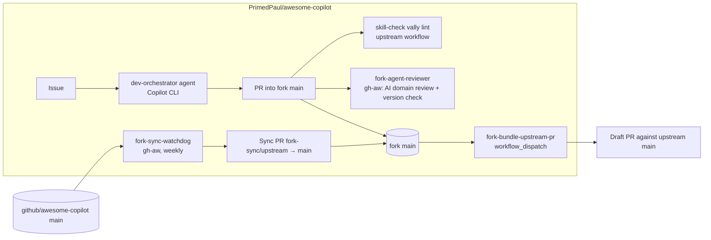

# Fork-Only Automation Tooling

Fork-specific workflows, agents, and documentation for developing the **Oracle-to-PostgreSQL Migration Expert** custom agent in `PrimedPaul/awesome-copilot` (a fork of `github/awesome-copilot`) and promoting it upstream.

> **Fork-only.** Nothing in `.github/fork-only/` or `.github/workflows/fork-*` is ever proposed upstream. Only the agent file, its plugin, and its skills are promoted.

## Status

**Authored, compiled, and lint-checked — not yet exercised in Actions.** See [First-run checklist](#first-run-checklist). Treat every claim below as unverified until you have seen a green run.

## Architecture

### Workflows (`.github/workflows/fork-*`)

| File | Kind | Trigger | What it does |
|---|---|---|---|
| `fork-sync-watchdog.md` → `.lock.yml` | gh-aw | Weekly Fri 10:00 UTC, manual | Deterministic `sync` job pushes `upstream/main` to branch `fork-sync/upstream` and opens/refreshes a PR into `main` (with the PAT so CI runs). AI agent comments on that PR with a summary, incoming commits, change footprint, anything touching this agent, and newly added upstream workflow files. If `CONTRIBUTING.md` or `AGENTS.md` changed, it also opens an issue with the full diff and what it means for this fork. |
| `fork-agent-reviewer.md` → `.lock.yml` | gh-aw | `pull_request` into `main`, path-scoped to the agent, plugin, and `skills/*oracle-to-postgres*` | `version_check` job fails if `plugin.json` version equals upstream. AI agent applies the `ai-prompt-engineering-safety-review` skill plus an Oracle→PostgreSQL domain checklist and submits one review (`COMMENT` or `REQUEST_CHANGES`; can never `APPROVE`). |
| `fork-bundle-upstream-pr.yml` | plain YAML | `workflow_dispatch` | Computes the single diff between `upstream/main` and fork `main` for the agent paths (agent file, plugin, every skill listed in `plugin.json`), applies it on a branch based on `upstream/main`, runs `npm run build` + `eng/fix-line-endings.sh`, commits, force-pushes `upstream-promotion/oracle-to-postgres-migration-expert` to the fork, and opens a **draft** PR against upstream (or reports the existing one). Fails hard if there is no delta, the version was not bumped, or the diff does not apply. Supports `dry_run`. |

The gh-aw sources live in `.github/workflows/*.md` alongside their compiled `.lock.yml`, following upstream's convention for its own live agentic workflows (the top-level `workflows/` directory is the *contribution catalog*, not where this repo's automation runs). Recompile after editing a source: `gh aw compile --validate fork-sync-watchdog fork-agent-reviewer`.

### Agents (`.github/fork-only/agents/`)

Custom agents for interactive Copilot CLI sessions; they are not run by Actions.

- **dev-orchestrator.agent.md** — issue → grill → plan → skeptic critique → approval gate → implement → pre-PR self-review. Ends with the promotion checklist (version bump, `npm run build`, line endings, validators).
- **plan-skeptic.agent.md** — adversarial sub-agent the orchestrator dispatches to critique its own plan.

### No state files

Earlier drafts tracked "last seen" SHAs in JSON. That was a second source of truth that could drift. Everything is now computed against `upstream/main`: unmerged upstream commits are simply `origin/main..upstream/main`, and the unpromoted agent delta is simply `git diff upstream/main origin/main -- <agent paths>`.

## Repository settings this design depends on

Verified via the REST API on 2026-09-17. Re-check if behaviour looks wrong.

| Setting | Value | Why |
|---|---|---|
| Actions → General → Actions permissions | *Allow PrimedPaul, and select non-PrimedPaul actions* with **Allow actions created by GitHub** ticked | The allow-list governs `uses:` steps, not which workflow files run. Without GitHub-owned actions every workflow fails at checkout. |
| Actions → General → **Require actions to be pinned to a full-length commit SHA** | **On** | Enforces SHA pinning at the runner. Any unpinned `uses:` is rejected. |
| Actions → General → Workflow permissions | Read-only; cannot approve PRs | Least privilege. Each workflow declares the `permissions:` it needs. |
| Ruleset "Branch Protection for 'main'" | deletion, non-fast-forward, `pull_request` (0 approvals), Copilot code review | Nothing pushes to `main` directly — the watchdog and bundler open PRs. Linear history is **off** so sync PRs can use *Create a merge commit*. |
| Ruleset → `pull_request` → *Require approval of the most recent reviewable push* / *extra approval for unattributed changes* | Recommended **off** | Automation commits are authored by `github-actions[bot]`; with 0 required approvals these are harmless but noisy. |

### Which upstream workflows to leave enabled

Upstream ships ~40 workflows that will all run in the fork. Disable the ones that assume upstream secrets or org context via the Actions tab (**⋯ → Disable workflow**; this is repository state, not a file, so it survives syncs). Keep enabled:

- `skill-check.yml` + `skill-check-comment.yml` — free vally lint on agent/skill changes
- `validate-plugins.yml`, `validate-readme.yml`, `validate-agentic-workflows-pr.yml` — the checks an upstream PR will face
- `fork-*` — ours

The watchdog lists any **newly added** upstream workflow files in its sync-PR comment so you can decide per file after merging.

## Secret: `FORK_AUTOMATION_PAT`

One **classic** PAT with the **`public_repo`** scope only. Fine-grained PATs cannot be granted on `github/awesome-copilot` (you do not own it), and `public_repo` is the minimum classic scope that can open a PR against a public repo you do not own.

Used for exactly two things, both in deterministic (non-agent) jobs:

1. **Watchdog `sync` job** — checkout token, pushing `fork-sync/upstream`, and `gh pr create` on the fork. A PR created with `GITHUB_TOKEN` would not trigger `pull_request` workflows; a PAT-created one does.
2. **Bundler** — `gh pr create --repo github/awesome-copilot`. The promotion branch itself is pushed to the fork with `GITHUB_TOKEN`.

The PAT is **never** available to a gh-aw agent job. gh-aw's compiler reports it as a "new restricted secret" on first compile of the watchdog; that is expected and has been reviewed.

Set an expiry (90 days) and note the renewal date in your calendar. To rotate: **Settings → Secrets and variables → Actions → `FORK_AUTOMATION_PAT`**.

### Copilot for gh-aw

The gh-aw workflows use the Copilot engine and request `copilot-requests: write`. Your account's Copilot subscription is what runs them. If the agent job fails at engine start-up, check the gh-aw [engines reference](https://github.github.com/gh-aw/reference/engines/) for the current credential requirement.

## Using the system

### Development flow

1. Open an issue in the fork describing the change.
2. In Copilot CLI, select the **Development Orchestrator** agent (`.github/fork-only/agents/dev-orchestrator.agent.md`) and give it the issue number.
3. It grills, plans, sends the plan to **Plan Skeptic**, waits for your approval, implements, bumps `plugin.json` version, runs `npm run build`, and self-reviews.
4. Open a PR against fork `main`. `skill-check` (vally) and `fork-agent-reviewer` run. The reviewer's `version_check` job fails if the version was not bumped.
5. Merge when satisfied — you are the sole reviewer.

### Weekly sync

Friday 10:00 UTC (or **Actions → Fork Sync Watchdog → Run workflow**). A PR titled `chore(fork-sync): merge upstream main (YYYY-MM-DD)` appears with an AI comment. Merge with **Create a merge commit**. If `CONTRIBUTING.md`/`AGENTS.md` changed, an issue labelled `fork-automation`, `contribution-guidelines` explains the impact — read it before the next promotion.

If the branch already has an open PR, the watchdog fast-forwards it rather than opening another.

### Promote to upstream

**Actions → Fork Bundle Upstream PR → Run workflow.** Inputs: optional title, `ai_authored` (default on — appends `🤖🤖🤖` per `CONTRIBUTING.md` fast-track rule), `dry_run`.

Run with `dry_run` first; the job summary shows the diff stat. Then run for real. The draft PR is opened as **you**. Review it on GitHub, then mark it *Ready for review*. Re-running after further fork merges refreshes the same branch/PR.

## First-run checklist

- [ ] Merge this branch to fork `main` (schedule/dispatch only fire from the default branch).
- [ ] Confirm the three `fork-*` workflows appear in the Actions tab.
- [ ] Disable upstream workflows you do not want (see list above).
- [ ] Add `FORK_AUTOMATION_PAT` secret.
- [ ] **Watchdog**: Run workflow → expect a sync PR with an AI comment (or a "nothing to sync" notice).
- [ ] **Reviewer**: open a test PR that edits the agent file *without* bumping the version → expect `version_check` red and an AI review; bump the version → expect green.
- [ ] **Bundler**: run with `dry_run` → inspect the summary; then run for real → confirm the draft PR on upstream.
- [ ] Update the *Status* section above once each is green.

## Troubleshooting

| Symptom | Likely cause | Fix |
|---|---|---|
| Every workflow fails at `actions/checkout` | Actions allow-list excludes GitHub-owned actions, or an action is not SHA-pinned | Settings → Actions → General |
| Watchdog: `gh pr create` 403 | PAT missing/expired or lacks `public_repo` | Rotate secret |
| Watchdog sync PR shows merge conflict | Fork `main` has edits to upstream-owned files | Resolve locally: `git fetch upstream && git merge upstream/main`, push to a branch, PR it |
| Reviewer `version_check` red | `plugin.json` version equals upstream | Bump it on the PR branch |
| Bundler: "No unpromoted changes" | Fork `main` matches upstream for the agent paths | Nothing to promote |
| Bundler: `git apply` fails | Should be impossible (branch *is* `upstream/main`); indicates a fetch problem | Re-run; if it persists, open an issue with the log |
| gh-aw agent job fails at engine start | Copilot credential requirement changed | See gh-aw engines reference |

## Editing fork-only tooling

- Plain YAML: edit, then `actionlint` locally.
- gh-aw: edit the `.md`, then `gh aw compile --validate <name>` and commit **both** the `.md` and `.lock.yml`. The compiler also rewrites `.gitattributes` and `.github/aw/actions-lock.json` — those are **upstream-owned**; `git checkout -- .gitattributes .github/aw/actions-lock.json` before committing or every weekly sync will conflict.
- Never let these paths leak into a promotion — the bundler only takes the agent's paths, but check the dry-run diff anyway.

## References

- [GitHub Agentic Workflows](https://github.github.com/gh-aw/) — frontmatter, safe-outputs, custom jobs
- [Security hardening for GitHub Actions](https://docs.github.com/en/actions/security-for-github-actions/security-guides/security-hardening-for-github-actions) — SHA pinning, script injection, least privilege
- [Workflow triggers run from the default branch](https://docs.github.com/en/actions/writing-workflows/choosing-when-your-workflow-runs/events-that-trigger-workflows#schedule)
- [Classic PAT scopes](https://docs.github.com/en/apps/oauth-apps/building-oauth-apps/scopes-for-oauth-apps#available-scopes)
