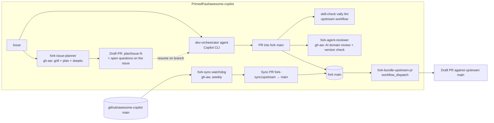

# Fork-Only Automation Tooling

Fork-specific workflows, agents, and documentation for developing the **Oracle-to-PostgreSQL Migration Expert** custom agent in `PrimedPaul/awesome-copilot` (a fork of `github/awesome-copilot`) and promoting it upstream.

> **Fork-only.** Nothing in `.github/fork-only/` or `.github/workflows/fork-*` is ever proposed upstream. Only the agent file, its plugin, and its skills are promoted.

## Status

**Authored, compiled, lint-checked, watchdog-exercised, and reviewer green- and negative-path verified in Actions.** The bundler is verified end-to-end; see [First-run checklist](#first-run-checklist).

## Architecture

### Workflows (`.github/workflows/fork-*`)

| File | Kind | Trigger | What it does |
| --- | --- | --- | --- |
| `fork-issue-planner.md` → `.lock.yml` | gh-aw | `issues: [opened]` by the repo owner (excluding `fork-automation`-labelled issues), plus `workflow_dispatch` with an `issue_number` input | Does the first round of grilling and planning without a human in the loop. Reads the issue and the files it plausibly touches, classifies scope (agent / fork tooling / out of scope), writes `.github/fork-only/plans/issue-<N>.md` beginning with parseable YAML frontmatter delimited by `---` and containing a grilling pass (ambiguities, IN/OUT scope, constraints, **assumptions made**), a concrete plan with the semver bump level, acceptance criteria, a self-adversarial skeptic's report with a confidence rating, open questions, and verification commands. Opens a **draft** PR on branch `plan/issue-<N>` and posts one comment on the issue linking that PR and repeating the plan's open-questions list verbatim, along with the biggest risk. `allowed-files` restricts it to `.github/fork-only/plans/issue-*.md` — it can never touch the agent, the plugin, the skills, or any workflow. |
| `fork-sync-watchdog.md` → `.lock.yml` | gh-aw | Weekly Fri 10:00 UTC, manual | Deterministic `sync` job pushes `upstream/main` to branch `fork-sync/upstream` and opens/refreshes a PR into `main` (with the PAT so CI runs). AI agent comments on that PR with a summary, incoming commits, change footprint, anything touching this agent, and a **Keep / Disable / Integrate** verdict for every newly added upstream workflow file (with disable steps and, for Integrate, which fork file to change), plus a one-line impact note for each modified upstream workflow. If `CONTRIBUTING.md` or `AGENTS.md` changed, it also opens an issue with the full diff and what it means for this fork. |
| `fork-agent-reviewer.md` → `.lock.yml` | gh-aw | `pull_request` into `main`, path-scoped to the agent, plugin, and `skills/*oracle-to-postgres*` | `version_check` job fails if `plugin.json` version equals upstream. AI agent applies the `ai-prompt-engineering-safety-review` skill plus an Oracle→PostgreSQL domain checklist and submits one review (`COMMENT` or `REQUEST_CHANGES`; can never `APPROVE`). |
| `fork-bundle-upstream-pr.yml` | plain YAML | `workflow_dispatch` | Computes the single diff between `upstream/main` and fork `main` for the agent paths (agent file, plugin, every skill listed in `plugin.json`), applies it on a branch based on `upstream/main`, runs `npm run build` + `eng/fix-line-endings.sh`, commits, force-pushes `upstream-promotion/oracle-to-postgres-migration-expert-v1.1.1` to the fork, and opens a **draft** PR against upstream (or reports the existing one). Fails hard if there is no delta, the version was not bumped, the diff does not apply, or any staged/committed path is outside the promotion allowlist. Supports `dry_run`. |

The gh-aw sources live in `.github/workflows/*.md` alongside their compiled `.lock.yml`, following upstream's convention for its own live agentic workflows (the top-level `workflows/` directory is the *contribution catalog*, not where this repo's automation runs). Recompile after editing a source: `gh aw compile --validate fork-sync-watchdog fork-agent-reviewer fork-issue-planner`.

### Agents (`.github/agents/`)

Custom agents for interactive Copilot CLI sessions; they are not run by Actions. They live under `.github/agents/` — not `.github/fork-only/agents/` — because Copilot CLI only discovers selectable custom agents in `.github/agents/` (repo-level) or `~/.copilot/agents/` (user-level); a `.github/fork-only/agents/` file is never scanned and cannot be selected with `/agent`. This is still fork-only tooling: neither `npm run build`/`skill-check` (which only walk the top-level `agents/**`) nor `fork-bundle-upstream-pr` (which diffs a hard-coded list of the migration-expert agent's own paths) ever look at `.github/agents/`, so nothing here can leak upstream.

- **dev-orchestrator.agent.md** — issue → grill → plan → skeptic critique → approval gate → implement → pre-PR self-review. Reads `.github/fork-only/plans/issue-<N>.md` first if the planner produced one. Ends with the promotion checklist (version bump, `npm run build`, line endings, validators). Selectable via `/agent` (`mode: primary`, `hidden: false`, `user-invocable: true`).
- **plan-skeptic.agent.md** — adversarial sub-agent the orchestrator dispatches to critique its own plan. `fork-issue-planner` adopts the same persona for its self-critique section. Not selectable via `/agent` — only reachable as a sub-agent dispatch (`mode: subagent`, `hidden: true`, `user-invocable: false`).

### No state files

Earlier drafts tracked "last seen" SHAs in JSON. That was a second source of truth that could drift. Everything is now computed against `upstream/main`: unmerged upstream commits are simply `origin/main..upstream/main`, and the unpromoted agent delta is simply `git diff upstream/main origin/main -- <agent paths>`.

Plan files under `.github/fork-only/plans/` are the one exception, and deliberately so: they are **advisory artefacts, not state**. Nothing reads them automatically and nothing branches on their contents, so a stale plan is a stale note, not a drifting source of truth.

## Repository settings this design depends on

Verified via the REST API on 2026-09-17. Re-check if behaviour looks wrong.

| Setting | Value | Why |
| --- | --- | --- |
| Actions → General → Actions permissions | *Allow PrimedPaul, and select non-PrimedPaul actions* with **Allow actions created by GitHub** ticked | The allow-list governs `uses:` steps, not which workflow files run. Without GitHub-owned actions every workflow fails at checkout. |
| Actions → General → **Require actions to be pinned to a full-length commit SHA** | **On** | Enforces SHA pinning at the runner. Any unpinned `uses:` is rejected. |
| Actions → General → Workflow permissions | Read-only; cannot approve PRs | Least privilege. Each workflow declares the `permissions:` it needs. |
| Ruleset "Branch Protection for 'main'" | deletion, non-fast-forward, `pull_request` (0 approvals), Copilot code review | Nothing pushes to `main` directly — the watchdog and bundler open PRs. Linear history is **off** so sync PRs can use *Create a merge commit*. |
| Ruleset → `pull_request` → *Require approval of the most recent reviewable push* / *extra approval for unattributed changes* | Recommended **off** | Automation commits are authored by `github-actions[bot]`; with 0 required approvals these are harmless but noisy. |

### Which upstream workflows to leave enabled

Upstream ships ~40 workflows that will all run in the fork. Disable the ones that assume upstream secrets or org context via the Actions tab (**⋯ → Disable workflow**; this is repository state, not a file, so it survives syncs). Keep enabled:

- `skill-check.yml` + `skill-check-comment.yml` — free vally lint on agent/skill changes
- `validate-plugins.yml`, `validate-readme.yml`, `validate-agentic-workflows-pr.yml` — the checks an upstream PR will face
- `fork-*` — ours

The watchdog applies this policy to every **newly added** upstream workflow file in its sync-PR comment: a per-file **Keep / Disable / Integrate** recommendation with reasoning, the exact disable steps, and — for *Integrate* — what to change in the fork's own tooling. It also notes whether **modified** upstream workflows change anything for a fork that keeps them enabled. The verdicts are suggestions; you decide after merging. If you change this list, the agent's policy lives in the *About this fork* section of `fork-sync-watchdog.md` — keep the two in step.

## Secret: `FORK_AUTOMATION_PAT`

One **classic** PAT with the **`public_repo`** and **`workflow`** scopes. Fine-grained PATs cannot be granted on `github/awesome-copilot` (you do not own it), and `public_repo` is the minimum classic scope that can open a PR against a public repo you do not own. `workflow` is required because the watchdog pushes `upstream/main` — which routinely contains changes under `.github/workflows/` — and GitHub refuses any push that touches workflow files from a token without that scope (`GITHUB_TOKEN` cannot do it either).

Used for exactly two things, both in deterministic (non-agent) jobs:

1. **Watchdog `sync` job** — checkout token, pushing `fork-sync/upstream`, and `gh pr create` on the fork. A PR created with `GITHUB_TOKEN` would not trigger `pull_request` workflows; a PAT-created one does.
2. **Bundler** — `gh pr create --repo github/awesome-copilot`. The promotion branch itself is pushed to the fork with `GITHUB_TOKEN`.

The PAT is **never** available to a gh-aw agent job. gh-aw's compiler reports it as a "new restricted secret" on first compile of the watchdog; that is expected and has been reviewed.

`fork-issue-planner` does **not** use the PAT. Its draft PR is opened with `GITHUB_TOKEN`, which means the plan PR does not trigger `pull_request` workflows — harmless, because a plan-only PR has nothing for CI to check. CI starts once you push implementation commits to that branch yourself.

Set an expiry (90 days) and note the renewal date in your calendar. To rotate: **Settings → Secrets and variables → Actions → `FORK_AUTOMATION_PAT`**.

### Copilot for gh-aw

The gh-aw workflows use the Copilot engine and request `copilot-requests: write`. Your account's Copilot subscription is what runs them. If the agent job fails at engine start-up, check the gh-aw [engines reference](https://github.github.com/gh-aw/reference/engines/) for the current credential requirement.

## Using the system

### Development flow

1. Open an issue in the fork describing the change.
2. **Fork Issue Planner** fires automatically (owner-opened issues only, `fork-automation`-labelled ones excluded). Within a few minutes you get a draft PR `[plan] plan: issue #N — …` on branch `plan/issue-<N>` containing `.github/fork-only/plans/issue-<N>.md` with `---`-delimited YAML frontmatter, plus an issue comment linking the draft PR and repeating the plan's open questions verbatim with the biggest risk.
3. Answer the open questions in the issue. That is the human half of the grilling the CI run could not do.
4. In Copilot CLI, check out `plan/issue-<N>`, select the **Development Orchestrator** agent (`/agent` → `.github/agents/dev-orchestrator.agent.md`) and give it the issue number. It reads the plan file as a starting point — the plan is advisory, so the orchestrator re-grills with your answers and rewrites it freely.
5. It grills, plans, sends the plan to **Plan Skeptic**, waits for your approval, implements, bumps `plugin.json` version, runs `npm run build`, and self-reviews.
6. Mark the plan PR *Ready for review* once it carries the implementation (or close it and open a fresh PR — the branch is yours). `skill-check` (vally) and `fork-agent-reviewer` run. The reviewer's `version_check` job fails if the version was not bumped.
7. Merge when satisfied — you are the sole reviewer.

The planner never touches anything outside `.github/fork-only/plans/issue-*.md`, so a bad plan costs you a `git rm` and nothing else. To re-plan after the issue is clarified, **Actions → Fork Issue Planner → Run workflow** with the issue number; it force-refreshes the same branch and PR.

### Weekly sync

Friday 10:00 UTC (or **Actions → Fork Sync Watchdog → Run workflow**). A PR titled `chore(fork-sync): merge upstream main (YYYY-MM-DD)` appears with an AI comment. Merge with **Create a merge commit**. Then act on the comment's workflow table: disable each **Disable** verdict in the Actions tab, open an issue for each **Integrate** you agree with, and update the keep-list above if it changed. If `CONTRIBUTING.md`/`AGENTS.md` changed, an issue labelled `fork-automation`, `contribution-guidelines` explains the impact — read it before the next promotion.

If the branch already has an open PR, the watchdog fast-forwards it rather than opening another.

### Promote to upstream

**Actions → Fork Bundle Upstream PR → Run workflow.** No change description is required. The bundler derives the generated title and detailed Summary from all non-merge commit subjects and the changed promotable paths between upstream `main` and fork `main`, so multiple logical changes are represented together. `title` is optional and overrides the generated title when a deliberate custom title is needed. `ai_authored` defaults on (appends `🤖🤖🤖` per `CONTRIBUTING.md` fast-track rule), and `dry_run` builds the branch and shows the diff without pushing or opening a PR.

Run with `dry_run` first; the job summary shows the diff stat. Then run for real. The draft PR is opened as **you**. Review it on GitHub, then mark it *Ready for review*. Re-running after further fork merges refreshes the same branch/PR.

## First-run checklist

- [x] Merge this branch to fork `main` (schedule/dispatch only fire from the default branch).
- [x] Confirm the four `fork-*` workflows appear in the Actions tab.
- [x] Disable upstream workflows you do not want (see list above).
- [x] Add `FORK_AUTOMATION_PAT` secret (`public_repo` + `workflow` scopes).
- [x] **Watchdog**: Run workflow → successful run [#35353935549](https://github.com/PrimedPaul/awesome-copilot/actions/runs/35353935549) created sync PR [#17](https://github.com/PrimedPaul/awesome-copilot/pull/17), posted one AI summary comment, and the PR was merged.
- [x] **Reviewer green path**: PR [#37](https://github.com/PrimedPaul/awesome-copilot/pull/37) ran successfully after the fork-safe merge-ref checkout and GitHub network allowlist were restored. Its [reviewer run](https://github.com/PrimedPaul/awesome-copilot/actions/runs/35414912410) completed `version_check`, agent review, safe outputs, and conclusion successfully.
- [x] **Reviewer negative path**: PR [#39](https://github.com/PrimedPaul/awesome-copilot/pull/39) changed the agent with the plugin version set to upstream `1.1.0`; `version_check` failed as expected in [the reviewer run](https://github.com/PrimedPaul/awesome-copilot/actions/runs/35421185433).
- [x] **Bundler**: run [#35426058576](https://github.com/PrimedPaul/awesome-copilot/actions/runs/35426058576) completed every step, pushed the versioned promotion branch, and opened upstream PR [github/awesome-copilot#3364](https://github.com/github/awesome-copilot/pull/3364).
- [x] **Planner**: open a throwaway issue describing a small agent tweak → expect a `[plan] …` draft PR on `plan/issue-<N>` and a comment with open questions. Delete the branch and close the issue afterwards. Verified via [issue #28](https://github.com/PrimedPaul/awesome-copilot/issues/28) → draft PR [#29](https://github.com/PrimedPaul/awesome-copilot/pull/29) ([run](https://github.com/PrimedPaul/awesome-copilot/actions/runs/35381990328)): correct scope classification, accurate file reads, full plan sections, one PR + one comment as designed.

## Troubleshooting

| Symptom | Likely cause | Fix |
| --- | --- | --- |
| Every workflow fails at `actions/checkout` | Actions allow-list excludes GitHub-owned actions, or an action is not SHA-pinned | Settings → Actions → General |
| Watchdog: `gh pr create` 403 | PAT missing/expired or lacks `public_repo` | Rotate secret |
| Watchdog: push fails with `refusing to allow a Personal Access Token to create or update workflow ... without workflow scope` | PAT lacks the `workflow` scope | Edit the classic PAT → tick `workflow` → update the `FORK_AUTOMATION_PAT` secret → re-run |
| Watchdog sync PR shows merge conflict | Fork `main` has edits to upstream-owned files | Resolve locally: `git fetch upstream && git merge upstream/main`, push to a branch, PR it |
| Reviewer `version_check` red | `plugin.json` version equals upstream | Bump it on the PR branch |
| Bundler: "No unpromoted changes" | Fork `main` matches upstream for the agent paths | Nothing to promote |
| Bundler: `git apply` fails | Should be impossible (branch *is* `upstream/main`); indicates a fetch problem | Re-run; if it persists, open an issue with the log |
| Bundler: PR creation fails after a prior promotion PR was closed and its head branch was deleted | GitHub will not reuse a deleted PR head, even if a same-named branch is recreated | Configure a new, change-aligned promotion branch name (for example, version-scoped) and rerun. If the head branch still exists, the bundler reopens and refreshes its prior PR. |
| Planner did not run on a new issue | Issue was not opened by the repo owner, or carries the `fork-automation` label (the watchdog's own issues are excluded by design) | Re-run manually: Actions → Fork Issue Planner → Run workflow → issue number |
| Planner run fails at `create_pull_request` with a protected-files or allowed-files error | The agent tried to write outside `.github/fork-only/plans/issue-*.md` | Working as designed — the planner must never edit code. Re-run; if it repeats, tighten the *Rules* section of `fork-issue-planner.md` |
| Planner PR has the `fork-automation` label but the label does not exist | The repository has no `fork-automation` label yet | Create it once in Issues → Labels (the watchdog needs it too) |
| gh-aw agent job fails at engine start | Copilot credential requirement changed | See gh-aw engines reference |

## Editing fork-only tooling

- Plain YAML: edit, then `actionlint` locally.
- gh-aw: edit the `.md`, then `gh aw compile --validate <name>` and commit **both** the `.md` and `.lock.yml`. The compiler also rewrites `.gitattributes` and `.github/aw/actions-lock.json` — those are **upstream-owned**; `git checkout -- .gitattributes .github/aw/actions-lock.json` before committing or every weekly sync will conflict.
- Never let these paths leak into a promotion — the bundler only takes the agent's paths, but check the dry-run diff anyway.
- The bundler also runs a fail-closed path guard before and after the build and again after committing. If a conflict-resolution merge or any other change introduces a fork-only path, the job stops before pushing or refreshing the upstream PR.

## References

- [GitHub Agentic Workflows](https://github.github.com/gh-aw/) — frontmatter, safe-outputs, custom jobs
- [Security hardening for GitHub Actions](https://docs.github.com/en/actions/security-for-github-actions/security-guides/security-hardening-for-github-actions) — SHA pinning, script injection, least privilege
- [Workflow triggers run from the default branch](https://docs.github.com/en/actions/writing-workflows/choosing-when-your-workflow-runs/events-that-trigger-workflows#schedule)
- [Classic PAT scopes](https://docs.github.com/en/apps/oauth-apps/building-oauth-apps/scopes-for-oauth-apps#available-scopes)
