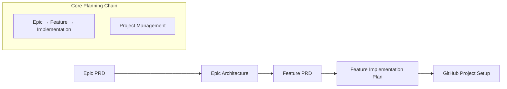

# GitHub Copilot Prompt Library

This directory contains specialized prompt files designed to work with GitHub Copilot to streamline the development process using a comprehensive hierarchical breakdown approach.

## Core Planning Workflow

This streamlined workflow covers the essential planning stages from epic definition through project management setup, with integrated testing and quality assurance.

### Hierarchical Work Breakdown Structure

Our workflow follows the Agile hierarchy: **Epic → Feature → Implementation → Project Management**, with each level providing specific value and granularity:

- **Epic**: Large business capability spanning multiple features (milestone level)
- **Feature**: Deliverable user-facing functionality within an epic  
- **Implementation**: Technical planning and architecture for feature delivery
- **Project Management**: GitHub issues, automation, and delivery tracking

---

## Streamlined Development Flow

### Input/Output Chain

1. **Epic PRD** → Business requirements and scope definition
2. **Epic Architecture** → High-level technical approach and system design
3. **Feature PRD** → Detailed feature specifications and user requirements
4. **Feature Implementation** → Technical planning and development approach
5. **GitHub Project Setup** → Automated project management and tracking

---

## Step-by-Step Execution Guide

### 1. Epic Definition (Product Management)

- Use `plan-epic-pm.prompt.md` to create an Epic PRD
- **Input:** High-level epic idea or business requirement
- **Output:** `/docs/ways-of-work/plan/epic/{epic-name}.md`

### 2. Epic Architecture (Technical Leadership)

- Use `plan-epic-arch.prompt.md` with the Epic PRD to define technical architecture
- **Input:** Epic PRD from step 1
- **Output:** `/docs/ways-of-work/plan/epic/{epic-name}-arch.md`

### 3. Feature Definition (Product Management)

- Use `plan-feature-prd.prompt.md` for each feature in the epic
- **Input:** Epic PRD and Epic Architecture
- **Output:** `/docs/ways-of-work/plan/{epic-name}/{feature-name}.md`

### 4. Feature Implementation Planning (Engineering)

- Use `plan-feature-implementation.prompt.md` to create technical implementation plan
- **Input:** Feature PRD and Epic Architecture
- **Output:** `/docs/ways-of-work/plan/{epic-name}/{feature-name}/implementation-plan.md`

### 5. GitHub Project Setup (Project Management)

- Use `plan-github.prompt.md` to generate automated project management and issue tracking
- **Input:** Epic PRD, Epic Architecture, Feature PRD, Implementation Plan
- **Output:** `/docs/ways-of-work/plan/{epic-name}/{feature-name}/project-plan.md`

---

## Best Practices

- **Sequential Execution**: Follow the step-by-step guide in order for optimal results
- **Document Attachment**: Always attach required input documents as specified in each prompt
- **File Path Consistency**: Use absolute file paths for referencing outputs
- **Version Control**: Maintain version control for all planning artifacts
- **Review and Validate**: Review outputs before using as inputs for subsequent steps
- **Iterative Refinement**: Use feedback loops to improve planning quality

---

## Available Prompts

- **plan-epic-pm.prompt.md** – Epic Product Requirements Document
- **plan-epic-arch.prompt.md** – Epic Technical Architecture Specification  
- **plan-feature-prd.prompt.md** – Feature Product Requirements Document
- **plan-feature-implementation.prompt.md** – Feature Technical Implementation Plan
- **plan-test.prompt.md** – Comprehensive Test Strategy (ISTQB & ISO 25010) - wip
- **plan-github.prompt.md** – GitHub Project Management and Issue Planning

---

## AI Agent Integration & Automation

- **Sequential Planning**: Copilot-driven workflow execution from epic to project management
- **Document Chain Integration**: Each prompt builds on previous outputs for complete traceability
- **Quality Gate Automation**: ISTQB framework integration with automated validation
- **GitHub Integration**: Automated project setup and issue tracking from planning artifacts
- **Multi-Modal Planning**: Business, technical, testing, and project management perspectives
- **Artifact Management**: Structured file output with consistent naming and organization

---

## Simplified Workflow Pattern

- **Epic Level**: Define business capability and technical architecture
- **Feature Level**: Detailed requirements and implementation planning  
- **Project Level**: Comprehensive testing strategy and project management setup

The process provides **complete traceability** from high-level business goals down to specific implementation plans and quality validation, with automated project management integration.

---

## Usage Patterns

### Complete Epic Planning

1. Epic PRD → Epic Architecture → Feature PRD → Implementation → Project Setup

### Feature-Focused Planning

1. Feature PRD → Implementation Plan → GitHub Setup

### Project Management Setup

1. Gather all artifacts → GitHub Project Planning → Automated issue creation

---

This streamlined planning workflow provides complete coverage from business requirements through technical implementation and quality assurance, with integrated project management automation for efficient delivery tracking.
