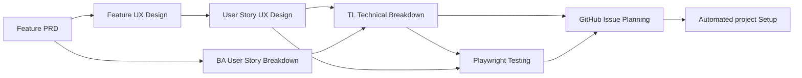
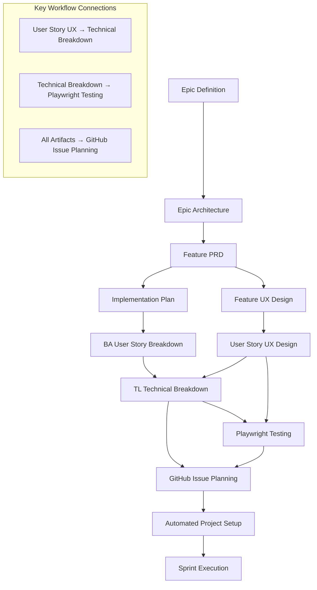

# GitHub Copilot Prompt Library

This directory contains specialized prompt files designed to work with GitHub Copilot to streamline the development process for the Epoch platform using a comprehensive hierarchical breakdown approach.

## Unified Epic, Feature, and Testing Workflow

This workflow integrates user story UX design, technical breakdown, and comprehensive testing automation into a single, traceable process. All steps, prompts, and best practices are consolidated here for clarity and efficiency.

### Hierarchical Work Breakdown Structure

Our workflow follows the Agile hierarchy: **Epic → Feature → Story/Enabler → Test → Task**, with each level providing specific value and granularity:

- **Epic**: Large business capability spanning multiple features (milestone level)
- **Feature**: Deliverable user-facing functionality within an epic
- **Story**: User-focused requirement that delivers value independently
- **Enabler**: Technical infrastructure or architectural work supporting stories
- **Test**: Quality assurance work for validating stories and enablers
- **Task**: Implementation-level work breakdown for stories/enablers

---

## Complete Feature Development Flow

### Input/Output Chain

1. **Feature PRD** → User stories and requirements
2. **User Story UX Design** → Micro-interaction specifications
3. **Technical Breakdown** → Implementation tasks with UX context
4. **Playwright Testing** → Comprehensive test strategy
5. **GitHub Issue Planning** → Automated project management

---

## Step-by-Step Execution Guide

### 1. Epic Definition (Product)

- Use `epic-pm.prompt.md` to create an Epic PRD.
- **Input:** High-level epic idea.
- **Output:** `/docs/ways-of-work/plan/epic/{epic-name}.md`

### 2. Epic Architecture

- Use `epic-arch.prompt.md` with the Epic PRD to define high-level technical architecture.
- **Input:** Epic PRD.
- **Output:** `/docs/ways-of-work/plan/epic/{epic-name}-arch.md`

### 3. Feature Definition (Product)

- Use `feature-prd.prompt.md` for each feature in the epic to create a Feature PRD.
- **Input:** Feature from Epic Architecture.
- **Output:** `/docs/ways-of-work/plan/{epic-name}/{feature-name}.md`

### 4. Feature Design (UI/UX)

- Use `feature-ux.prompt.md` with the Feature PRD to create a UI/UX design spec.
- **Input:** Feature PRD.
- **Output:** `/docs/ways-of-work/plan/{epic-name}/{feature-name}/design.md`

#### 4a. User Story Design (Micro-UX)

- Use `user-story-ux.prompt.md` for detailed interaction design at the user story level.
- **Input:** User stories from Feature PRD.
- **Output:** `/docs/ways-of-work/plan/{epic-name}/{feature-name}/user-story-{id}-design.md`

### 5. Feature Implementation Plan

- Use `feature-implementation.prompt.md` with the Feature PRD and Design Spec to create a technical plan.
- **Input:** Feature PRD and Design Spec.
- **Output:** `/docs/ways-of-work/plan/{epic-name}/{feature-name}/implementation-plan.md`

### 6. Feature Testing Strategy (ISTQB & ISO 25010)

- Use `feature-test.prompt.md` to generate a comprehensive test strategy.
- **Input:** Epic PRD, Epic Architecture, Feature PRD, Feature UX Design, Implementation Plan.
- **Output:** `/docs/ways-of-work/plan/{epic-name}/{feature-name}/test-strategy.md`

### 7. Business Analyst Breakdown

- Use `ba-user-story-breakdown.prompt.md` to break down features into user stories for AI agent execution.
- **Input:** Feature PRD, Design Spec, Implementation Plan.
- **Output:** `/docs/ways-of-work/plan/{epic-name}/{feature-name}/user-stories-breakdown.md`

### 8. Tech Lead Technical Breakdown

- Use `tl-technical-breakdown.prompt.md` to convert user stories into implementation tasks.
- **Input:** User Stories Breakdown and all previous artifacts.
- **Output:** `/docs/ways-of-work/plan/{epic-name}/{feature-name}/technical-breakdown.md`

### 9. Story-Level Playwright Testing

- Use `playwright-testing.prompt.md` to create detailed Playwright test implementations.
- **Input:** Test Strategy, User Story UX Design, Technical Breakdown.
- **Output:** `/docs/ways-of-work/plan/{epic-name}/{feature-name}/story-{id}-playwright-tests.md`

### 10. GitHub Issue Planning & Automation

- Use `github-issue-plan.prompt.md` to generate automated project management.
- **Input:** All feature artifacts (PRD, UX, Technical, Test Strategy, Playwright Testing plans).
- **Output:** `/docs/ways-of-work/plan/{epic-name}/{feature-name}/project-plan.md` and `/docs/ways-of-work/plan/{epic-name}/{feature-name}/github-issues-checklist.md`

---

## Best Practices

- **Always attach required documents** as specified in each prompt.
- **Use absolute file paths** for referencing outputs.
- **Maintain file naming conventions** and version control all artifacts.
- **Review outputs** before using as inputs for subsequent steps.
- **Validate technical feasibility** and ensure UX consistency.
- **Leverage MCP tools** for automation and traceability.
- **Iterate and refine** using feedback loops.

---

## Available Prompts

- **epic-pm.prompt.md** – Epic PRD
- **epic-arch.prompt.md** – Epic Architecture
- **feature-prd.prompt.md** – Feature PRD
- **feature-ux.prompt.md** – Feature UI/UX Design
- **story-ux.prompt.md** – User Story UX Design
- **feature-implementation.prompt.md** – Implementation Plan
- **feature-test.prompt.md** – Test Strategy
- **story-ba-breakdown.prompt.md** – User Story Breakdown
- **story-tl.prompt.md** – Technical Breakdown
- **story-test.prompt.md** – Playwright Testing
- **github-issue-plan.prompt.md** – GitHub Issue Planning

---

## AI Agent Integration & Automation

- **Multi-Agent Orchestration**: Copilot, Claude, MCP tools
- **Executable Code Actions**: CodeAct patterns
- **MCP Server Configuration**: Automated tool chain setup
- **Context-Aware Handoffs**: Seamless transitions between planning, development, and testing
- **Quality Gate Automation**: Autonomous validation with human oversight
- **Comprehensive Testing**: Playwright MCP integration
- **Project Management Automation**: GitHub Issues and Projects API
- **Kanban Workflow Support**: Automated status transitions and dependency tracking
- **Anti-Solutioneering Guidance**: Focus on outcomes over prescribed solutions

---

## Workflow Connections Diagram

---

## Cyclical Workflow Pattern

- **Epic Level**: Each epic can contain multiple features, each requiring full workflow execution
- **Feature Level**: Each feature contains multiple stories/enablers, each with detailed UX and technical breakdown
- **Story Level**: Each story can generate multiple implementation tasks and test cases
- **Testing Level**: Each story/enabler requires comprehensive test coverage across multiple test types

The process **repeats and deepens** as you move through the hierarchy, ensuring complete coverage and traceability from high-level business goals down to specific implementation tasks and quality validation.

---

## User Story Implementation

1. User Story UX → TL Technical → Playwright Testing → GitHub Issues

## Testing Focus

1. Review existing artifacts → Playwright Testing → Execute test automation

## Project Management Setup

1. Gather all feature artifacts → GitHub Issue Planning → Automated project creation

---

## Checklist & Deferred Work Policy

- **Always create a checklist** when starting work on any Epic, Feature, or Issue. Name the file `_checklist-{issue-number}.md` if an issue number is available, otherwise use `_checklist-epic.md`, `_checklist-feat.md`, etc.
- **Update the checklist** as work is completed, marking items off in real time.
- **Move any deferred or explicitly skipped items** to a `_todo.md` file in the same directory (e.g., `_todo.md` for open/parked tasks).
- **Checklist and todo files must be kept up to date** throughout the workflow for traceability and auditability.

This ensures all work is tracked, deferred items are not lost, and the workflow remains transparent and reviewable.
