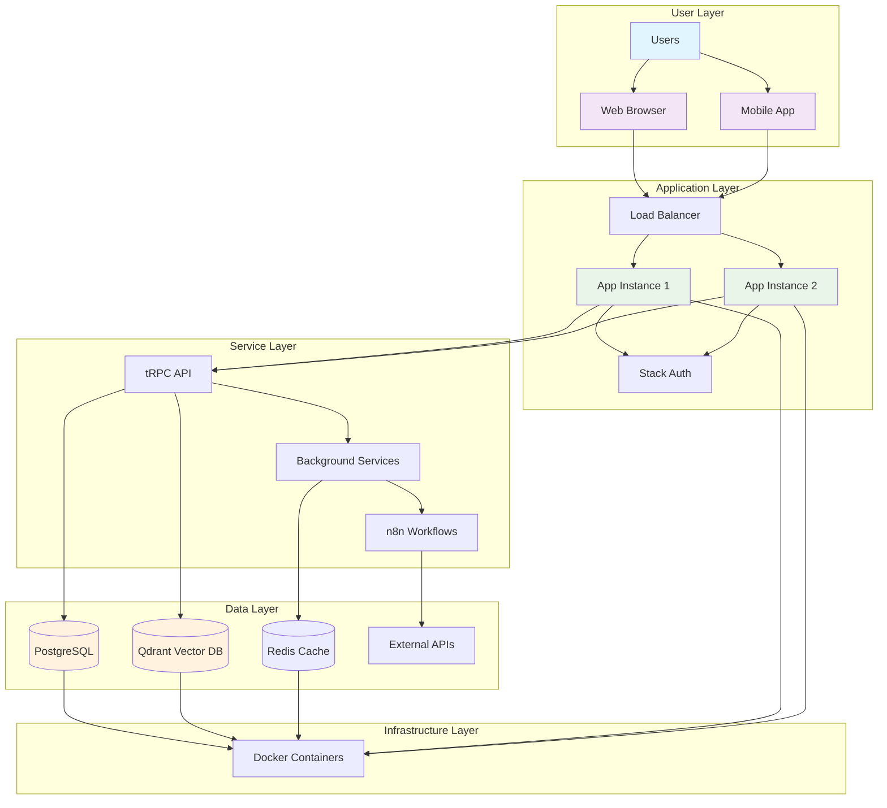

# Epic Architecture Specification Prompt

## Goal

Act as a Senior Software Architect. Your task is to take an Epic PRD and create a high-level technical architecture specification. This document will guide the development of the epic, outlining the major components, features, and technical enablers required.

## Context Considerations

- The Epic PRD from the Product Manager.
- **Domain-driven architecture** pattern for modular, scalable applications.
- **Self-hosted and SaaS deployment** requirements.
- **Docker containerization** for all services.
- **TypeScript/Next.js** stack with App Router.
- **Turborepo monorepo** patterns.
- **tRPC** for type-safe APIs.
- **Stack Auth** for authentication.

**Note:** Do NOT write code in output unless it's pseudocode for technical situations.

## Output Format

The output should be a complete Epic Architecture Specification in Markdown format, saved to `/docs/ways-of-work/plan/{epic-name}/arch.md`.

### Specification Structure

#### 1. Epic Architecture Overview

- A brief summary of the technical approach for the epic.

#### 2. System Architecture Diagram

Create a comprehensive Mermaid diagram detailing the full system architecture for the epic:

**Architecture Flow Description:**

- **Color Coding**: User interactions (blue), Applications (purple), Services (green), Data (orange)
- **Service Boundaries**: Clear separation between application zones and data persistence
- **Data Flow**: Request routing from users through load balancer to application instances
- **Integration Points**: Authentication, background processing, and external service connections

#### 3. High-Level Features & Technical Enablers

- A list of the high-level features to be built.
- A list of technical enablers (e.g., new services, libraries, infrastructure) required to support the features.

#### 4. Technology Stack

- A list of the key technologies, frameworks, and libraries to be used.

#### 5. Technical Value

- Estimate the technical value (e.g., High, Medium, Low) with a brief justification.

#### 6. T-Shirt Size Estimate

- Provide a high-level t-shirt size estimate for the epic (e.g., S, M, L, XL).

## Context Template

- **Epic PRD:** [The content of the Epic PRD markdown file]
