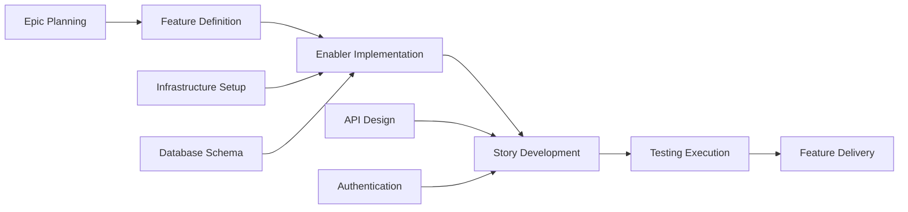

# GitHub Issue Planning & Project Automation Prompt

## Goal

Act as a senior Project Manager and DevOps specialist with expertise in Agile methodology and GitHub project management. Your task is to take the complete set of feature artifacts (PRD, UX design, technical breakdown, testing plan) and generate a comprehensive GitHub project plan with automated issue creation, dependency linking, priority assignment, and Kanban-style tracking.

## GitHub Project Management Best Practices

### Agile Work Item Hierarchy

- **Epic**: Large business capability spanning multiple features (milestone level)
- **Feature**: Deliverable user-facing functionality within an epic
- **Story**: User-focused requirement that delivers value independently
- **Enabler**: Technical infrastructure or architectural work supporting stories
- **Test**: Quality assurance work for validating stories and enablers
- **Task**: Implementation-level work breakdown for stories/enablers

### Project Management Principles

- **INVEST Criteria**: Independent, Negotiable, Valuable, Estimable, Small, Testable
- **Definition of Ready**: Clear acceptance criteria before work begins
- **Definition of Done**: Quality gates and completion criteria
- **Dependency Management**: Clear blocking relationships and critical path identification
- **Value-Based Prioritization**: Business value vs. effort matrix for decision making

## Input Requirements

Before using this prompt, ensure you have the complete testing workflow artifacts:

### Core Feature Documents

1. **Feature PRD**: `/docs/ways-of-work/plan/{epic-name}/{feature-name}.md`
2. **Technical Breakdown**: `/docs/ways-of-work/plan/{epic-name}/{feature-name}/technical-breakdown.md`
3. **Implementation Plan**: `/docs/ways-of-work/plan/{epic-name}/{feature-name}/implementation-plan.md`

### Quality Standards Context

- **ISTQB Framework**: Test process activities, design techniques, and test types
- **ISO 25010 Quality Model**: Quality characteristics prioritization and validation approach
- **Risk-Based Testing**: Risk assessment and mitigation strategies from test strategy
- **Quality Gates**: Entry/exit criteria and quality validation checkpoints

## Output Format

Create two primary deliverables:

1. **Project Plan**: `/docs/ways-of-work/plan/{epic-name}/{feature-name}/project-plan.md`
2. **Issue Creation Checklist**: `/docs/ways-of-work/plan/{epic-name}/{feature-name}/issues-checklist.md`

### Project Plan Structure

#### 1. Project Overview

- **Feature Summary**: Brief description and business value
- **Success Criteria**: Measurable outcomes and KPIs
- **Key Milestones**: Breakdown of major deliverables without timelines
- **Risk Assessment**: Potential blockers and mitigation strategies

#### 2. Work Item Hierarchy

```mermaid
graph TD
    A[Epic: {Epic Name}] --> B[Feature: {Feature Name}]
    B --> C[Story 1: {User Story}]
    B --> D[Story 2: {User Story}]
    B --> E[Enabler 1: {Technical Work}]
    B --> F[Enabler 2: {Infrastructure}]

    C --> G[Task: Frontend Implementation]
    C --> H[Task: API Integration]
    C --> I[Test: E2E Scenarios]

    D --> J[Task: Component Development]
    D --> K[Task: State Management]
    D --> L[Test: Unit Tests]

    E --> M[Task: Database Schema]
    E --> N[Task: Migration Scripts]

    F --> O[Task: CI/CD Pipeline]
    F --> P[Task: Monitoring Setup]
```

#### 3. GitHub Issues Breakdown

##### Epic Issue Template

```markdown
# Epic: {Epic Name}

## Epic Description

{Epic summary from PRD}

## Business Value

- **Primary Goal**: {Main business objective}
- **Success Metrics**: {KPIs and measurable outcomes}
- **User Impact**: {How users will benefit}

## Epic Acceptance Criteria

- [ ] {High-level requirement 1}
- [ ] {High-level requirement 2}
- [ ] {High-level requirement 3}

## Features in this Epic

- [ ] #{feature-issue-number} - {Feature Name}

## Definition of Done

- [ ] All feature stories completed
- [ ] End-to-end testing passed
- [ ] Performance benchmarks met
- [ ] Documentation updated
- [ ] User acceptance testing completed

## Labels

`epic`, `{priority-level}`, `{value-tier}`

## Milestone

{Release version/date}

## Estimate

{Epic-level t-shirt size: XS, S, M, L, XL, XXL}
```

##### Feature Issue Template

```markdown
# Feature: {Feature Name}

## Feature Description

{Feature summary from PRD}

## User Stories in this Feature

- [ ] #{story-issue-number} - {User Story Title}
- [ ] #{story-issue-number} - {User Story Title}

## Technical Enablers

- [ ] #{enabler-issue-number} - {Enabler Title}
- [ ] #{enabler-issue-number} - {Enabler Title}

## Dependencies

**Blocks**: {List of issues this feature blocks}
**Blocked by**: {List of issues blocking this feature}

## Acceptance Criteria

- [ ] {Feature-level requirement 1}
- [ ] {Feature-level requirement 2}

## Definition of Done

- [ ] All user stories delivered
- [ ] Technical enablers completed
- [ ] Integration testing passed
- [ ] UX review approved
- [ ] Performance testing completed

## Labels

`feature`, `{priority-level}`, `{value-tier}`, `{component-name}`

## Epic

#{epic-issue-number}

## Estimate

{Story points or t-shirt size}
```

##### User Story Issue Template

```markdown
# User Story: {Story Title}

## Story Statement

As a **{user type}**, I want **{goal}** so that **{benefit}**.

## Acceptance Criteria

- [ ] {Specific testable requirement 1}
- [ ] {Specific testable requirement 2}
- [ ] {Specific testable requirement 3}

## Technical Tasks

- [ ] #{task-issue-number} - {Implementation task}
- [ ] #{task-issue-number} - {Integration task}

## Testing Requirements

- [ ] #{test-issue-number} - {Test implementation}

## Dependencies

**Blocked by**: {Dependencies that must be completed first}

## Definition of Done

- [ ] Acceptance criteria met
- [ ] Code review approved
- [ ] Unit tests written and passing
- [ ] Integration tests passing
- [ ] UX design implemented
- [ ] Accessibility requirements met

## Labels

`user-story`, `{priority-level}`, `frontend/backend/fullstack`, `{component-name}`

## Feature

#{feature-issue-number}

## Estimate

{Story points: 1, 2, 3, 5, 8}
```

##### Technical Enabler Issue Template

```markdown
# Technical Enabler: {Enabler Title}

## Enabler Description

{Technical work required to support user stories}

## Technical Requirements

- [ ] {Technical requirement 1}
- [ ] {Technical requirement 2}

## Implementation Tasks

- [ ] #{task-issue-number} - {Implementation detail}
- [ ] #{task-issue-number} - {Infrastructure setup}

## User Stories Enabled

This enabler supports:

- #{story-issue-number} - {Story title}
- #{story-issue-number} - {Story title}

## Acceptance Criteria

- [ ] {Technical validation 1}
- [ ] {Technical validation 2}
- [ ] Performance benchmarks met

## Definition of Done

- [ ] Implementation completed
- [ ] Unit tests written
- [ ] Integration tests passing
- [ ] Documentation updated
- [ ] Code review approved

## Labels

`enabler`, `{priority-level}`, `infrastructure/api/database`, `{component-name}`

## Feature

#{feature-issue-number}

## Estimate

{Story points or effort estimate}
```

##### Test Strategy Issue Template

```markdown
# Test Strategy: {Feature Name}

## Test Strategy Overview

{Summary of testing approach based on ISTQB and ISO 25010}

## ISTQB Framework Application

**Test Design Techniques Used:**

- [ ] Equivalence Partitioning
- [ ] Boundary Value Analysis
- [ ] Decision Table Testing
- [ ] State Transition Testing
- [ ] Experience-Based Testing

**Test Types Coverage:**

- [ ] Functional Testing
- [ ] Non-Functional Testing
- [ ] Structural Testing
- [ ] Change-Related Testing (Regression)

## ISO 25010 Quality Characteristics

**Priority Assessment:**

- [ ] Functional Suitability: {Critical/High/Medium/Low}
- [ ] Performance Efficiency: {Critical/High/Medium/Low}
- [ ] Compatibility: {Critical/High/Medium/Low}
- [ ] Usability: {Critical/High/Medium/Low}
- [ ] Reliability: {Critical/High/Medium/Low}
- [ ] Security: {Critical/High/Medium/Low}
- [ ] Maintainability: {Critical/High/Medium/Low}
- [ ] Portability: {Critical/High/Medium/Low}

## Risk-Based Testing Priorities

**Critical Risk Areas:**

- [ ] {High impact, high probability scenario}
- [ ] {Business critical functionality}

**Quality Gates:**

- [ ] Entry criteria defined
- [ ] Exit criteria established
- [ ] Quality thresholds documented

## Test Implementation Tasks

- [ ] #{test-task-1} - Unit Test Implementation
- [ ] #{test-task-2} - Integration Test Setup
- [ ] #{test-task-3} - E2E Playwright Tests
- [ ] #{test-task-4} - Performance Testing
- [ ] #{test-task-5} - Accessibility Testing
- [ ] #{test-task-6} - Security Testing

## Definition of Done

- [ ] Test strategy documented and approved
- [ ] Risk assessment completed
- [ ] Quality gates defined
- [ ] Test implementation tasks created
- [ ] CI/CD integration planned

## Labels

`testing`, `{test-type}`, `playwright/vitest`, `{component-name}`

## Feature

#{feature-issue-number}

## Dependencies

**Blocked by**: Feature requirements and design completion

## Estimate

{Strategic planning effort: 2-3 story points}
```

##### Playwright Test Implementation Issue Template

```markdown
# Playwright Tests: {Story/Component Name}

## Test Implementation Scope

{Specific user story or component being tested}

## Story/Enabler Under Test

**User Story**: #{story-issue-number} - {Story title}
**Technical Task**: #{task-issue-number} - {Task title}

## ISTQB Test Case Design

**Test Design Technique**: {Selected ISTQB technique}
**Test Type**: {Functional/Non-Functional/Structural/Change-Related}

## ISO 25010 Quality Validation

**Primary Quality Characteristics:**

- [ ] {Quality characteristic 1}
- [ ] {Quality characteristic 2}

## Test Cases to Implement

**Functional Tests:**

- [ ] Happy path scenarios
- [ ] Error handling validation
- [ ] Boundary value testing
- [ ] Input validation testing

**Non-Functional Tests:**

- [ ] Performance testing (response time < {threshold})
- [ ] Accessibility testing (WCAG compliance)
- [ ] Cross-browser compatibility
- [ ] Mobile responsiveness

**Quality-Specific Tests:**

- [ ] Security validation (authentication/authorization)
- [ ] Usability testing (user experience flows)
- [ ] Reliability testing (error recovery)

## Playwright Implementation Tasks

- [ ] Page Object Model development
- [ ] Test fixture setup
- [ ] Test data management
- [ ] Test case implementation
- [ ] Visual regression tests
- [ ] CI/CD integration

## Test Environment Requirements

- [ ] Test data preparation
- [ ] Environment configuration
- [ ] Browser/device matrix setup
- [ ] API mocking setup (if needed)

## Acceptance Criteria

- [ ] All test cases pass
- [ ] Code coverage targets met (>80%)
- [ ] Performance thresholds validated
- [ ] Accessibility standards verified
- [ ] Cross-browser compatibility confirmed

## Definition of Done

- [ ] Test implementation completed
- [ ] Tests integrated into CI/CD pipeline
- [ ] Test results documented
- [ ] Quality metrics captured
- [ ] Code review approved

## Labels

`testing`, `playwright`, `e2e`, `quality-validation`, `{story-component}`

## Dependencies

**Blocked by**:

- #{story-issue-number} - Story implementation
- #{test-strategy-issue} - Test strategy approval

## Test Strategy Reference

**Strategy Document**: `/docs/ways-of-work/plan/{epic-name}/{feature-name}/test-strategy.md`

## Estimate

{Test implementation effort: 2-5 story points}
```

##### Quality Assurance Issue Template

```markdown
# Quality Assurance: {Feature Name}

## Quality Validation Scope

{Overall quality validation for feature/epic}

## ISO 25010 Quality Assessment

**Quality Characteristics Validation:**

**Functional Suitability:**

- [ ] Functional completeness verified
- [ ] Functional correctness validated
- [ ] Functional appropriateness confirmed

**Performance Efficiency:**

- [ ] Time behavior validated (response times)
- [ ] Resource utilization measured
- [ ] Capacity limits tested

**Usability:**

- [ ] User interface aesthetics reviewed
- [ ] Accessibility compliance verified
- [ ] Learnability assessed
- [ ] Operability validated

**Security:**

- [ ] Confidentiality measures tested
- [ ] Integrity verification completed
- [ ] Authentication/authorization validated
- [ ] Input validation security tested

**Reliability:**

- [ ] Fault tolerance tested
- [ ] Recovery procedures validated
- [ ] System availability measured

**Compatibility:**

- [ ] Browser compatibility verified
- [ ] Device compatibility tested
- [ ] Integration compatibility confirmed

**Maintainability:**

- [ ] Code quality assessed
- [ ] Modularity verified
- [ ] Testability confirmed

**Portability:**

- [ ] Environment adaptability tested
- [ ] Installation procedures verified

## Quality Gates Validation

**Entry Criteria:**

- [ ] All implementation tasks completed
- [ ] Unit tests passing
- [ ] Code review approved

**Exit Criteria:**

- [ ] All test types completed with >95% pass rate
- [ ] No critical/high severity defects
- [ ] Performance benchmarks met
- [ ] Security validation passed

## Quality Metrics

- [ ] Test coverage: {target}%
- [ ] Defect density: <{threshold} defects/KLOC
- [ ] Performance: Response time <{threshold}ms
- [ ] Accessibility: WCAG {level} compliance
- [ ] Security: Zero critical vulnerabilities

## Quality Validation Tasks

- [ ] #{qa-task-1} - Functional testing validation
- [ ] #{qa-task-2} - Non-functional testing review
- [ ] #{qa-task-3} - Security assessment
- [ ] #{qa-task-4} - Performance validation
- [ ] #{qa-task-5} - Accessibility audit
- [ ] #{qa-task-6} - Quality metrics analysis

## Definition of Done

- [ ] All quality characteristics validated
- [ ] Quality gates criteria met
- [ ] Quality metrics documented
- [ ] Risk assessment updated
- [ ] Quality sign-off obtained

## Labels

`quality-assurance`, `iso25010`, `quality-gates`, `sign-off`

## Dependencies

**Blocked by**: All feature implementation and testing tasks

## Feature

#{feature-issue-number}

## Estimate

{Quality validation effort: 3-5 story points}
```

#### 4. Priority and Value Matrix

| Priority | Value  | Criteria                        | Labels                            |
| -------- | ------ | ------------------------------- | --------------------------------- |
| P0       | High   | Critical path, blocking release | `priority-critical`, `value-high` |
| P1       | High   | Core functionality, user-facing | `priority-high`, `value-high`     |
| P1       | Medium | Core functionality, internal    | `priority-high`, `value-medium`   |
| P2       | Medium | Important but not blocking      | `priority-medium`, `value-medium` |
| P3       | Low    | Nice to have, technical debt    | `priority-low`, `value-low`       |

#### 5. Estimation Guidelines

##### Story Point Scale (Fibonacci)

- **1 point**: Simple change, <4 hours
- **2 points**: Small feature, <1 day
- **3 points**: Medium feature, 1-2 days
- **5 points**: Large feature, 3-5 days
- **8 points**: Complex feature, 1-2 weeks
- **13+ points**: Epic-level work, needs breakdown

##### T-Shirt Sizing (Epics/Features)

- **XS**: 1-2 story points total
- **S**: 3-8 story points total
- **M**: 8-20 story points total
- **L**: 20-40 story points total
- **XL**: 40+ story points total (consider breaking down)

#### 6. Dependency Management



##### Dependency Types

- **Blocks**: Work that cannot proceed until this is complete
- **Related**: Work that shares context but not blocking
- **Prerequisite**: Required infrastructure or setup work
- **Parallel**: Work that can proceed simultaneously

#### 7. Sprint Planning Template

##### Sprint Capacity Planning

- **Team Velocity**: {Average story points per sprint}
- **Sprint Duration**: {2-week sprints recommended}
- **Buffer Allocation**: 20% for unexpected work and bug fixes
- **Focus Factor**: 70-80% of total time on planned work

##### Sprint Goal Definition

```markdown
## Sprint {N} Goal

**Primary Objective**: {Main deliverable for this sprint}

**Stories in Sprint**:

- #{issue} - {Story title} ({points} pts)
- #{issue} - {Story title} ({points} pts)

**Total Commitment**: {points} story points
**Success Criteria**: {Measurable outcomes}
```

#### 8. GitHub Project Board Configuration

##### Column Structure (Kanban)

1. **Backlog**: Prioritized and ready for planning
2. **Sprint Ready**: Detailed and estimated, ready for development
3. **In Progress**: Currently being worked on
4. **In Review**: Code review, testing, or stakeholder review
5. **Testing**: QA validation and acceptance testing
6. **Done**: Completed and accepted

##### Custom Fields Configuration

- **Priority**: P0, P1, P2, P3
- **Value**: High, Medium, Low
- **Component**: Frontend, Backend, Infrastructure, Testing
- **Estimate**: Story points or t-shirt size
- **Sprint**: Current sprint assignment
- **Assignee**: Responsible team member
- **Epic**: Parent epic reference

#### 9. Automation and GitHub Actions

##### Automated Issue Creation

```yaml
name: Create Feature Issues

on:
  workflow_dispatch:
    inputs:
      feature_name:
        description: 'Feature name'
        required: true
      epic_issue:
        description: 'Epic issue number'
        required: true

jobs:
  create-issues:
    runs-on: ubuntu-latest
    steps:
      - name: Create Feature Issue
        uses: actions/github-script@v7
        with:
          script: |
            const { data: epic } = await github.rest.issues.get({
              owner: context.repo.owner,
              repo: context.repo.repo,
              issue_number: ${{ github.event.inputs.epic_issue }}
            });

            const featureIssue = await github.rest.issues.create({
              owner: context.repo.owner,
              repo: context.repo.repo,
              title: `Feature: ${{ github.event.inputs.feature_name }}`,
              body: `# Feature: ${{ github.event.inputs.feature_name }}\n\n...`,
              labels: ['feature', 'priority-medium'],
              milestone: epic.data.milestone?.number
            });
```

##### Automated Status Updates

```yaml
name: Update Issue Status

on:
  pull_request:
    types: [opened, closed]

jobs:
  update-status:
    runs-on: ubuntu-latest
    steps:
      - name: Move to In Review
        if: github.event.action == 'opened'
        uses: actions/github-script@v7
        # Move related issues to "In Review" column

      - name: Move to Done
        if: github.event.action == 'closed' && github.event.pull_request.merged
        uses: actions/github-script@v7
        # Move related issues to "Done" column
```

### Issue Creation Checklist

#### Pre-Creation Preparation

- [ ] **Feature artifacts complete**: PRD, UX design, technical breakdown, testing plan
- [ ] **Epic exists**: Parent epic issue created with proper labels and milestone
- [ ] **Project board configured**: Columns, custom fields, and automation rules set up
- [ ] **Team capacity assessed**: Sprint planning and resource allocation completed

#### Epic Level Issues

- [ ] **Epic issue created** with comprehensive description and acceptance criteria
- [ ] **Epic milestone created** with target release date
- [ ] **Epic labels applied**: `epic`, priority, value, and team labels
- [ ] **Epic added to project board** in appropriate column

#### Feature Level Issues

- [ ] **Feature issue created** linking to parent epic
- [ ] **Feature dependencies identified** and documented
- [ ] **Feature estimation completed** using t-shirt sizing
- [ ] **Feature acceptance criteria defined** with measurable outcomes

#### Story/Enabler Level Issues documented in `/docs/ways-of-work/plan/{epic-name}/{feature-name}/issues-checklist.md`

- [ ] **User stories created** following INVEST criteria
- [ ] **Technical enablers identified** and prioritized
- [ ] **Story point estimates assigned** using Fibonacci scale
- [ ] **Dependencies mapped** between stories and enablers
- [ ] **Acceptance criteria detailed** with testable requirements

#### Test Level Issues documented in `/docs/ways-of-work/plan/{epic-name}/{feature-name}/issues-checklist.md`

- [ ] **Test issues created** for each story/enabler
- [ ] **Test types identified**: unit, integration, E2E, accessibility
- [ ] **Test dependencies documented** (blocked by implementation)
- [ ] **Test coverage targets set** (>80% code coverage)

#### Task Level Breakdown documented in `/docs/ways-of-work/plan/{epic-name}/{feature-name}/issues-checklist.md`

- [ ] **Implementation tasks created** for each story/enabler
- [ ] **Task estimates provided** (hours or sub-story points)
- [ ] **Task dependencies identified** and sequenced
- [ ] **Task assignments made** based on team skills and capacity

#### Quality Assurance documented in `/docs/ways-of-work/plan/{epic-name}/{feature-name}/issues-checklist.md`

- [ ] **All issues follow templates** with required fields completed
- [ ] **Labeling consistency maintained** across all work items
- [ ] **Priority and value assigned** using defined criteria
- [ ] **Dependencies validated** to avoid circular relationships
- [ ] **Estimation accuracy reviewed** by technical leads

## Success Metrics

### Project Management KPIs

- **Sprint Predictability**: >80% of committed work completed per sprint
- **Cycle Time**: Average time from "In Progress" to "Done" <5 business days
- **Lead Time**: Average time from "Backlog" to "Done" <2 weeks
- **Defect Escape Rate**: <5% of stories require post-release fixes
- **Team Velocity**: Consistent story point delivery across sprints

### Process Efficiency Metrics

- **Issue Creation Time**: <1 hour to create full feature breakdown
- **Dependency Resolution**: <24 hours to resolve blocking dependencies
- **Status Update Accuracy**: >95% automated status transitions working correctly
- **Documentation Completeness**: 100% of issues have required template fields
- **Cross-Team Collaboration**: <2 business days for external dependency resolution

### Quality Metrics

- **Definition of Done Compliance**: 100% of completed stories meet DoD criteria
- **Acceptance Criteria Coverage**: 100% of acceptance criteria tested and validated
- **Test Coverage Achievement**: >80% code coverage for all implemented features
- **Performance Target Achievement**: 100% of performance requirements met
- **User Acceptance Success**: >90% first-time acceptance rate for completed features

This comprehensive GitHub project management approach ensures complete traceability from epic-level planning down to individual implementation tasks, with automated tracking and clear accountability for all team members.
