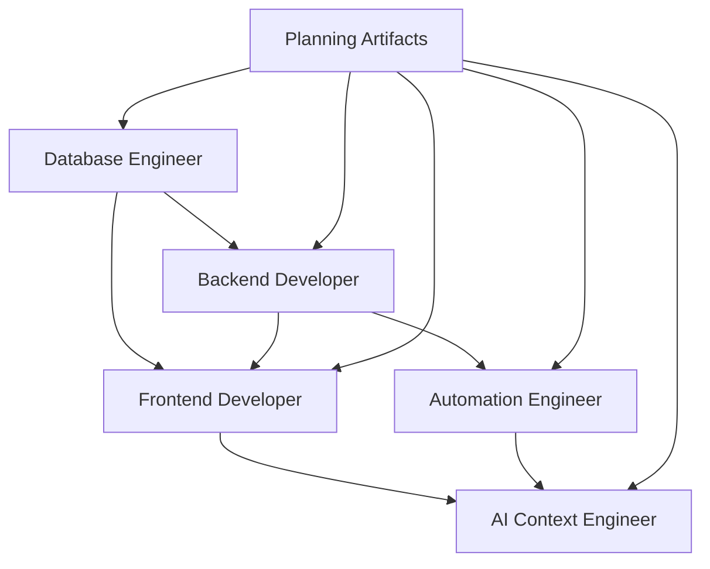

# Epoch Role-Based Implementation Guide

## Overview

This guide explains how to use the Epoch role-specific development prompts to transform planning artifacts (PRDs, implementation plans, GitHub issues) into working software. Each role prompt is designed to take planning outputs and create high-quality implementations with appropriate MCP tool integration.

## Implementation Workflow

### 1. Planning Phase (Already Complete)

Using the planning prompts in `/docs/ways-of-work/plan/`:

- ✅ Epic created: [#28 - Pantry Epic](https://github.com/craigbekker/epoch/issues/28)
- ✅ Feature created: [#29 - Recipe Library Management](https://github.com/craigbekker/epoch/issues/29)
- ✅ Technical enablers created: Database Schema (#30), tRPC API (#31), UI Components (#32), n8n Workflow (#33)
- ✅ User story created: [#34 - Recipe Grid View](https://github.com/craigbekker/epoch/issues/34)

### 2. Implementation Phase (Using Role Prompts)

#### Phase 1: Foundation Infrastructure

**Database Engineer** → Use `/prompts/roles/database-engineer.prompt.md`

- **Input**: Issue #30 - Database Schema & Migrations
- **Output**: PostgreSQL schema, Drizzle migrations, indexes
- **MCP Tools**: Database MCP for query testing and validation
- **Deliverables**:
  - `apps/web/drizzle/schema/recipes.ts`
  - Migration files in `apps/web/drizzle/`
  - Performance indexes and constraints

**Backend Developer** → Use `/prompts/roles/backend-developer.prompt.md`

- **Input**: Issue #31 - tRPC Recipe API Router
- **Dependencies**: Database schema (#30)
- **Output**: Type-safe tRPC endpoints
- **MCP Tools**: Database MCP for testing, GitHub MCP for PR management
- **Deliverables**:
  - `apps/web/src/server/api/routers/recipe.ts`
  - Input validation schemas
  - Error handling and authentication

#### Phase 2: User Interface Foundation

**Frontend Developer** → Use `/prompts/roles/frontend-developer.prompt.md`

- **Input**: Issue #32 - UI Foundation Components
- **Output**: Reusable React components
- **MCP Tools**: Playwright MCP for accessibility and interaction testing
- **Deliverables**:
  - `packages/ui/components/recipes/RecipeCard.tsx`
  - `packages/ui/components/recipes/RecipeGrid.tsx`
  - Storybook stories and component tests

#### Phase 3: Feature Implementation

**Frontend Developer** → Use `/prompts/roles/frontend-developer.prompt.md`

- **Input**: Issue #34 - Recipe Grid View User Story
- **Dependencies**: Database (#30), API (#31), Components (#32)
- **Output**: Complete recipe library page
- **MCP Tools**: Playwright MCP for comprehensive E2E testing
- **Deliverables**:
  - `apps/web/src/app/recipes/page.tsx`
  - Complete responsive recipe grid
  - Loading states, error handling, empty states

#### Phase 4: Intelligent Automation

**Automation Engineer** → Use `/prompts/roles/automation-engineer.prompt.md`

- **Input**: Issue #33 - n8n Recipe Import Workflow
- **Output**: Intelligent recipe import system
- **MCP Tools**: GitHub MCP for webhook setup, Memory MCP for pattern storage
- **Deliverables**:
  - n8n workflow for URL scraping
  - AI-powered recipe extraction
  - Vector embeddings for search

**AI Context Engineer** → Use `/prompts/roles/ai-context-engineer.prompt.md`

- **Input**: AI requirements from automation workflows
- **Output**: Sophisticated prompt systems and context management
- **MCP Tools**: Memory MCP for context storage, Sequential Thinking MCP for complex reasoning
- **Deliverables**:
  - Recipe extraction prompts
  - Context management systems
  - Personalization engines

## Role Integration Patterns

### Cross-Role Dependencies



### Handoff Protocols

#### Database → Backend

- **Database Engineer** provides:

  - Complete schema definitions
  - Migration scripts
  - Performance benchmarks
  - Query optimization recommendations

- **Backend Developer** receives:
  - Type-safe database access patterns
  - Optimized query examples
  - Performance constraints
  - Data access patterns

#### Backend → Frontend

- **Backend Developer** provides:

  - Complete tRPC type definitions
  - API documentation with examples
  - Error handling patterns
  - Authentication requirements

- **Frontend Developer** receives:
  - End-to-end type safety
  - Clear API contracts
  - Error handling guidance
  - Performance expectations

#### Frontend → Automation

- **Frontend Developer** provides:

  - User interaction patterns
  - Data requirements
  - Performance constraints
  - Integration points

- **Automation Engineer** receives:
  - User workflow understanding
  - Integration requirements
  - Performance targets
  - Data transformation needs

## MCP Tool Integration Strategy

### By Role

#### Database Engineer

- **Primary**: Database MCP for query execution and schema validation
- **Secondary**: GitHub MCP for migration deployment coordination
- **Usage Pattern**: Always validate queries and performance with Database MCP

#### Backend Developer

- **Primary**: Database MCP for testing data operations
- **Secondary**: GitHub MCP for PR management and issue linking
- **Usage Pattern**: Test all database operations and API endpoints

#### Frontend Developer

- **Primary**: Playwright MCP for comprehensive UI testing
- **Secondary**: GitHub MCP for PR creation with screenshots
- **Usage Pattern**: Always validate accessibility and user interactions

#### Automation Engineer

- **Primary**: GitHub MCP for webhook integration
- **Secondary**: Memory MCP for storing workflow patterns
- **Usage Pattern**: Validate all webhook endpoints and data flows

#### AI Context Engineer

- **Primary**: Memory MCP for context storage and retrieval
- **Secondary**: Sequential Thinking MCP for complex reasoning
- **Usage Pattern**: Store and retrieve context patterns for optimization

## Quality Standards

### Each Role Must Deliver

#### Database Engineer

- [ ] Schema passes all constraint tests
- [ ] Migrations are reversible and tested
- [ ] Query performance meets <100ms targets
- [ ] Database MCP validation completed
- [ ] Household data isolation verified

#### Backend Developer

- [ ] All endpoints are type-safe and validated
- [ ] Authentication and authorization implemented
- [ ] Error handling covers all edge cases
- [ ] Performance targets met (<500ms API responses)
- [ ] Database MCP query testing completed

#### Frontend Developer

- [ ] Components pass accessibility testing
- [ ] Responsive design works on all devices
- [ ] Playwright MCP validation completed
- [ ] Performance targets met (90+ Lighthouse score)
- [ ] User interactions are smooth and intuitive

#### Automation Engineer

- [ ] Workflows handle errors gracefully
- [ ] Integration points are thoroughly tested
- [ ] Performance optimization implemented
- [ ] Monitoring and observability included
- [ ] GitHub MCP webhook validation completed

#### AI Context Engineer

- [ ] Prompts are robust and reliable
- [ ] Context management is efficient
- [ ] Privacy requirements are met
- [ ] Error handling and fallbacks implemented
- [ ] Memory MCP context validation completed

## Implementation Commands

### Starting Implementation

For each role, use this pattern:

```bash
# Example: Backend Developer implementing tRPC API
copilot prompt --file=".github/prompts/roles/backend-developer.prompt.md" \
  --context="Issue #31: tRPC Recipe API Router" \
  --context="Database schema from #30" \
  --context="Feature requirements from #29"
```

### MCP Validation Commands

Each role should validate their work:

```bash
# Database Engineer
dbcode-execute-query --query="SELECT * FROM recipes LIMIT 1"

# Frontend Developer
mcp_playwright_browser_snapshot
mcp_playwright_browser_take_screenshot

# Automation Engineer
mcp_github_create_pull_request --title="Recipe Import Workflow"
```

## Success Metrics

### Overall Feature Success

- [ ] All user acceptance criteria met
- [ ] Performance benchmarks achieved
- [ ] Security requirements validated
- [ ] Accessibility standards met
- [ ] Cross-browser compatibility confirmed

### Role-Specific Success

- [ ] Database: Query performance and data integrity
- [ ] Backend: API performance and type safety
- [ ] Frontend: User experience and accessibility
- [ ] Automation: Workflow reliability and intelligence
- [ ] AI Context: Prompt effectiveness and context retention

This implementation guide ensures that each role delivers high-quality work that integrates seamlessly with other roles, leveraging the appropriate MCP tools for validation and testing throughout the development process.
