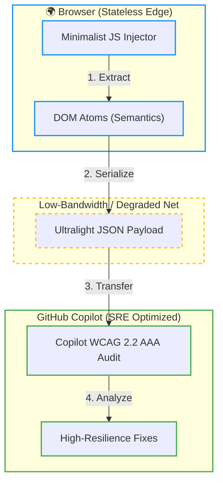

# Resilient WCAG 2.2 AAA Audit (Stateless Edge)

This recipe demonstrates how to perform accessibility audits using GitHub Copilot in environments with **degraded infrastructure** or **low bandwidth**.

<details>
  <summary>🔍 View Architectural Workflow Diagram</summary>
  

</details>

## Context
Standard accessibility tools often require heavy dependencies (Playwright, Puppeteer). In global health equity scenarios - core to the **BiotechProject** vision, we need a "Zero-Framework" approach that runs entirely at the Edge.

## The Recipe
1. **Extract:** Use a minimalist Vanilla JS script to snapshot the semantic DOM.
2. **Audit:** Pass the minimalist JSON to Copilot with specific agentic instructions.

### Step 1: Zero-Framework Snapshot
Run this in the browser console. It extracts only the "Atoms of Accessibility":

```javascript
const snapshot = Array.from(document.querySelectorAll('button, a, input, [role], h1, h2'))
  .map(el => ({
    t: el.tagName,
    r: el.getAttribute('role') || 'none',
    l: el.getAttribute('aria-label') || el.innerText.trim().slice(0, 30),
    f: el.tabIndex >= 0
  }));
console.log(JSON.stringify(snapshot));
```

#### **Step 2: Copilot Prompt**
"Analyze this accessibility snapshot for WCAG 2.2 AAA compliance. Focus on keyboard navigation and screen reader labels. Suggest fixes optimized for low-resource environments."

#### **Benefits**
**Stateless:** No server-side processing needed.
**Resilient:** Works on high-latency networks.
**Ethical:** Promotes global health equity by ensuring access for all.
