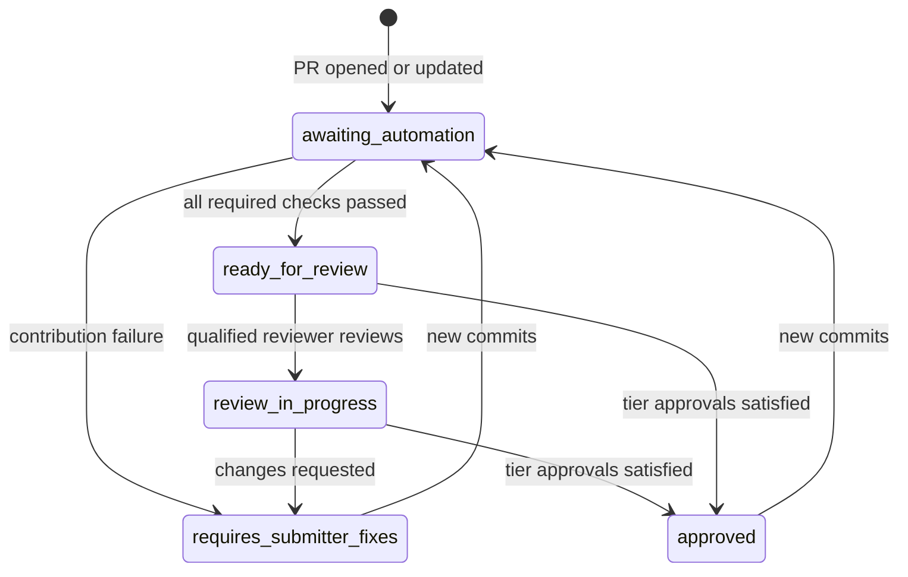

# Submission gate

The `submission-gate` check is the single required status for pull requests into `main`. It combines the repository's automated checks, a merge-risk tier, and the approvals that tier needs into one result. It also keeps the PR labels and a status comment current, so contributors and reviewers see the same state.

Tracking issue: [github/awesome-copilot#4184](https://github.com/github/awesome-copilot/issues/4184) (Phase 2, enforcement).

| Piece | Location |
|---|---|
| Aggregate check (reader) | [`.github/workflows/submission-gate.yml`](../../.github/workflows/submission-gate.yml), workflow **Submission Gate**, job `submission-gate` |
| Labels and status comment (writer) | [`.github/workflows/submission-gate-writer.yml`](../../.github/workflows/submission-gate-writer.yml), workflow **Submission Gate Writer** |
| PR commands | [`.github/workflows/pr-commands.yml`](../../.github/workflows/pr-commands.yml) |
| Checks the gate waits for | [`.github/submission-gate.yml`](../../.github/submission-gate.yml) |
| Risk tiers and approval policy | [`.github/risk-tiers.yml`](../../.github/risk-tiers.yml) |
| Reviewer pools (Phase 1) | `.github/review-routing.yml` |
| Logic and tests | [`eng/submission-gate.mjs`](../../eng/submission-gate.mjs), [`eng/submission-gate.test.mjs`](../../eng/submission-gate.test.mjs) |

## How the gate works

1. **Submission Gate** runs on every PR (`opened`, `synchronize`, `reopened`, `ready_for_review`) and on every review (`submitted`, `edited`, `dismissed`). It has no path filter, so it always reports.
2. It checks out the **base commit**, not the PR, and loads its logic and policy from there. A PR therefore can't change how it is judged. The one exception is the bootstrap PR that introduces the gate: the base has no gate yet, so the gate from the PR is used and a warning is logged.
3. It lists the PR's changed files and picks the checks in `.github/submission-gate.yml` whose `branches` and `paths` match. These filters mirror each workflow's own `pull_request` trigger. `eng/submission-gate.test.mjs` fails if they drift apart.
4. It polls the Actions runs for the PR head commit, every 30 seconds for up to 40 minutes. It stops early if a required check reports a contribution failure.
5. It classifies the merge-risk tier, evaluates reviews against that tier's approval policy, and computes the PR state.
6. The check **passes only when the state is `approved`**. That means every required check passed and the tier's approvals are present. Otherwise the run fails with a short reason, and the job summary shows the full status table.

Because a review re-runs the gate, the check turns green as soon as the last required approval arrives.

### Checks

| Check | Workflow | Applies when | Blocking |
|---|---|---|---|
| Line endings | `check-line-endings.yml` | every PR to `main` | yes |
| Generated README consistency | `validate-readme.yml` | resources, `docs/**`, `README.md` | yes |
| Plugin and extension validation | `validate-plugins.yml` | `plugins/**`, `extensions/**` | yes |
| Canvas extension validation | `validate-canvas-extensions.yml` | `extensions/**` | yes |
| Plugin structure | `check-plugin-structure.yml` | `plugins/**` | yes |
| Skill validation | `validate-skills.yml` (new, runs `npm run skill:validate`) | `skills/**` | yes |
| Skill lint (vally) | `skill-check.yml` | skills and agents | completion only |
| Submission gate tests | `validate-submission-gate.yml` | gate config, workflows | yes |
| Agentic workflow validation | `validate-agentic-workflows-pr.yml` | `workflows/**` | yes |
| Risk scan | `pr-risk-scan.yml` | resource directories | completion only |
| Contributor reputation | `contributor-check.yml` | every PR | completion only |
| Duplicate resource scan | `pr-duplicate-check.lock.yml` | every PR | advisory |
| PR quality signal | `pr-quality-signal.lock.yml` | every PR | advisory |
| Canvas/plugin smoke test | any job named `canvas-smoke-test` | `extensions/**`, `plugins/**` | yes, if it reports |

Notes on the rows above:

- **Completion only** means the workflow posts its findings as comments or labels and does not fail on them. The gate needs the workflow to finish; any failure of it is an infrastructure failure. The contributor reputation risk level also feeds the risk tier.
- **Advisory** checks never block. If they fail, the status comment shows a warning.
- **Canvas/plugin smoke test** is a pluggable slot matched by check-run name. Phase 3 of #4184 provides it. If no such check reports, the gate skips it.

To add a check, add an entry to `.github/submission-gate.yml`. Copy the workflow's `branches` and `paths` exactly, then run `node --test eng/submission-gate.test.mjs`.

## Infrastructure vs contribution failures

Every failed check falls into one of two categories. The status comment and the gate output show which one.

| Category | Meaning | What happens |
|---|---|---|
| ❌ **Contribution failure** | The check ran and found a problem in the PR, such as a stale README, an invalid plugin, or CRLF line endings. | State becomes `requires-submitter-fixes`. The comment shows the fix hint for that check. |
| 🔧 **Infrastructure failure** | The automation itself broke: runner or setup error, dependency install, checkout, artifact transfer, timeout, cancellation, a run waiting for maintainer approval, or a check that never reported. | State stays `awaiting-automation`. The contributor is told it isn't their fault and can comment `/rerun-checks`. |

A failed run is classified by its first failing step:

- The step matches the check's `contribution_steps` → contribution failure.
- The step matches the global `infrastructure_steps` (for example `Set up job`, `Install dependencies`, `Checkout`) → infrastructure failure.
- A failed step matching neither list → contribution failure, so real validation problems are never hidden.
- `timed_out`, `cancelled`, `startup_failure`, and `action_required` runs → always infrastructure failures.
- A required check that never reported → infrastructure failure. The gate declares it missing once everything else has finished and 8 minutes have passed, or when the gate times out.
- Checks marked `failure_kind: infrastructure` → every failure is an infrastructure failure. Use this for workflows that report findings rather than fail on them.

### Known intermittent failures in AI-assisted checks

We reviewed recent runs of the agentic advisory workflows on `github/awesome-copilot` while building the gate:

- **PR Quality Signal** (`pr-quality-signal.lock.yml`): 4 of the last 30 runs failed and 24 were skipped (fork PRs; the workflow does not opt into forks). Every failure was in the `agent` job, with `awf-reflect: models fetch returned 401`. The compiled lock authenticates Copilot inference with `secrets.COPILOT_GITHUB_TOKEN` (a PAT), which fails when that secret is missing, expired, or unlicensed. The fix is the same as `pr-duplicate-check`: add `copilot-requests: write` to the workflow permissions and recompile with gh-aw v0.88.8, the version the locks use. That recompile is a maintainer follow-up.
- **PR Duplicate Check** (`pr-duplicate-check.lock.yml`): 27 of 30 runs succeeded. It already uses `copilot-requests: write` with the Actions token. The 2 failures were intermittent inference 401s.

Both workflows only post advisory comments, so the gate lists them as `required: false` with `failure_kind: infrastructure`. They must finish or fail before the gate shows them as done, but their failures never block a PR. The comment shows a ⚠️ warning instead.

## Merge-risk tiers

Automation applies **exactly one** of `merge-risk:low`, `merge-risk:medium`, `merge-risk:high` to each open PR. Tiers are evaluated in this order; the first match wins.

### High

A PR is high risk if any of these apply:

- **Any changed file matches a high-risk path:**
  - Review policy and automation: `.github/**` (includes workflows, `CODEOWNERS`, `.github/review-routing.yml`, `.github/risk-tiers.yml`, `.github/submission-gate.yml`), `CODEOWNERS`, `docs/CODEOWNERS`
  - Build and repository scripts: `eng/**`, `scripts/**`, `package.json`, `package-lock.json`
  - Agentic workflows and hooks: `workflows/**`, `hooks/**`, `plugins/**/hooks/**`
  - MCP configuration: `**/mcp.json`, `**/.mcp.json`
  - Bundled executables: `**/*.sh`, `**/*.bash`, `**/*.ps1`, `**/*.psm1`, `**/*.bat`, `**/*.cmd`, `**/*.py`, `skills/**/scripts/**`, `plugins/**/scripts/**`
  - External code sources: `plugins/external.json`
  - Generated `.github/plugin/marketplace.json` is excluded.
- **An added diff line matches a capability trigger:**
  - Process execution (`child_process`, `spawn(`, `execSync(`, `eval(`, `new Function`, `node:vm`) in extensions, plugins, skills, or the website
  - Piping a downloaded script into a shell (`curl … | bash`, `irm … | iex`, `Invoke-Expression`)
  - MCP server or hook `command` declarations in plugin, extension, or skill JSON
- **Contributor risk is high:** the PR has the `needs-review:HIGH` label, or the contributor reputation artifact for the head commit reports `HIGH`. This signal can raise the tier but never lower it.

### Low

A PR is low risk if either of these applies:

- Every changed file is documentation, metadata, generated output, or an image: `docs/**`, root `README.md`, `CONTRIBUTING.md`, `CODE_OF_CONDUCT.md`, `SECURITY.md`, `SUPPORT.md`, `LICENSE`, `.all-contributorsrc`, `.github/plugin/marketplace.json`, or image files.
- It is a small update to existing resources: every file is *modified* (none added, removed, or renamed), each is a docs path or under `agents/`, `instructions/`, `skills/`, `plugins/`, or `extensions/`, and the total change is at most 40 lines.

### Medium

Everything else, for example a new agent, skill, plugin, or canvas extension, or a larger rewrite of an existing resource.

The status comment includes a collapsed "Why this tier" list with the reasons that applied.

### Approval policy

| Tier | Required approvals |
|---|---|
| `merge-risk:low` | 1 approval from a reviewer with write access |
| `merge-risk:medium` | 1 approval from a domain reviewer for the area touched |
| `merge-risk:high` | 2 approvals, including a core or security maintainer |

How approvals are counted:

- A reviewer's **latest** decisive review counts: `APPROVED`, `CHANGES_REQUESTED`, or `DISMISSED`. A later comment-only review does not reset an approval.
- The PR author and bots never count.
- An approval qualifies if the reviewer has write, maintain, or admin permission, or is listed in any pool in `.github/review-routing.yml`.
- Any outstanding `CHANGES_REQUESTED` from a qualified reviewer blocks the gate and sets the state to `requires-submitter-fixes`.

Domain reviewers come from the Phase 1 routing file. The `domains` section of `.github/risk-tiers.yml` maps paths to pools:

| Area | Paths | Pool |
|---|---|---|
| Canvas | `extensions/**` | `canvas` |
| Plugin | `plugins/**` | `plugin` |
| Content | `agents/**`, `instructions/**`, `skills/**` | `content` |
| Workflow/security | `workflows/**`, `hooks/**`, `.github/workflows/**` | `workflow-security` |

The core pools are `core-maintainers` and `workflow-security`. Members of a core pool also satisfy the domain requirement.

If routing isn't staffed yet, the gate falls back instead of blocking:

- **`.github/review-routing.yml` missing, or the matching domain pools empty:** any approver with write access satisfies the domain requirement.
- **Both core pools empty:** a high-risk PR needs one of its two approvals from a user with `admin` or `maintain` permission.

The status comment shows a note whenever a fallback is in effect.

## PR states

Each open PR has **exactly one** state label. PRs labeled `external-plugin` are the exception: the external plugin intake workflows own the shared state labels there, so only the risk label and status comment are managed.

| Label | Meaning |
|---|---|
| `awaiting-automation` | Required checks are still running, or one hit an infrastructure failure |
| `requires-submitter-fixes` | A required check found a contribution problem, or a reviewer requested changes |
| `ready-for-review` | All required checks passed; waiting for a reviewer |
| `review-in-progress` | A qualified reviewer has reviewed, but the tier's approvals aren't all in yet |
| `approved` | Checks passed and the tier's approvals are satisfied; `submission-gate` is green |

When several conditions hold, the first one in this order wins: `requires-submitter-fixes`, `awaiting-automation`, `approved`, `review-in-progress`, `ready-for-review`.

### Status comment

The writer keeps one comment per PR, marked with `<!-- submission-gate-status -->` and updated in place. It shows:

- the state and risk tier, with the reasons for the tier
- every applicable check with its outcome and log link
- action items: contribution fixes, infrastructure retries, advisory warnings
- approval progress and what is still needed
- the assigned reviewers (requested reviewers and teams) and the review target date from Phase 1's `review-due:YYYY-MM-DD` label
- the available commands

## Commands

Comment one of these as the first line of a PR comment.

| Command | Who can run it | What it does |
|---|---|---|
| `/rerun-checks` | PR author; users with write, maintain, or admin | Re-runs the failed jobs of every failed, cancelled, or timed-out workflow run for the head commit, re-runs the gate, and refreshes the status comment |
| `/request-review` | PR author; users with write, maintain, or admin | Adds `needs-reviewer` and dispatches Phase 1's `review-routing.yml` on `main`, which assigns a reviewer and sets `review-due:*` |

Other details:

- Runs waiting for a maintainer to approve workflows for first-time contributors (`action_required`) can't be re-run by a command; the reply says so.
- Commands from bots, and from anyone else, are ignored silently.
- The workflow reacts with 👀 and replies with a short summary.

## Security model

- **Reader/writer split.** The gate runs in the `pull_request` context with a read-only token. It never writes labels or comments. **Submission Gate Writer** runs on `workflow_run`, hourly `schedule`, and `workflow_dispatch` with default-branch code. It rebuilds the whole evaluation from the GitHub API, so it doesn't trust artifacts from PR runs. It maps a run to a PR only when the head SHA, head repository, head branch, and base repository all match.
- **Only trusted code runs.** No workflow here executes PR code with a write token. The gate loads its logic from the base commit, except in the bootstrap case described above, which still has only a read-only token. The writer and command workflows check out the default branch and install dependencies with `npm ci --ignore-scripts`.
- **Contributor reputation artifact.** It is used only as a raise-only signal. It must match schema `contributor-check-result/v1` and the PR head SHA.
- **Untrusted text.** Comment bodies are read from the event payload and never interpolated into scripts. Reviewer logins, check names, and details are sanitized before they go into markdown.
- **Tampering with the gate.** A PR can edit `.github/workflows/submission-gate.yml` itself. That edit makes the PR `merge-risk:high`, which requires 2 approvals including a core or security maintainer, and the trusted writer still computes the labels. The ruleset should also require `submission-gate` from the GitHub Actions app so that no other source can satisfy it.
- **Rate limits.** The hourly writer sweep refreshes at most 60 open PRs updated in the last 30 days, so a large backlog stays within API rate limits.

## Maintainer follow-up

These steps need repository-admin action and are not done by automation:

- **Require `submission-gate`** in the `main` ruleset, with GitHub Actions as the source.
- **Create the new labels** by running the **Setup Repository Labels** workflow: `awaiting-automation`, `review-in-progress`, `merge-risk:*`.
- **Staff the pools** in `.github/review-routing.yml` so the domain and core requirements stop using fallbacks.
- **Fix PR Quality Signal auth:** add `copilot-requests: write` to `.github/workflows/pr-quality-signal.md` and recompile with gh-aw v0.88.8.
