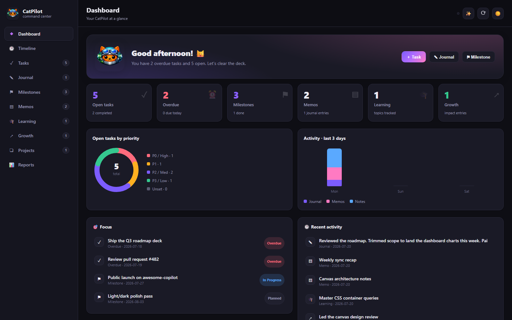

# CatPilot Canvas

A beautiful, modern **GitHub Copilot canvas extension** that turns [CatPilot](https://github.com/tanure/cat-copilot) into a visual command center — manage everything CatPilot tracks without leaving the Copilot app.

## What it does

The canvas reads and writes the **same** config-driven storage as the CatPilot CLI, agent, skills, and MCP server, so every surface stays in sync.

- **Dashboard** — hero greeting, summary cards, an open-tasks-by-priority donut, a last-3-days activity chart, a focus list and a recent-activity feed.
- **Tasks** — switch between **list (table)** and **board (kanban)** views, complete inline, edit/save locally, and open a detail popup.
- **Journal, Milestones, Memos, Learning, Growth, Projects** — browse, add, and open full detail views.
- **Reports** — generate GitHub Copilot **executive reports** for any period (this week, last month, all time…) and open them as markdown or HTML.
- **Timeline** — a 7/14/30-day activity rail grouped by day, with one-click **agent actions**.
- **Settings** — an interactive config wizard that **previews** exactly which files a storage/partition change would move, gated behind an explicit approval before anything is migrated.
- **Help** — an in-canvas capabilities guide.
- **Markdown everywhere** — every text field has a formatting toolbar, a live preview toggle, and a **Generate with Copilot** button. A global **Ask Copilot** button hands any prompt to the agent.
- **Light / dark** theme toggle.

## Assets

- `assets/preview.png` — dashboard screenshot used for the extension card.

## Author

Built by [Albert Tanure](https://github.com/tanure). Source: [tanure/cat-copilot](https://github.com/tanure/cat-copilot).
