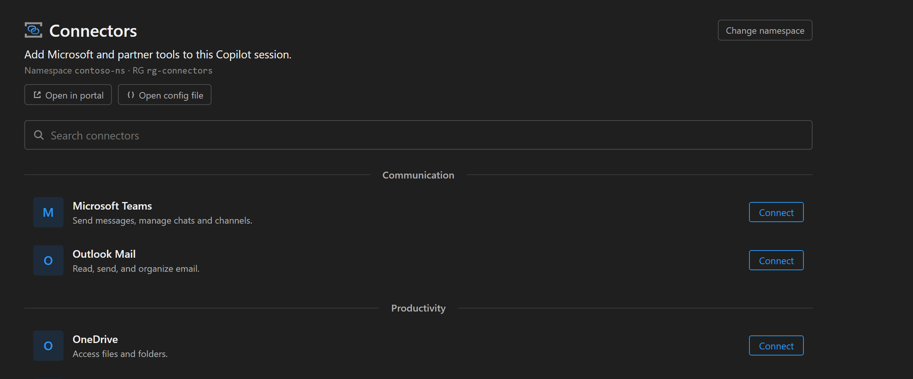

# MCP Connectors

A Copilot CLI canvas extension for browsing and adding [Model Context Protocol (MCP)](https://modelcontextprotocol.io) connectors from an Azure Connector Namespace directly inside your Copilot session.

## What it does

Opens an interactive canvas in Copilot where you can:

- Browse the MCP connectors published to your Azure Connector Namespace.
- Search and filter connectors by name or category.
- Add a connector to your session with one click to enable its tools.

Once added, the connector's MCP tools become available to Copilot for the rest of your session.

## Prerequisites

- An Azure account with access to a **Connector Namespace** (the `Microsoft.Web/connectorGateways` resource). If you don't have one yet, the canvas links you to creating one.
- A modern web browser for sign-in.

You do **not** need the Azure CLI installed. The extension signs you in through your browser the first time it needs to talk to Azure.

## Usage

1. Install the extension and open the **MCP Connectors** canvas in Copilot.
2. The first time the canvas needs Azure, a browser tab opens for sign-in. Complete sign-in and return to Copilot.
3. Pick the subscription that holds your Connector Namespace.
4. Browse or search the available connectors and add the ones you want.

If a subscription has no Connector Namespace, the canvas shows a short setup guide instead of an empty list.

## How sign-in works

Authentication uses the standard OAuth 2.0 authorization-code flow with PKCE against the well-known Azure CLI public client. A short-lived loopback HTTP listener captures the redirect, exchanges the code for an Azure Resource Manager token, and caches it for reuse. No client secret is used. The refresh token is cached under your Copilot home directory (`~/.copilot/extensions/connector-namespaces/artifacts/auth-cache.json`, written with owner-only `0600` permissions) so you are not prompted to sign in every session. Tokens are refreshed silently until the refresh token itself expires, after which you sign in once more.

All Azure Resource Manager calls are restricted to the public ARM endpoint (`management.azure.com`); the extension does not contact any other host.

## License

[MIT](LICENSE)
