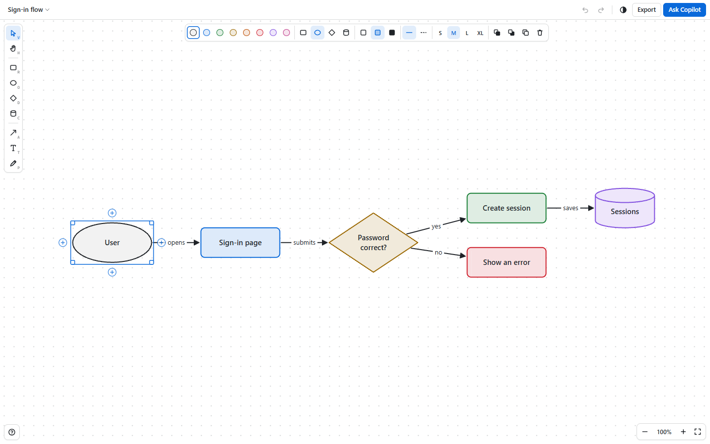

# Draw

Draw simple diagrams in a GitHub Copilot app canvas: boxes, ellipses, diamonds and databases joined by arrows that stay attached, plus text and a freehand pen. You and Copilot work on the same drawing.



## What it does

- Draws rectangles, ellipses, diamonds, databases, arrows, text and freehand pen strokes. Arrows stay attached when you move shapes.
- Connects shapes quickly: hover a shape and drag a **+** handle to another shape, or click **+** (or select the shape and press `Tab`) to add the next step.
- Styles shapes and arrows with 8 colors, 3 fills, dashed lines, 4 text sizes, arrow heads, and straight, elbow or curved routes.
- Snaps to a grid, and supports zoom, pan, undo, redo, copy, paste and duplicate.
- Keeps several drawings per session. Switch, rename, duplicate or delete them from the drawing menu.
- Exports PNG or SVG files, or copies the drawing as an image.
- **Ask Copilot** sends the drawing to the chat with your question, both as an image and as a text outline with element ids.
- Matches the Copilot app's light or dark theme, or stays light or dark if you prefer.

## Install

Ask Copilot to install the extension:

```text
Install this extension: https://github.com/github/awesome-copilot/tree/main/extensions/draw
```

Reload extensions, then ask Copilot to open the `draw` canvas.

## Drawing with Copilot

Ask in the chat, for example "Draw how our sign-in flow works" or "Add a cache between the API and the database". Copilot's changes show up live, and you can undo them in the canvas. The canvas provides these actions:

| Action | What it does |
| --- | --- |
| `get_drawing` | Reads the drawing as an outline with element ids, plus what the user has selected |
| `set_diagram` | Replaces the drawing with nodes and edges, laid out automatically |
| `add_elements` | Adds nodes, edges and text next to what is already there |
| `update_elements` | Changes labels, shapes, colors, sizes, positions and arrow ends |
| `delete_elements` | Deletes elements, and any arrows attached to deleted shapes |
| `layout` | Re-arranges the shapes into neat layers that follow the arrows |
| `clear` | Removes everything |
| `export_image` | Saves a PNG or SVG and returns its path, so Copilot can look at the result |
| `list_drawings` | Lists the drawings in this session |
| `open_drawing` | Shows another drawing, or creates a new one |
| `select_elements` | Selects elements to point them out to the user |
| `set_theme` | Switches between matching the app, light and dark |

## Keyboard shortcuts

Press `?` in the canvas to see all of them. On macOS, use `Cmd` instead of `Ctrl`.

| Keys | Action |
| --- | --- |
| `V`, `H` | Select, pan |
| `R`, `O`, `D`, `C` | Rectangle, ellipse, diamond, database |
| `A`, `T`, `P` | Arrow, text, pen |
| `Tab` | Add the next step to the selected shape (`Shift+Tab` adds a sibling) |
| `Enter` or double-click | Edit a label |
| `Ctrl+Arrow` | Add a shape in that direction |
| `Ctrl+Z`, `Ctrl+Shift+Z` | Undo, redo |
| `Shift+1` | Fit the drawing on screen |

## Where your data goes

- Drawings are JSON files in the current session's `files/drawings` folder, and exports are saved in `files/drawings/exports`. Each session has its own drawings.
- If a drawing can't be written to disk, the canvas says so, keeps your changes in memory and keeps trying to save them.
- The theme choice is saved in `~/.copilot/draw/settings.json` (under `COPILOT_HOME` when it is set) and applies to every session.

## Security

The canvas is served by a local server that listens on `127.0.0.1` on a random port. It checks the `Host` header, requires a random per-server token on every API request, and sends a content security policy that only allows scripts and connections from itself. The extension has no dependencies besides the Copilot SDK and makes no requests to the internet. The only process it starts is your file manager (Explorer, Finder or `xdg-open`), when you choose **Show in folder** after an export.

## Tests

The tests use Node's built-in test runner, so there is nothing to install. From this folder, run:

```sh
node --test
```
