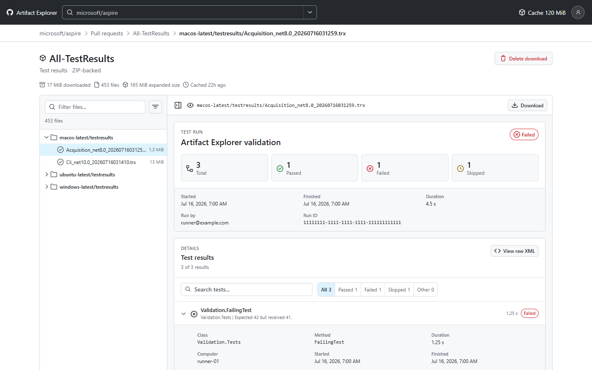

# Artifact Explorer

> **GitHub, the missing parts:** GitHub Actions makes artifacts easy to produce, but pull-request reviewers still have to download opaque ZIP files and inspect them out of context. Artifact Explorer turns those artifacts into a fast, GitHub-native, navigable experience inside Copilot.

Artifact Explorer is a community-built Copilot canvas extension with the internal extension ID `pr-artifact-explorer`. It is not an official GitHub product or endorsed feature.

<picture>
  <source media="(prefers-color-scheme: dark)" srcset="assets/preview-dark.png">
  <source media="(prefers-color-scheme: light)" srcset="assets/preview.png">
  
</picture>

## What it does

- Navigates repositories, pull requests, artifacts, and files with persistent breadcrumbs.
- Loads pull requests progressively, caches result pages, and supports query filters for fast review.
- Downloads an artifact once, indexes its ZIP, and streams entries directly from the archive without extracting them to disk.
- Previews root-level static sites in a sandboxed loopback frame when the artifact contains `index.html`.
- Plays asciinema terminal recordings and renders structured TRX test reports.
- Syntax-highlights JSON and XML, previews images and PDFs, renders text with safe escaping, and identifies binary content.
- Keeps large files available for direct download and falls back to the original artifact archive when a ZIP entry uses an unsupported encoding.
- Provides per-artifact cleanup, clear-all cleanup, and a cache usage view.
- Uses a responsive Primer interface that follows Copilot's light and dark themes.

## Security and local data

Artifact Explorer inherits eligible GitHub accounts from the Copilot app, GitHub CLI, or process environment. Tokens remain inside the extension process: the canvas receives only sanitized account metadata, while authenticated GitHub API requests are made by the local extension server.

Artifact ZIPs and preferences are stored under:

```text
$COPILOT_HOME/extensions/pr-artifact-explorer/artifacts/
```

When `COPILOT_HOME` is unset, it defaults to `~/.copilot`. Cached archives remain local until removed through the per-artifact or clear-all controls.

Static-site previews bind to an ephemeral `127.0.0.1` port, apply a restrictive content security policy, prevent path traversal, and stream files from the ZIP. A preview requires `index.html` at the artifact root. Static content is untrusted, remains sandboxed by the canvas, and has no access to GitHub tokens.

## Install

Ask Copilot to install the committed extension:

```text
Install this extension: https://github.com/github/awesome-copilot/tree/main/extensions/pr-artifact-explorer
```

You can also copy the folder to one of the supported extension locations:

- `~/.copilot/extensions/pr-artifact-explorer/` for user scope
- `.github/extensions/pr-artifact-explorer/` for project scope

Reload extensions, then ask Copilot to open the `pr-artifact-explorer` canvas. You can optionally provide a repository (`owner/name`), pull request number, or GitHub pull request URL when opening it.

## Agent actions

- `open_pull_request { repository, pullNumber }` - navigate an open canvas to a pull request.
- `inspect_artifact { repository, artifactId }` - download, index, detect, and open an Actions artifact.
- `cache_status` - report local artifact cache usage.
- `clear_cache { artifactId? }` - remove one cached artifact or clear the entire cache.
- `accounts` - list sanitized GitHub account metadata available to the extension.
- `set_account { id }` - select the GitHub account used for repository and artifact requests.

## Included third-party components

The extension bundles Primer CSS, Octicons, and the asciinema player for offline rendering. Their notices are preserved in `third-party-licenses/`.
