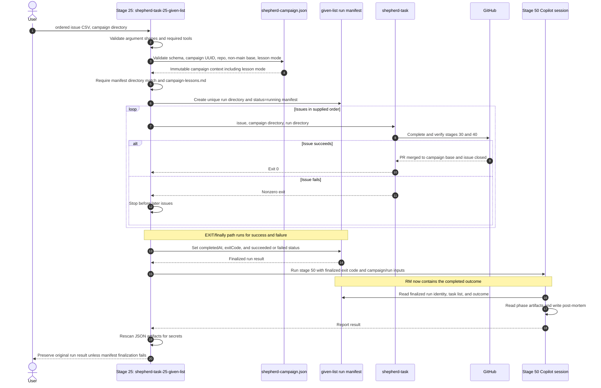

# Figure 01 — Stage 25 given-list batch orchestration

Stage 25 (`shepherd-task-25-given-list`) owns one serial run. It validates the durable campaign
manifest, creates a run manifest, dispatches issues one at a time, stops at the
first failure, finalizes the run manifest, and then invokes the post-mortem path
with that finalized result.

The run directory name is
`shepherd-tasks-<campaign-uuid>-YYYYMMDD-HHMM`. A retry is a new stage 25
invocation and therefore a new run directory and run manifest.
