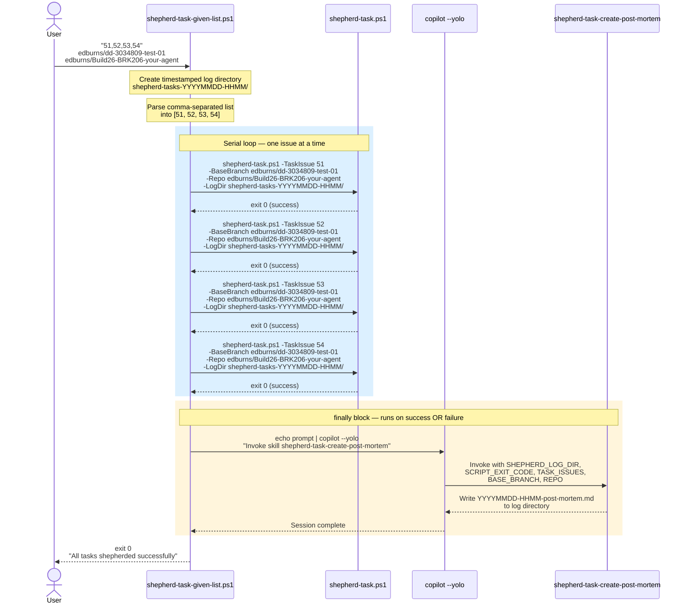

# Figure 01: shepherd-task-given-list — Batch Dispatch

This diagram shows the highest-level orchestration: how `shepherd-task-given-list.ps1` takes a comma-separated list of issue numbers and dispatches them serially.

## Example Invocation

```powershell
shepherd-task-given-list.ps1 "51,52,53,54" edburns/dd-3034809-test-01 edburns/Build26-BRK206-your-agent
```

## Sequence Diagram



## Failure Behavior

If any `shepherd-task.ps1` invocation fails (non-zero exit), the loop stops immediately at that issue. The `finally` block still runs, invoking the post-mortem skill with the non-zero exit code so that a failure report is always generated.
