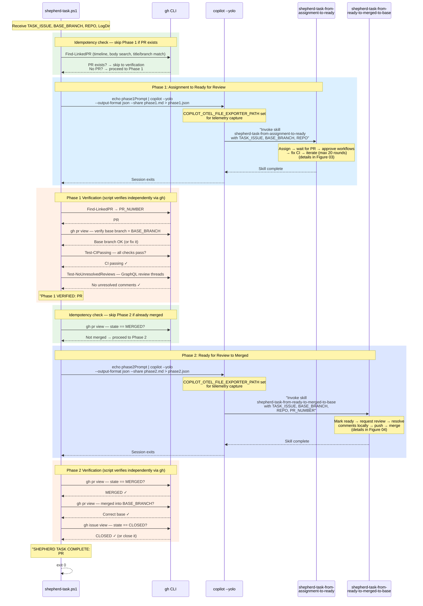

# Figure 02: shepherd-task — Single Issue Orchestration

This diagram drills down into what happens inside `shepherd-task.ps1` for a single issue. It shows the two phases, the `copilot --yolo` sessions that invoke skills, and the independent state verification between phases.

## Sequence Diagram

## Key Design Points

- **Scripts verify state independently** — they don't trust `copilot` exit codes; they use `gh` CLI to confirm PR existence, CI status, and merge state between phases.
- **Idempotent** — if a PR already exists for the issue, Phase 1 is skipped. If already merged, Phase 2 is skipped. Safe to re-run after failures.
- **Each phase runs in a separate `copilot --yolo` session** — the skill instructions are read fresh each time.
