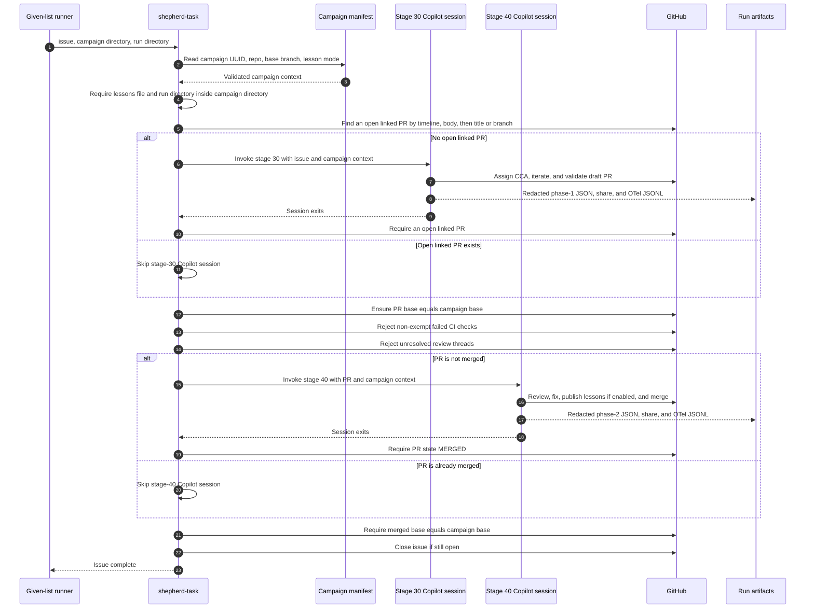

# Figure 02 — One-issue orchestration

`shepherd-task` receives only the task issue, campaign metadata directory, and
existing given-list run directory. It derives repository, base branch, campaign
UUID, and lesson mode from `shepherd-campaign.json`.

```mermaid
sequenceDiagram
    autonumber
    participant GL as Given-list runner
    participant ST as shepherd-task
    participant CM as Campaign manifest
    participant P1 as Stage 30 Copilot session
    participant P2 as Stage 40 Copilot session
    participant GH as GitHub
    participant Art as Run artifacts

    GL->>ST: issue, campaign directory, run directory
    ST->>CM: Read campaign UUID, repo, base branch, lesson mode
    CM-->>ST: Validated campaign context
    ST->>ST: Require lessons file and run directory inside campaign directory
    ST->>GH: Find an open linked PR by timeline, body, then title or branch

    alt No open linked PR
        ST->>P1: Invoke stage 30 with issue and campaign context
        P1->>GH: Assign CCA, iterate, and validate draft PR
        P1-->>Art: Redacted phase-1 JSON, share, and OTel JSONL
        P1-->>ST: Session exits
        ST->>GH: Require an open linked PR
    else Open linked PR exists
        ST->>ST: Skip stage-30 Copilot session
    end

    ST->>GH: Ensure PR base equals campaign base
    ST->>GH: Reject non-exempt failed CI checks
    ST->>GH: Reject unresolved review threads

    alt PR is not merged
        ST->>P2: Invoke stage 40 with PR and campaign context
        P2->>GH: Review, fix, publish lessons if enabled, and merge
        P2-->>Art: Redacted phase-2 JSON, share, and OTel JSONL
        P2-->>ST: Session exits
        ST->>GH: Require PR state MERGED
    else PR is already merged
        ST->>ST: Skip stage-40 Copilot session
    end

    ST->>GH: Require merged base equals campaign base
    ST->>GH: Close issue if still open
    ST-->>GL: Issue complete
```

The outer script does not trust a successful Copilot process exit as proof of
completion. It re-queries GitHub after each phase. The stage skills perform the
deeper issue, SHA, CI, review, and lesson gates shown in Figures 03 and 04.
