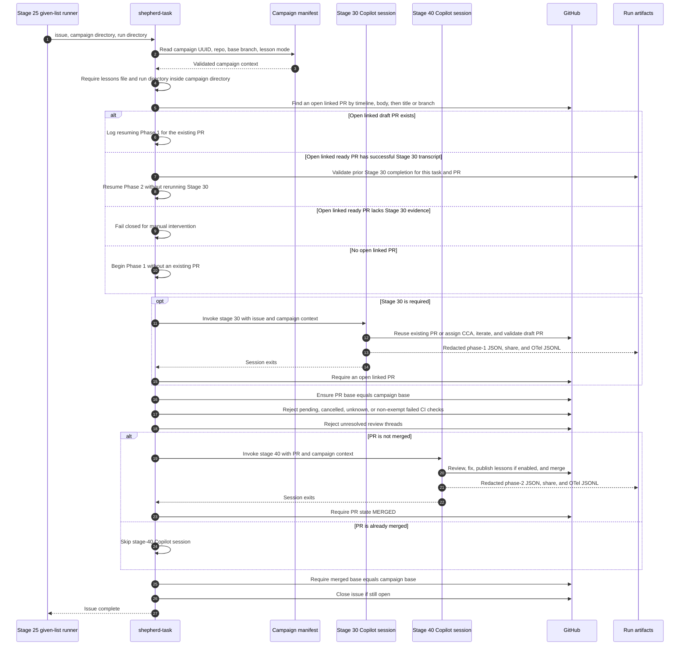

# Figure 02 — One-issue orchestration

`shepherd-task` receives only the task issue, campaign metadata directory, and
existing given-list run directory. It derives repository, base branch, campaign
UUID, and lesson mode from `shepherd-campaign.json`.

```mermaid
sequenceDiagram
    autonumber
    participant GL as Stage 25 given-list runner
    participant ST as shepherd-task
    participant CM as Campaign manifest
    participant P1 as Stage 30 Copilot session
    participant P2 as Stage 40 Copilot session
    participant GH as GitHub
    participant Art as Run artifacts

    GL->>ST: issue, campaign directory, run directory
    ST->>CM: Read campaign UUID, repo, base branch, lesson mode
    CM-->>ST: Validated campaign context
    ST->>ST: Require lessons file and run directory inside campaign directory
    ST->>GH: Find an open linked PR by timeline, body, then title or branch

    alt Open linked draft PR exists
        ST->>ST: Log resuming Phase 1 for the existing PR
    else Open linked ready PR has successful Stage 30 transcript
        ST->>Art: Validate prior Stage 30 completion for this task and PR
        ST->>ST: Resume Phase 2 without rerunning Stage 30
    else Open linked ready PR lacks Stage 30 evidence
        ST->>ST: Fail closed for manual intervention
    else No open linked PR
        ST->>ST: Begin Phase 1 without an existing PR
    end
    opt Stage 30 is required
        ST->>P1: Invoke stage 30 with issue and campaign context
        P1->>GH: Reuse existing PR or assign CCA, iterate, and validate draft PR
        P1-->>Art: Redacted phase-1 JSON, share, and OTel JSONL
        P1-->>ST: Session exits
        ST->>GH: Require an open linked PR
    end

    ST->>GH: Ensure PR base equals campaign base
    ST->>GH: Reject pending, cancelled, unknown, or non-exempt failed CI checks
    ST->>GH: Reject unresolved review threads

    alt PR is not merged
        ST->>P2: Invoke stage 40 with PR and campaign context
        P2->>GH: Review, fix, publish lessons if enabled, and merge
        P2-->>Art: Redacted phase-2 JSON, share, and OTel JSONL
        P2-->>ST: Session exits
        ST->>GH: Require PR state MERGED
    else PR is already merged
        ST->>ST: Skip stage-40 Copilot session
    end

    ST->>GH: Require merged base equals campaign base
    ST->>GH: Close issue if still open
    ST-->>GL: Issue complete
```

The outer script does not trust a successful Copilot process exit as proof of
completion. It re-queries GitHub after each phase. An existing open linked PR
resumes Stage 30 without a second CCA assignment while the PR is draft. If a
prior Stage 40 attempt already made the PR ready, the runner resumes Stage 40
only after validating a successful Stage 30 transcript for that exact task and
PR in the supplied run directory. The stage skills perform the deeper issue,
SHA, CI, review, and lesson gates shown in Figures 03 and 04.
The outer CI postcondition independently requires every reported check bucket
to be terminal and acceptable; JSON-mode exit status alone is not treated as
proof that pending checks completed.
