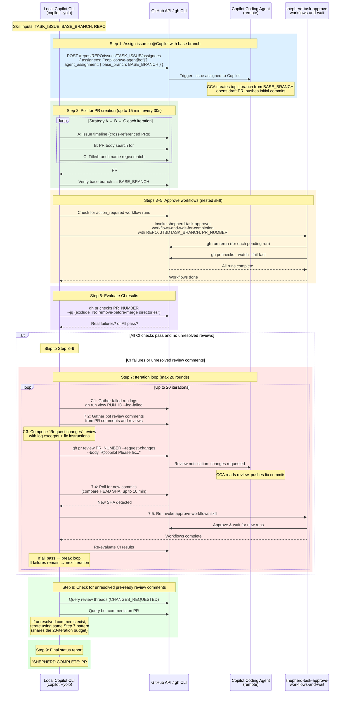

# Figure 03: From Assignment to Ready for Review

This diagram shows the detail of the `shepherd-task-from-assignment-to-ready` skill, including its nested invocation of `shepherd-task-approve-workflows-and-wait-for-completion`. All of this runs inside a single `copilot --yolo` session (the Local Copilot CLI), which orchestrates interaction with the remote Copilot Coding Agent (CCA) via the GitHub API.

## Sequence Diagram

## Notes

- The Local Copilot CLI acts as the **orchestrator** — it never modifies code itself in this phase. All code changes are made by the **remote Copilot Coding Agent (CCA)**.
- The `agent_assignment.base_branch` API parameter is the only reliable way to set the base branch. The simpler `gh issue edit --add-assignee` does not support this parameter, causing CCA to default to `main`.
- The "No remove-before-merge directories" CI failure is always ignored — it is expected on feature branches.
- The 20-iteration budget is shared between CI fix iterations (Step 7) and pre-ready review comment iterations (Step 8).
