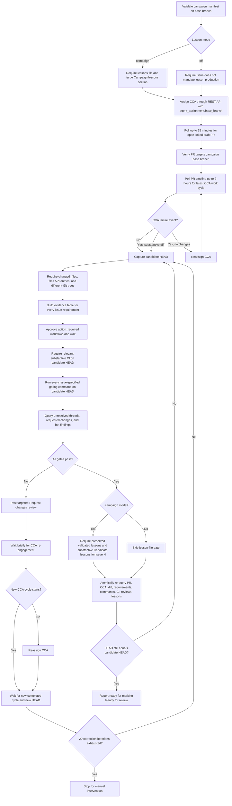

# Figure 03 — Stage 30: assignment to the Ready boundary

Stage 30 leaves the PR open and draft. It reports completion only after every
readiness gate passes against one unchanged PR head.

```mermaid
flowchart TD
    A[Validate campaign manifest on base branch] --> B{Lesson mode}
    B -->|campaign| C[Require lessons file and issue Campaign lessons section]
    B -->|off| D[Require issue does not mandate lesson production]
    C --> E[Assign CCA through REST API with agent_assignment.base_branch]
    D --> E
    E --> F[Poll up to 15 minutes for open linked draft PR]
    F --> G[Verify PR targets campaign base branch]
    G --> H[Poll PR timeline up to 2 hours for latest CCA work cycle]
    H --> I{CCA failure event?}
    I -->|No| J[Capture candidate HEAD]
    I -->|Yes, substantive diff| J
    I -->|Yes, no changes| K[Reassign CCA]
    K --> H
    J --> L[Require changed_files, files API entries, and different Git trees]
    L --> M[Build evidence table for every issue requirement]
    M --> N[Approve action_required workflows and wait]
    N --> O[Require relevant substantive CI on candidate HEAD]
    O --> P[Run every issue-specified gating command on candidate HEAD]
    P --> Q[Query unresolved threads, requested changes, and bot findings]
    Q --> R{All gates pass?}
    R -->|No| S[Post targeted Request changes review]
    S --> T[Wait briefly for CCA re-engagement]
    T --> U{New CCA cycle starts?}
    U -->|No| V[Reassign CCA]
    U -->|Yes| W[Wait for new completed cycle and new HEAD]
    V --> W
    W --> X{20 correction iterations exhausted?}
    X -->|No| J
    X -->|Yes| FAIL[Stop for manual intervention]
    R -->|Yes| Y{campaign mode?}
    Y -->|Yes| Z[Require preserved validated lessons and substantive Candidate lessons for issue N]
    Y -->|No| AA[Skip lesson-file gate]
    Z --> AB[Atomically re-query PR, CCA, diff, requirements, commands, CI, reviews, lessons]
    AA --> AB
    AB --> AC{HEAD still equals candidate HEAD?}
    AC -->|No| J
    AC -->|Yes| DONE[Report ready for marking Ready for review]
```

Expected failures from the repository’s remove-before-merge path check are
excluded, but skipped relevant CI is not treated as success. A timeout, missing
test environment, or untestable acceptance criterion is a failure rather than
permission to advance.
