# Figure 04: From Ready for Review to Merged

This diagram shows the detail of the `shepherd-task-from-ready-to-merged-to-base` skill. Unlike Phase 1 (which relies on the remote Copilot Coding Agent), this phase resolves review comments **locally** using a git worktree, with dialog between the Copilot Code Review Agent (CCRA) and the local Copilot CLI session.

## Sequence Diagram

```mermaid
sequenceDiagram
    participant CLI as Local Copilot CLI<br/>(copilot --yolo)
    participant GitHub as GitHub API / gh CLI
    participant CCRA as Copilot Code Review<br/>Agent (remote)
    participant Worktree as Git Worktree<br/>(../review-copilot-pr-N)
    participant ApproveWF as shepherd-task-approve-<br/>workflows-and-wait

    Note over CLI: Skill inputs: TASK_ISSUE, BASE_BRANCH, REPO, PR_NUMBER

    rect rgb(220, 240, 255)
        Note over CLI,CCRA: Step 0–1: Find PR, mark ready, request review
        CLI->>GitHub: Find PR via timeline/body/title strategies
        CLI->>GitHub: gh pr ready PR_NUMBER
        CLI->>GitHub: gh pr edit --add-reviewer<br/>copilot-pull-request-reviewer
        Note over CCRA: CCRA begins analyzing the PR diff
    end

    rect rgb(230, 245, 230)
        Note over CLI,CCRA: Step 2–3: Wait for CCRA review and count comments
        CLI->>GitHub: Poll for review (4 detection strategies,<br/>every 30s, up to 10 min)
        Note over CLI: Strategy A: body matches "Copilot's findings"<br/>Strategy B: body matches "Pull request overview"<br/>Strategy C: user login contains copilot-pull-request-reviewer<br/>Strategy D: line-level comments from user "Copilot"
        CCRA-->>GitHub: Post review with N comments
        GitHub-->>CLI: Review detected, N comments found
    end

    alt N == 0 (no comments)
        Note over CLI: Skip to Step 15 (final checks)
    else N > 0 (comments to address)
        rect rgb(255, 245, 220)
            Note over CLI,Worktree: Step 4: Set up local worktree (sibling directory)
            CLI->>GitHub: git fetch upstream
            CLI->>Worktree: git worktree add<br/>"../review-copilot-pr-N"<br/>"upstream/JTBDTASK_BRANCH"
        end

        rect rgb(240, 240, 255)
            Note over CLI,ApproveWF: Step 5: Approve workflows before gathering comments
            CLI->>ApproveWF: Invoke approve-workflows skill<br/>(REPO, JTBDTASK_BRANCH, PR_NUMBER)
            Note over ApproveWF: (See Figure 03 for details)
            ApproveWF-->>CLI: Workflows complete
        end

        rect rgb(255, 230, 230)
            Note over CLI,GitHub: Review resolution loop (max 8 rounds)
            loop Up to 8 iterations
                CLI->>GitHub: Step 6: Gather all review comments<br/>from copilot-pull-request-reviewer / Copilot

                loop For each review comment
                    Note over CLI,Worktree: Step 7: Address each comment locally
                    Note over CLI: 7.1: Evaluate comment merit
                    alt Comment has merit
                        CLI->>Worktree: 7.2: Implement fix in worktree<br/>Run targeted tests
                        CLI->>Worktree: 7.3: git commit (do NOT push yet)<br/>Record commit hash for reply
                    else Comment has no merit
                        Note over CLI: Note: will resolve with explanation in Step 9
                    end
                end

                CLI->>Worktree: Step 8: Push all fixes at once<br/>git push REMOTE HEAD:JTBDTASK_BRANCH

                loop For each addressed comment
                    Note over CLI,GitHub: Step 9: Reply and resolve threads
                    CLI->>GitHub: POST .../comments/COMMENT_ID/replies<br/>body: "Fixed in abc1234. [explanation]"
                    CLI->>GitHub: GraphQL resolveReviewThread<br/>mutation { resolveReviewThread(...) }
                end

                rect rgb(255, 245, 220)
                    Note over CLI,ApproveWF: Steps 10–11: Wait for CI, approve workflows
                    CLI->>GitHub: gh pr checks --watch
                    CLI->>ApproveWF: Invoke approve-workflows skill
                    ApproveWF-->>CLI: Workflows complete
                end

                CLI->>GitHub: Step 12: Re-request Copilot review<br/>gh pr edit --add-reviewer<br/>copilot-pull-request-reviewer
                Note over CCRA: CCRA reviews the updated diff
                CLI->>GitHub: Step 13: Poll for new review findings
                CCRA-->>GitHub: Post new review
                GitHub-->>CLI: New review detected

                Note over CLI: If 0 new comments → break loop<br/>If comments remain → next iteration
            end
        end
    end

    rect rgb(230, 255, 230)
        Note over CLI,ApproveWF: Step 14: Final workflow approval
        CLI->>ApproveWF: Invoke approve-workflows skill
        ApproveWF-->>CLI: All runs complete
    end

    rect rgb(220, 255, 220)
        Note over CLI,GitHub: Steps 15–21: Final checks, cleanup, and merge
        CLI->>GitHub: Step 15: Verify only expected CI failure remains
        CLI->>Worktree: Step 16: git worktree remove<br/>"../review-copilot-pr-N"
        CLI->>GitHub: Step 17: Verify base branch ≠ main
        CLI->>GitHub: Step 18: Handle merge conflicts<br/>(rebase + force-with-lease if needed)
        CLI->>GitHub: Step 19: gh pr merge --merge --delete-branch
        CLI->>GitHub: Step 20: gh issue close TASK_ISSUE
        Note over CLI: Step 21: "SHEPHERD COMPLETE:<br/>PR #N merged to BASE_BRANCH"
    end
```

## Key Design Points

### Local Worktree Resolution

All review comment fixes happen in a **sibling git worktree** (`../review-copilot-pr-N`), not in the main working tree and not via the remote Copilot Coding Agent. This gives more reliable results because the local Copilot CLI has full context of the codebase and can run tests before committing.

### "Fixed in \<hash\>" Pattern

When replying to each review comment, the reply includes the commit hash that addresses it: `"Fixed in abc1234. [explanation of the fix]"`. This creates a traceable link between the review feedback and the specific commit that resolved it. The thread is then resolved via the GraphQL `resolveReviewThread` mutation.

### Max Review Rounds

The review resolution loop runs for a **maximum of 8 iterations**. If the CCRA continues to generate new comments after 8 rounds, the skill reports failure and stops, requiring manual intervention. This prevents infinite loops when the review agent and the local fixer disagree.

### Workflow Approval

The `shepherd-task-approve-workflows-and-wait-for-completion` sub-skill is invoked at multiple points: before gathering comments (Step 5), after pushing fixes (Step 11), and before the final merge (Step 14). Each push to the PR branch triggers new workflow runs that require approval.
