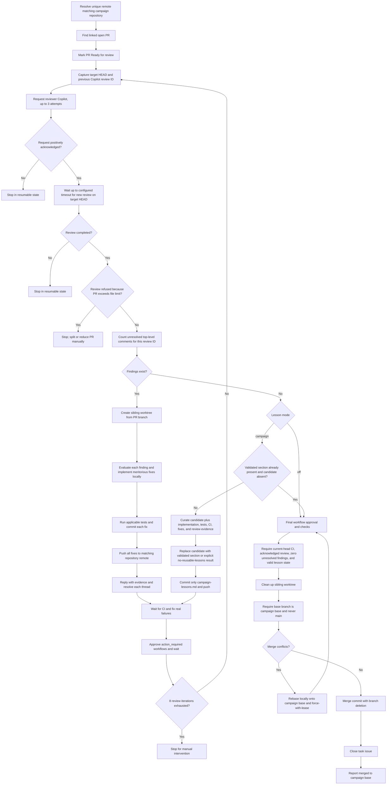

# Figure 04 — Stage 40: Ready boundary to merged

Stage 40 performs current-head Copilot review, resolves findings locally,
publishes campaign lessons when enabled, revalidates the publication commit,
and merges into the campaign base branch.

The lesson publication commit changes the PR head, so pre-publication CI and
review evidence is discarded. The publication head must complete the same
workflow and review loop before merge.
