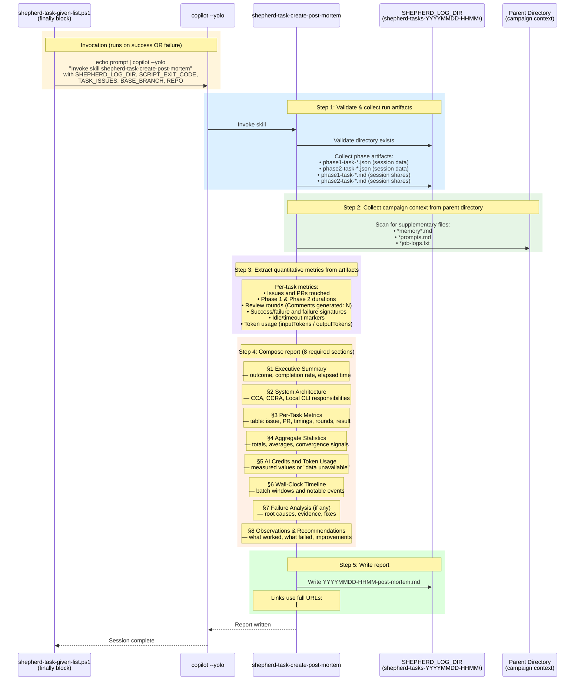

# Figure 05: Post-Mortem Report Generation

This diagram shows the detail of the `shepherd-task-create-post-mortem` skill. It is invoked from the `finally` block of `shepherd-task-given-list.ps1` (see Figure 01) so that a report is always generated, regardless of whether the run succeeded or failed.

## Sequence Diagram

## Key Design Points

### Always Runs

The post-mortem skill is invoked from a `finally` block (PowerShell) or `trap EXIT` (Bash), so it executes for **all outcomes** — full success, partial failure, or early abort. The `SCRIPT_EXIT_CODE` input distinguishes these cases.

### Evidence-Based

The report is built entirely from local run artifacts (JSON session logs, markdown shares, OTEL traces). It does not require GitHub API calls unless local artifacts are insufficient, keeping it reliable even when network access is degraded.

### Structured for Both Outcomes

The 8-section structure serves both **successful runs** (throughput, convergence, quality metrics) and **failed runs** (root cause analysis, failure signatures, corrective actions). Sections are populated or marked "N/A" based on available data.

### Link Formatting

All issue and PR references are rendered as full Markdown hyperlinks using the `REPO` input — never plain-text `#123` references. Table-of-contents entries use plain text to avoid nested link issues.
