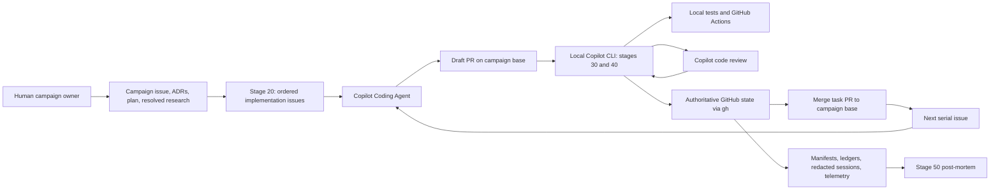

# Making shepherd-task: from a manual AI supervision loop to a traceable engineering campaign

Rich Chiodo described the question behind this document with a calculator
analogy: using the calculator is less interesting than understanding how its
silicon was made.

For shepherd-task, the “silicon” is not a single clever prompt. It is the
division of labor among people, language models, shell scripts, GitHub state,
tests, and durable evidence. The system came from writing down a repetitive
human supervision loop, separating judgment from mechanics, and then turning
the mechanics into explicit state transitions that could be independently
verified. It evolved by treating every false success, timeout, ambiguous API
response, and expensive review loop as evidence that the model of the workflow
was incomplete.

The result is an opinionated engineering system built around GitHub issues.
Copilot Coding Agent (CCA) performs initial implementation. Copilot code review
(CCRA) supplies review findings. Local Copilot CLI sessions perform semantic
orchestration and local review remediation. Bash and PowerShell scripts create
process boundaries, preserve evidence, and verify postconditions through
`gh`. GitHub Actions supplies executable gates. A human still owns the
campaign, resolves research questions, handles hard failures, and reviews the
eventual campaign-to-`main` pull request.

This is deliberately not an operating guide. See [README.md](README.md) for
installation and usage. This document explains why the pieces exist, how they
were discovered, and what another team can reuse without copying
shepherd-task itself.

## The manual loop that became the product

The starting workflow was already AI-assisted:

1. Assign an existing issue to CCA.
2. Wait for it to create and implement a pull request.
3. Manually approve workflows that GitHub reported as requiring action.
4. Read every CCRA comment and decide whether it had merit.
5. Fix meritorious comments locally; explain or decline the others.
6. Run the relevant tests and wait for CI.
7. Push the topic branch.
8. Request or wait for another review.
9. Repeat until the pull request was clean.
10. Move the pull request through the ready and merge boundaries.

The problem was not that any one step was impossible. The problem was that the
steps were repetitive, asynchronous, and easy to misclassify. A pull request
could exist while CCA had only pushed an empty `Initial plan` commit. A
workflow could appear “completed” with `action_required` as its conclusion. A
review request could fail locally after the server had accepted the mutation.
A review could complete but refuse to inspect the pull request because it
contained too many files. A passing selector job could hide the fact that all
substantive jobs had been skipped. A Copilot CLI process could exit zero after
its own final message said shepherding had failed.

That mix of judgment and mechanics suggested the first important
decomposition:

- **Keep judgment in model-driven skills.** Determining whether a review
  comment is correct, whether an issue requirement has concrete evidence, or
  how to repair a defect benefits from repository context and semantic
  reasoning.
- **Put process control in scripts.** Argument validation, directory layout,
  artifact naming, serial dispatch, version checks, redaction, and invocation
  boundaries should not depend on a model remembering them.
- **Use GitHub as the authoritative external state.** The script should not
  trust a model session merely because it exited. It should query the pull
  request, commit, checks, reviews, threads, merge state, and issue state.

The initial contribution made that split explicit. Commit `3a39fb23` on
July 16, 2026 introduced a two-phase system with three skills and paired Bash
and PowerShell scripts. Its motivation section named the repetitive work:
assigning issues, waiting for pull requests, approving workflows, interpreting
failures, requesting changes, resolving review comments, and merging. Its key
design decision was already present: scripts would verify state independently
instead of trusting Copilot exit codes.

That first version was the transistor, not the finished processor.

## The architecture is a set of authority boundaries

The current architecture is easiest to understand as a collection of actors
with deliberately limited authority.

### The human owns intent and exceptions

The human creates the campaign issue and non-`main` campaign base branch,
supplies or approves architecture, resolves implementation-gating research
questions, starts runs, and handles failures the system intentionally refuses
to guess through. The final campaign branch still receives normal human review
before it reaches `main`.

This matters because shepherd-task is not an attempt to remove people from
software engineering. It is an attempt to remove repeated mechanical
supervision while preserving explicit places where human judgment is required.

### Issues are the durable unit of specification

The issue tracker was chosen as more than a queue. Each child issue is a
human-visible, linkable specification that can hold:

- exact scope and out-of-scope boundaries;
- resolved architectural decisions;
- relevant research findings;
- files and APIs to change;
- acceptance criteria;
- executable gating commands;
- the required campaign base branch;
- its relation to a parent campaign issue.

An ordered issue list also supplies a recovery surface. If a run fails on the
third of five issues, the first two merged pull requests remain visible and
the remaining subset can be dispatched in a later run. The state is not hidden
inside one model conversation.

### CCA implements; local Copilot resolves reviews

CCA is good at taking a well-specified issue and producing an initial
implementation in a draft pull request. It is less reliable as the sole owner
of a long, repeated review-remediation loop. Once CCA has reported a finished
work cycle, a review comment alone may not restart it.

Stage 30 can re-engage CCA when readiness defects are found, because the task
is still within the implementation boundary. Stage 40 deliberately resolves
CCRA findings locally in a sibling Git worktree. The local Copilot CLI
evaluates each comment, changes the checked-out pull-request branch, runs
targeted tests, commits, pushes, replies with commit evidence, and resolves the
thread. This makes review remediation observable and testable without relying
on the remote coding agent to wake up correctly after every finding.

### Skills decide; scripts constrain and verify

The skills under `skills/shepherd-task-*` contain the semantic workflow. They
describe what counts as substantive work, how to evaluate issue requirements,
how to interpret reviews, and when to fail closed.

The scripts under `plugins/shepherd-task/scripts/` launch separate
`copilot --yolo` sessions, establish artifact paths, pass immutable campaign
context, and query GitHub after each phase. The one-issue orchestrators say the
principle plainly: a zero Copilot exit is not semantic success. Stage output
must contain a terminal outcome, and GitHub must independently exhibit the
required state.

### `gh` supplies state, not policy

`gh` exposes issue, pull-request, review, workflow, and merge state. It does
not decide what that state means. Shepherd-task adds the policy:

- a linked open pull request is not enough; it must target the campaign base;
- a draft pull request is not ready merely because CI is green;
- the latest CCA finish must not predate its latest start;
- an effective diff requires changed files, a nonempty files API response, and
  different base and head trees;
- passing selector jobs are not substantive CI;
- review completion is tied to a review ID and target head SHA;
- a new commit invalidates evidence collected for the previous head.

This separation lets GitHub remain authoritative while keeping
shepherd-task-specific interpretation explicit.

## From an activity diagram to a fail-closed state machine

The primitive workflow looked like an activity diagram: assign, wait, review,
fix, merge. Real runs showed that each verb concealed several states.

“Request review,” for example, eventually became:

1. capture the target pull-request head;
2. capture the previous Copilot review ID;
3. request reviewer `@copilot`;
4. positively observe a request event, a pending review request, or a new
   review for the target head;
5. only then start the review-completion timeout;
6. require a new review whose commit ID equals the target head;
7. inspect whether that review refused coverage;
8. gather top-level findings associated with that review ID;
9. resolve findings and repeat for every new head.

That is a state machine, not a command sequence.

The same change happened at the readiness boundary. Stage 30 now binds its
evidence to one unchanged head SHA. It builds an evidence table for every
deliverable and acceptance criterion in the issue, runs every issue-specified
gate, checks relevant CI for that commit, and queries unresolved review
threads. If the head changes during validation, all prior evidence is stale.

This fail-closed bias is intentional. A timeout is not permission to proceed.
An unavailable required test is not an inferred pass. A skipped relevant
workflow is not success. An unreviewable oversized pull request does not
become mergeable because CCRA produced zero comments.

The most important burden-to-mechanism transitions were:

| Human burden or observed failure | Mechanism it produced |
|---|---|
| Repeatedly approving `action_required` workflows | A reusable workflow helper using `gh run rerun`, then `gh pr checks --watch --fail-fast` as the completion gate |
| Pull request created before CCA implemented anything | CCA lifecycle-event checks plus three independent effective-diff checks |
| Model process exited successfully after semantic failure | Terminal `SHEPHERD COMPLETE`/`SHEPHERD FAILED` assertions and independent GitHub postcondition verification |
| Review request command returned an ambiguous result | Positive acknowledgement through timeline, review-request, or completed-review state |
| Old review accidentally satisfied a new wait | Review ID and commit-SHA watermarks |
| CI passed only through selectors while substantive work was skipped | Changed-path relevance analysis and a requirement for substantive successful checks |
| Review fixes restarted an expensive or unreliable remote-agent loop | Local sibling worktrees, targeted tests, local commits, and evidence-bearing replies |
| Partial stage-20 issue creation left uncertain GitHub state | Persisted issue bodies, an append-after-each-mutation creation ledger, exact body verification, reconciliation, and manual cleanup commands |
| Long waits caused Copilot CLI to go idle and terminate | Blocking polling with long tool waits and explicit prohibition on idle turns |
| Logs were useful but could contain credentials or prompts | JSON/JSONL redaction before persistence plus defense-in-depth rescans |
| Similar Bash and PowerShell code drifted semantically | Paired scripts, paired contract tests, and explicit native-command exit handling |

## The campaign model made identity durable

The original system accepted a list of issues, a branch, and a repository.
That worked until retries, experiments, artifacts, and lesson propagation made
the lifetime of the work larger than one command invocation.

Commit `1e3746ef` on August 12, 2026 formalized a **campaign**: one ordered
engineering effort in one repository against one non-`main` base branch. A
campaign receives a UUID once. Its repository-visible metadata directory is
named from the parent issue and short name and ends in
`remove-before-merge`. Its `shepherd-campaign.json` becomes authoritative for
repository, base branch, campaign identity, and lesson mode.

That move solved several problems at once:

- callers no longer repeated repository and branch values at every layer;
- retries could create new run directories without changing campaign identity;
- artifacts from multiple attempts remained distinguishable;
- lesson mode became an immutable campaign decision;
- post-mortems could correlate tasks and retries;
- path consistency could be validated instead of inferred.

Each stage-25 invocation creates its own run directory and
`shepherd-task-25-given-list-run.json`. The run begins as `running` and is
finalized in an exit or `finally` path with timestamps, status, and the
original exit code. Stage 50 runs for success and failure. A failed issue stops
later issues, but it does not suppress the post-mortem.

The numbered lifecycle followed. Commit `5624d360` on August 27 named stages
00, 15, and 25 and aligned them with skills 10, 20, 30, 40, and 50. Gaps were
left intentionally so new stages could be inserted without renaming the whole
system:

- **00** creates durable campaign identity.
- **10** creates an ignorance-reduction plan when implementation issues do not
  already exist.
- A **human gate** resolves implementation-gating questions and may perform
  spikes.
- **15** derives stage-20 inputs without another interview.
- **20** creates and orders coding-agent-ready child issues.
- **25** dispatches an ordered issue subset serially.
- **30** moves one issue from assignment to the boundary before Ready for
  review.
- **40** moves the pull request from that boundary through review and merge to
  the campaign base.
- **50** creates an evidence-based post-mortem.

Stages 10 and 20 are optional when good issues already exist. Stage 00 is not,
because later stages need durable identity and campaign policy even when
planning happened elsewhere.

## ADRs and spikes became inputs, not attachments

The issue tracker goal raised a harder question: how does an issue become
specific enough for a coding agent without discarding architectural context?

Commit `6d95ef76` on July 21 introduced the ignorance-reduction-plan skill.
The plan separates unknowns from implementation. Its questions name concrete
choices, tradeoffs, proposed APIs, and required spikes. Crucially, new plans
leave `Resolution` blocks empty. The human research gate fills them before
implementation issues are created.

That is how ADRs and human expertise enter the workflow. An ADR can remove a
question entirely or constrain its options. A spike can establish whether an
API, runtime, or concurrency technique works. The resolved plan then gives
stage 20 a source of concrete decisions instead of a vague design document.

The plan-to-issues work appeared in commit `245f3bc7` on July 28 and was
subsequently hardened. Stage 15 now discovers the unique plan, its
ignorance-reduction heading, the task-bearing implementation heading, the
number of direct tasks, campaign state, and the matching Git remote. Ambiguity
is a hard error. Commit `d23e4c52` on August 26 removed the interactive
stage-20 interview because a deterministic derivation step was more reliable
and more reproducible.

Stage 20 builds a traceability map before it mutates GitHub. For every direct
implementation subsection, it relates:

- the exact task identity;
- files, APIs, and behavior;
- tests and gates;
- prerequisite task;
- constraining questions and resolutions;
- research findings;
- additional discriminating tests.

It drafts and persists every issue body before creating the first issue. This
matters because the issue body is the specification CCA will actually receive,
not merely a summary of the plan.

Research spikes required a further boundary. Spike code is written to learn,
not to become accidental production architecture. The stage-20 skill therefore
uses a **spike firewall**:

- carry forward decisions, constraints, rejected approaches, and operational
  consequences;
- do not tell CCA to copy spike directories, classes, test helpers, or
  dependencies;
- restate the finding in the issue body so implementation can proceed from the
  finding rather than from throwaway source.

This is a general lesson: research artifacts should reduce ignorance without
silently becoming implementation templates.

## Traceability is a chain of evidence

“Everything should be completely traceable” became a structural requirement,
not a promise to save chat transcripts.

A successful task can be followed through:

1. parent campaign issue;
2. campaign manifest and resolved plan;
3. ordered child issue;
4. CCA assignment with an explicit base branch;
5. linked draft pull request;
6. CCA lifecycle events and candidate head;
7. issue-requirement evidence and local gating commands;
8. checks tied to the candidate commit;
9. CCRA request acknowledgement, review ID, commit ID, comments, and threads;
10. local fix commits and replies;
11. final current-head CI and review state;
12. merge to the campaign base and issue closure;
13. run manifest, redacted sessions, telemetry, and post-mortem.

Stage 20 has its own mutation evidence. `creation-ledger.json` records each
created issue immediately, along with its persisted body file, verification
state, and parent-link state. `stage-20-result.json` distinguishes
`in_progress`, `failed`, and `complete`. A zero Copilot exit cannot stand in
for those artifacts.

The stage is intentionally one-shot. On partial failure it reconciles the
ledger against GitHub, stops all further mutation, and prints deletion
commands. Automatic rollback would create another class of partially observed
mutation. Manual cleanup is slower but auditable.

Traceability also created a security obligation. Commits `e9782ba3` on
August 4 and `d9a3fdc2` on August 7 introduced and hardened log redaction.
Credential-like keys, token patterns, content-bearing event fields, and
high-entropy strings are removed from JSON and JSONL artifacts. Campaign
artifacts are still treated as sensitive, and the documentation requires
another scan and human inspection before committing them.

Telemetry was added earlier in commit `0c578331` on July 17 because output
events did not contain enough token and AI-credit data for cost analysis.
Stage 50 later made those artifacts useful by producing a consistent report:
outcome, architecture, per-task metrics, aggregate statistics, available token
usage, timeline, failure analysis, and recommendations.

Post-mortems run after failures as well as successes because a failed run often
contains the most valuable design evidence.

## The design was built by failing in production

The commit history and the campaign artifacts show a repeated method:

1. run the system on real work;
2. preserve enough evidence to identify the false assumption;
3. change the state model or authority boundary;
4. add a regression contract;
5. repeat.

Several examples shaped the present design.

### Workflow approval was not the API first assumed

Early runs treated GitHub’s workflow approval as a normal pending state and
investigated an approval endpoint. The prompt-log review in
`dd-3031763-improve-agentic-velocity-remove-before-merge/20260803-dd-3042014-02-review-of-prompt-files-in-lieu-of-post-mortems.md`
records that same-repository runs appeared as `completed` with conclusion
`action_required`. The fork-only approval endpoint returned HTTP 403. The
working mechanism was `gh run rerun`, followed by `gh pr checks --watch`.

The broader lesson was to distinguish a UI label from the server’s actual
state model.

### Long polling could kill the orchestrator

During a Python demo run, the Copilot CLI session launched a poll, returned
control too early, and went idle. The runtime terminated the session even
though the remote review later arrived. Commit `adcb03b6` on July 18 added
explicit instructions to keep long polling calls active and also added a
monitor so a human could observe progress from another terminal.

The fix was not “increase every timeout.” It was to understand that remote
work, tool-call lifetime, and model-session lifetime were three separate
clocks.

### Ready did not request review

The same July 18 work recorded another false assumption: marking a pull request
Ready for review did not automatically request Copilot review. Later runs
showed that even the request command’s exit status was not enough. Old `gh`
versions could perform the mutation and then fail while querying deprecated
Projects Classic fields. Stage 40 therefore evolved from “run the command” to
“observe positive server acknowledgement.”

### PR creation was startup, not completion

CCA could open a draft pull request and push an empty `Initial plan` commit
before starting implementation. Commit `b0b8a78a` on July 30 hardened the
readiness gates. Today stage 30 requires a completed latest CCA cycle and three
separate proofs of an effective change. The issue body, not CCA’s summary,
defines the deliverables.

### Review completion was not review coverage

The post-mortem review in
`20260803-dd-3042014-01-review-of-extant-post-mortems.md` documents CCRA
refusing oversized pull requests, reporting no reviewable files, and failing
to deliver follow-up reviews within configured waits. A review object with
zero comments could mean convergence, lack of coverage, or refusal.

Stage 40 now detects the stable “unable to review” and “maximum number of
files” phrases together and stops for manual intervention. It uses review IDs,
commit IDs, comments, and thread state rather than presentation headings or a
“Comments generated” count.

### Platform pipelines changed command truth

PowerShell made a subtle class of failures visible: piping native output into
`ConvertFrom-Json`, `Select-String`, or another PowerShell command could change
what `$LASTEXITCODE` represented. Commit `b41bc00c` on September 1 captured
native output and status before transformations and added regression coverage.
The same rule was embedded in the skills so the agent-generated PowerShell
would follow it. This is an example of an operational discovery becoming both
code and model instruction.

### Repository names and branch names were not interchangeable

Early prompt logs mixed remote-qualified local names such as
`upstream/feature` with the branch name expected by GitHub. Other repositories
used `origin`; forks added another mapping. Stage 15 and stage 40 now resolve
the unique Git remote whose normalized GitHub URL matches the campaign
repository. Commit `5624d360` introduced URL-based resolution; later commits
such as `c2801de2` hardened fork handling.

### Completion gates had to ignore obsolete history

Branch-wide workflow listings include runs for old commits. Requiring every
historical run to finish can block a pull request whose current checks already
passed. Commit `8518b38b` on September 10 made current pull-request checks
authoritative and retained branch history only for diagnostics.

Again, the design moved toward immutable or current-head evidence rather than
accumulated incidental state.

## Experiments challenged the appealing ideas

Campaign lesson propagation was an appealing extension. In `campaign` mode,
one task could produce candidate lessons, stage 40 could validate and publish
them, and the next serial task could read them. Commit `ff4745d4` on August 12
implemented that loop.

The mechanism worked. The simple-math and Cargo Tracker experiments proved
that lessons could be captured, reviewed, merged into the campaign base, and
delivered forward. Some downstream behavior was consistent with those
lessons.

But the experiments did not prove the intended velocity benefit.

The analyses under
`dd-3031763-improve-agentic-velocity-remove-before-merge/` found that:

- merged code and tests already carried strong implicit knowledge;
- lesson publication changed the pull-request head and forced another CI and
  review cycle;
- CCRA sometimes treated the required candidate-to-validated transformation
  as a defect;
- lesson metadata created its own correctness surface;
- a Fibonacci-specific numeric lesson was overgeneralized to factorial;
- treatment campaigns often consumed more review rounds and time than control
  campaigns;
- final observable quality was high in both arms because the ordinary review
  loop already converged on the same terminal gates.

The simple-math analysis summarized the result precisely: collection worked,
propagation worked, and durable knowledge increased, but immediate downstream
velocity and first-review quality did not improve. The larger Cargo Tracker
post-mortem found that more than half of treatment review activity involved
lesson governance and also exposed durability problems, including deletion of
a prior validated lesson.

Those were not reasons to hide the feature. They were reasons to change its
default. Commit `7c82fb55` on September 3 made lesson propagation `off` unless
selected at campaign initialization. The README still labels `campaign` mode
experimental.

This is one of the most transferable parts of the story. Agentic systems
generate plausible enhancements faster than they generate evidence of value.
Optional complexity should be tested with treatment/control designs, and a
mechanism result should not be reported as an outcome result.

## Testing the workflow as a product

The first validation was real work in `github/copilot-sdk`. That exposed
failures no synthetic test would have predicted, but it was too expensive and
too stochastic to be the only test strategy.

The test estate grew in layers:

1. **Static and parsing contracts** check generated launchers, skill snippets,
   required line continuations, and shell syntax.
2. **Offline behavioral contracts** fake GitHub responses and exercise remote
   resolution, issue-body fidelity, ledger shapes, pagination, session outcome
   markers, and review-request preflights without invoking paid agents.
3. **Cross-platform pairs** hold Bash and PowerShell to the same externally
   visible contract.
4. **Simple-math campaigns** provide a small, deterministic two-task system
   with repository-owned Pester acceptance checks.
5. **Cargo Tracker campaigns** exercise five serial Java/Open Liberty tasks
   against a fixed baseline and substantive Maven CI.
6. **Treatment/control fixtures** compare optional lesson propagation against
   a control using the same plan and baseline.
7. **Installed-estate validation** proves the shipped plugin, skills, tests,
   and scripts work outside the source checkout.
8. **Portability contracts** reject Bash 4-only syntax and GNU-only
   assumptions so installed drivers work with Bash 3.2 on macOS.

The repository contains many narrow contracts because orchestration defects
are often one-character defects: `-f` instead of `-F`, a missing Bash line
continuation, a nested PowerShell array, a lost native exit code, CRLF
normalization, an OEM code page, or a paginated REST envelope. These do not
look architecturally important until they create or mutate real issues.

By September 2026, the tests themselves had become part of the installable
estate. Commit `a8196f1e` on September 8 versioned the complete lineup;
`82cf089b` on September 9 made the plugin manifest describe the estate; and
`0ffb69b3` included tests in it. The installer stages the plugin and all six
skills, validates the lineup, backs up the previous installation, publishes
the new one, and writes `install-manifest.json` last. A partial publication is
rolled back.

The version commands also refuse to mutate an installed copy. Commit
`15a633f6` restricted version updates to the tracked source layout while
allowing installed copies to report their version. Every script and skill is
stamped with the lineup version, and a separate version contract covers
persisted artifact schemas and the stage outcome protocol.

That packaging work reflects another general principle: once orchestration
controls durable mutations, it should be released as a coherent product, not
as a loose collection of prompts.

## A representative evolution timeline

The branch contains many corrective commits. These are representative turning
points rather than a complete changelog.

| Date | Commit | Design change | Evidence or pressure |
|---|---|---|---|
| 2026-07-16 | `3a39fb23` | Initial two-phase plugin with three skills and Bash/PowerShell orchestration | Repetitive manual CCA/CI/CCRA supervision |
| 2026-07-18 | `adcb03b6` | Prevent idle kills, explicitly request review, add monitor | Python demo runs exposed polling and review-trigger assumptions |
| 2026-07-21 | `6d95ef76` | Add ignorance-reduction planning | Need to incorporate ADRs, unknowns, and research before coding |
| 2026-07-28 | `245f3bc7` | Convert implementation plans into ordered issues | Issue tracker chosen as durable specification and coordination surface |
| 2026-07-30 | `b0b8a78a` | Harden readiness gates | PR creation, empty commits, and green selectors were insufficient evidence |
| 2026-08-04 / 08-07 | `e9782ba3`, `d9a3fdc2` | Add and harden redaction | Trace artifacts were valuable but could expose secrets |
| 2026-08-12 | `1e3746ef` | Formalize campaign identity and manifests | Runs, retries, artifacts, and policies outlived one invocation |
| 2026-08-12 | `ff4745d4` | Add campaign lesson propagation | Attempt to carry validated discoveries across serial tasks |
| 2026-08-26 | `d23e4c52` | Eliminate the stage-20 interview | Campaign state and plan structure could be derived deterministically |
| 2026-08-27 | `5624d360` | Number lifecycle stages and resolve remotes by repository URL | Need discoverable phases and support for different remote layouts |
| 2026-08-31 | `45c45546` | Analyze treatment versus control | Mechanism success did not establish velocity benefit |
| 2026-09-01 | `b41bc00c` | Fix native PowerShell status propagation | Pipelines obscured the actual result of `gh` |
| 2026-09-03 | `7c82fb55` | Default lesson propagation off | Experiments showed cost and transfer risk |
| 2026-09-08 / 09-09 | `a8196f1e`, `82cf089b` | Version and manifest the complete installed lineup | Scripts, skills, tests, and schemas needed coherent releases |
| 2026-09-09 | `927ce0d7` | Fix macOS portability | Bash and utility assumptions failed outside GNU/Linux/Windows |
| 2026-09-10 | `8518b38b` | Make current PR checks authoritative | Obsolete branch runs should be diagnostic, not merge-blocking |

## How to build your own version

The reusable product is not the exact stage lineup. It is the method used to
derive it.

### 1. Write down the human supervisory loop

Start with observation, not architecture. Record every click, wait, judgment,
copy-and-paste operation, retry, and state lookup. Include what the person does
when the happy path does not happen.

This reveals the difference between work worth automating and work that still
needs judgment.

### 2. Separate judgment from mechanics

Ask of each step:

- Does it require semantic understanding of code, requirements, or review
  advice?
- Or can it be expressed as a deterministic state query, validation, or
  mutation?

Use a model for the former. Use scripts and APIs for the latter. Do not ask one
long model session to remember both the product problem and every orchestration
invariant.

### 3. Name every actor and authority boundary

For each fact, decide who is allowed to assert it:

- the issue body defines the requested work;
- a manifest defines durable campaign identity;
- GitHub defines pull-request and review state;
- a commit SHA identifies the code being evaluated;
- the test process defines whether a command passed;
- the model may interpret evidence but should not manufacture it.

Many agentic failures are authority failures: the system accepts a summary
where it should query state.

### 4. Model states, not commands

Replace “request review” with its observable states. Replace “CCA finished”
with start and finish events tied to a resulting head. Replace “CI is green”
with relevant completed checks for a specific commit.

Define invalid and timeout states too. A state machine that specifies only the
happy path is still an activity diagram.

### 5. Choose a durable specification unit

Shepherd-task uses GitHub issues because they are visible to humans and agents,
link naturally to pull requests, and survive orchestration restarts. Another
team might choose work items, change requests, or repository files. The
important property is that the unit is durable, inspectable, and independently
addressable.

### 6. Introduce machine-readable identity early

Give the larger effort an immutable ID. Persist repository, base branch,
policy choices, input ordering, timestamps, and outcomes in machine-readable
artifacts. Do not reconstruct identity later from directory names and chat
history.

### 7. Bind evidence to immutable objects

Prefer commit SHAs, review IDs, issue IDs, and persisted body hashes over
mutable views. When mutation creates a new immutable object, invalidate the
old evidence.

This one rule prevents many false successes.

### 8. Make retries resumable and mutations auditable

Know which operations are safe to repeat and which are one-shot.
Shepherd-task can resume an existing pull request, but stage 20 will not guess
whether existing child issues correspond to a partially completed plan. It
records mutations and requires explicit cleanup.

Idempotency is not a slogan. It is a per-operation property.

### 9. Preserve evidence safely

Create the post-mortem and redaction path before the system becomes complex.
Otherwise the first hard failure will leave either no evidence or unsafe
evidence. Treat model transcripts as potentially sensitive even when they are
useful.

### 10. Turn incidents into contracts

Every recurring failure should produce a smaller executable test if possible:

- parse the generated script;
- fake the API response;
- simulate zero, one, and many ledger entries;
- exercise line endings and encodings;
- run on another shell or operating system.

Real agent runs discover problems. Offline contracts keep them fixed.

### 11. Measure optional intelligence

Features such as shared lessons, additional review loops, or agent-generated
memory can sound obviously beneficial. Measure them against a control.
Separate:

- whether the mechanism operated;
- whether behavior was consistent with it;
- whether it caused a better outcome;
- what latency, token, review, and governance cost it introduced.

### 12. Version the whole orchestration boundary

If scripts, skills, tests, and schemas must agree, release them together.
Record which version created durable artifacts. Make upgrades and downgrades
explicit.

## What not to copy blindly

Several shepherd-task choices are local design decisions, not universal
patterns:

- The exact stage numbers and names are optimized for this campaign model.
- Twenty stage-30 correction attempts and eight stage-40 review rounds are
  safety budgets, not scientifically optimal constants.
- The exemption for the repository’s
  `No remove-before-merge directories` check is repository-specific.
- Serial issues trade throughput for a simple, always-current base.
- Local worktrees fit a developer environment capable of running repository
  tests.
- The candidate-to-validated campaign lesson lifecycle remains experimental
  and is off by default.
- A final campaign branch and pull request fit repositories that want an extra
  human review boundary before `main`.

Copy the questions these choices answer, not necessarily the answers.

## The transferable result

Shepherd-task began as automation for a tedious loop, but the hard part was
not automating the commands. The hard part was deciding what evidence made
each transition true.

Its most reusable ideas are:

- use durable work items as the coordination surface;
- reserve models for semantic judgment;
- put state, identity, and process boundaries in deterministic code;
- query authoritative systems instead of trusting conversational success;
- bind validation to immutable evidence;
- fail closed when coverage or state is ambiguous;
- preserve redacted artifacts and generate post-mortems for every outcome;
- turn each production failure into a smaller contract;
- experiment before claiming that additional agent memory or review improves
  velocity.

That is the silicon. The visible workflow—issues entering at one end and
merged pull requests emerging at the other—is only what it computes.
