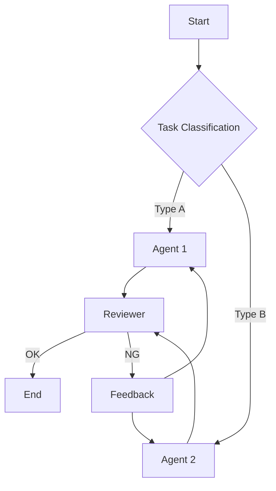

# Agentic Workflow Guide

A comprehensive guide for designing, reviewing, and improving agent workflows based on proven design principles.

## When to Use

- **New Workflow Design** - Define agent roles, responsibilities, and execution order
- **Workflow Review** - Detect issues by checking against design principles
- **Pattern Selection** - Choose the right workflow pattern for your task
- **Quality Improvement** - Iteratively refine workflows step by step
- **Scaffolding** - Generate workflow directory structures and templates

## Core Principles

→ See **[references/design-principles.md](references/design-principles.md)** for details

### Tier 1: Essential Principles

| Principle                | Description                      | Check Point                                      |
| ------------------------ | -------------------------------- | ------------------------------------------------ |
| **SSOT**                 | Single source of truth           | Is the same info defined in multiple places?     |
| **SRP**                  | 1 agent = 1 responsibility       | Does one agent handle multiple responsibilities? |
| **Simplicity First**     | Start with the simplest solution | Is the design overly complex?                    |
| **Fail Fast**            | Detect and fix errors early      | Can errors be detected and stopped immediately?  |
| **Iterative Refinement** | Build small, improve repeatedly  | Is it broken into small steps?                   |
| **Feedback Loop**        | Verify results at each step      | Can results be verified at each step?            |

### Tier 2: Quality Principles

| Principle           | Description                        | Check Point                           |
| ------------------- | ---------------------------------- | ------------------------------------- |
| **Transparency**    | Show plans and progress explicitly | Is progress visible?                  |
| **Gate/Checkpoint** | Validate at each step              | Is validation done before proceeding? |
| **DRY**             | Don't repeat yourself              | Are common processes reused?          |
| **ISP**             | Minimal context only               | Is unnecessary info being passed?     |
| **Idempotency**     | Safe to retry                      | Is it safe to retry operations?       |

## Workflow Patterns

→ See **[references/workflow-patterns.md](references/workflow-patterns.md)** for details

### Pattern Selection Guide

```
What's the nature of the task?
├─ Sequential processing needed ──→ Prompt Chaining
├─ Multiple independent tasks ────→ Parallelization
├─ Dynamic task decomposition ────→ Orchestrator-Workers
├─ Until quality criteria met ────→ Evaluator-Optimizer
└─ Processing varies by input ────→ Routing
```

### Pattern Overview

| Pattern                  | Use Case                           | Iterative Level |
| ------------------------ | ---------------------------------- | --------------- |
| **Prompt Chaining**      | Sequential with validation         | ⭐⭐⭐          |
| **Routing**              | Classify → route to specialists    | ⭐⭐            |
| **Parallelization**      | Execute independent tasks together | ⭐⭐            |
| **Orchestrator-Workers** | Dynamic decomposition → workers    | ⭐⭐⭐          |
| **Evaluator-Optimizer**  | Generate → evaluate → improve loop | ⭐⭐⭐⭐⭐      |

## Design Workflow

### Step 1: Requirements Gathering

```markdown
## Workflow Design Interview

1. **Goal**: What do you want to achieve?
2. **Task Decomposition**: What subtasks can this be broken into?
3. **Dependencies**: Are there ordering dependencies between tasks?
4. **Parallelism**: Which tasks can run independently?
5. **Quality Criteria**: What defines success/failure?
6. **Error Handling**: How should failures be handled?
```

### Step 2: Pattern Selection

Choose the optimal pattern based on requirements:

| Condition                         | Recommended Pattern  |
| --------------------------------- | -------------------- |
| Tasks have clear ordering         | Prompt Chaining      |
| Tasks are independent             | Parallelization      |
| Number of tasks is dynamic        | Orchestrator-Workers |
| Repeat until quality criteria met | Evaluator-Optimizer  |
| Processing varies by input type   | Routing              |

### Step 3: Create Design Diagram

Visualize with Mermaid:



### Step 4: Principle Check

Validate design against principles (use review checklist)

### Step 5: Implement & Iterate

Build small → verify → get feedback → improve

## Review Checklist

→ See **[references/review-checklist.md](references/review-checklist.md)** for details

### Quick Check

```markdown
## Workflow Review Checklist

### Core Principles

- [ ] **SSOT**: Is the same info defined in multiple places?
- [ ] **SRP**: Is each agent focused on a single responsibility?
- [ ] **Simplicity**: Is this the simplest possible solution?
- [ ] **Fail Fast**: Can errors be detected and stopped immediately?
- [ ] **Iterative**: Is it broken into small steps?
- [ ] **Feedback Loop**: Can results be verified at each step?

### Quality Principles

- [ ] **Transparency**: Are plans and progress visible?
- [ ] **Gate/Checkpoint**: Is validation done at each step?
- [ ] **DRY**: Are common processes reused?
- [ ] **ISP**: Is only necessary info being passed?
- [ ] **Idempotency**: Is it safe to retry?

### Anti-Pattern Detection

- [ ] Is too much responsibility packed into one agent?
- [ ] Is excessive context being passed?
- [ ] Is error handling missing?
- [ ] Is there potential for infinite loops?
- [ ] Are there points where human-in-the-loop is needed?
```

## Anti-Patterns

→ See **[references/anti-patterns.md](references/anti-patterns.md)** for details

| Anti-Pattern         | Problem                         | Solution                        |
| -------------------- | ------------------------------- | ------------------------------- |
| **God Agent**        | All responsibilities in 1 agent | Split with SRP                  |
| **Context Overload** | Passing excessive info          | Minimize with ISP               |
| **Silent Failure**   | Ignoring errors and continuing  | Stop immediately with Fail Fast |
| **Infinite Loop**    | No termination condition        | Set max iterations              |
| **Big Bang**         | Building everything at once     | Build small with Iterative      |

## Scaffold Workflow

Automatically generate workflow directory structures.

### Usage

```bash
# Basic workflow
python scripts/scaffold_workflow.py my-workflow

# Specify pattern
python scripts/scaffold_workflow.py code-review --pattern evaluator-optimizer

# Specify output path
python scripts/scaffold_workflow.py data-pipeline --pattern orchestrator-workers --path ./projects

# List available patterns
python scripts/scaffold_workflow.py --list-patterns
```

### Available Patterns

| Pattern                | Description                    |
| ---------------------- | ------------------------------ |
| `basic`                | Basic workflow structure       |
| `prompt-chaining`      | Sequential processing pattern  |
| `parallelization`      | Parallel processing pattern    |
| `orchestrator-workers` | Orchestrator + workers pattern |
| `evaluator-optimizer`  | Evaluation-improvement loop    |
| `routing`              | Routing pattern                |

### Generated Structure

```
my-workflow/
├── Agent.md                    # Workflow overview & agent list
├── README.md                   # Usage guide
├── .github/
│   ├── copilot-instructions.md # GitHub Copilot instructions
│   └── instructions/           # File-pattern-specific rules
│       ├── workflow.instructions.md
│       ├── agents.instructions.md
│       └── prompts.instructions.md
├── agents/                     # Agent definitions
├── prompts/                    # Prompt templates
│   ├── system_prompt.md
│   ├── task_prompt.md
│   └── error_handling_prompt.md
├── docs/                       # Design documentation
│   ├── design.md
│   └── review_notes.md
└── config/                     # Configuration files
```

## Resources

| File                                                    | Content                       |
| ------------------------------------------------------- | ----------------------------- |
| [design-principles.md](references/design-principles.md) | Detailed design principles    |
| [workflow-patterns.md](references/workflow-patterns.md) | Workflow pattern details      |
| [review-checklist.md](references/review-checklist.md)   | Review checklist              |
| [anti-patterns.md](references/anti-patterns.md)         | Anti-pattern collection       |
| [scaffold_workflow.py](scripts/scaffold_workflow.py)    | Directory structure generator |

## References

- [Building Effective Agents - Anthropic](https://www.anthropic.com/engineering/building-effective-agents)
- [Workflows and Agents - LangChain](https://docs.langchain.com/oss/python/langgraph/workflows-agents)
- [subagent-driven-development - obra/superpowers](https://github.com/obra/superpowers/tree/main/skills/subagent-driven-development)
- [dispatching-parallel-agents - obra/superpowers](https://github.com/obra/superpowers/tree/main/skills/dispatching-parallel-agents)
