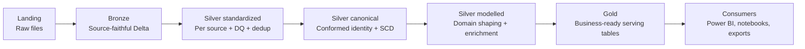

# Medallion Architecture on Microsoft Fabric

A four-layer pattern for ingesting, refining, and serving data on Fabric. Each layer has one job. When deciding where something belongs, match the job — not the convenience.

## The layers

| Layer       | Purpose                                                                        | Storage                                                   | Mutability                  |
| ----------- | ------------------------------------------------------------------------------ | --------------------------------------------------------- | --------------------------- |
| **Landing** | Capture raw source bytes as-is                                                 | Lakehouse `Files/` (CSV, JSON, Parquet, Excel, XML, etc.) | Immutable, lifecycle-tiered |
| **Bronze**  | Source-faithful Delta tables                                                   | Lakehouse Delta                                           | Append-only, schema-evolved |
| **Silver**  | Standardized, unified, deduplicated entities; business-modeled for consumption | Lakehouse Delta                                           | MERGE / SCD as needed       |
| **Gold**    | Business-ready tables and aggregates                                           | Lakehouse Delta or Warehouse                              | Recomputed or merged        |

### Flow at a glance



## Which layer does this transformation belong in?

- Storing the original file for audit/replay → **landing**
- Capturing the data exactly as the source sent it → **bronze**
- Renaming, casting types, applying business rules → **silver**
- Joining across sources, building star schemas, aggregates → **gold**

If you're tempted to clean data in bronze ("we don't need the bad rows"), don't. Bronze is evidence. Cleansing happens in silver where DQ rules can quarantine instead of silently drop.

## Cross-cutting conventions

These apply across all layers (or multiple layers) — bake them in before layer-specific decisions.

### Framework system columns

System-generated columns — the ones the framework adds, not the business — start with a leading underscore. This keeps them visually distinct and groups them at the end of column listings. Here are some examples of common framework columns and their meanings. The exact set may vary based on your metadata framework and implementation, but the principle of `_`-prefixed system columns is universal.

| Column               | Meaning                                                                                                                                                                                                 |
| -------------------- | ------------------------------------------------------------------------------------------------------------------------------------------------------------------------------------------------------- |
| `_run_id`            | Pipeline run that wrote this row                                                                                                                                                                        |
| `_run_timestamp`     | When the write happened                                                                                                                                                                                 |
| `_source_system`     | Name or code of the system the row originated from — essential in silver/gold tables that consolidate multiple sources                                                                                  |
| `_source_file`       | Path or name of the source file, for file/API-based ingestion. Enables row-level traceability back to landing                                                                                           |
| `_key_hash`          | Hash of the business key columns — used for identity / joins                                                                                                                                            |
| `_attribute_hash`    | Hash of the attribute columns — used both for SCD2 change detection *and* as the cheap equality check in upsert / MERGE logic (compare incoming `_attribute_hash` to target; skip the write when equal) |
| `_is_current`        | `1` for the current version of an SCD2 row, `0` for historical                                                                                                                                          |
| `_is_deleted`        | `1` when the source indicates the record has been deleted; framework soft-deletes rather than hard-deletes so history and lineage are preserved                                                         |
| `_valid_from`        | Start of validity window (SCD2)                                                                                                                                                                         |
| `_valid_to`          | End of validity window (SCD2); far-future date for current rows                                                                                                                                         |

If you see a column starting with `_` in a business query, that's a signal it's framework plumbing, not business data.

Illustrative silver row layout — business columns first, framework columns grouped at the end:

```
customer_key | customer_id | customer_name | country_code | ... | _source_system | _run_id | _run_timestamp | _key_hash | _attribute_hash | _is_current | _is_deleted | _valid_from | _valid_to
```

Analysts query the left. Framework plumbing sits on the right, prefixed and out of the way.

### Column suffixes

Use suffixes to make column type obvious at a glance. These apply to silver and gold (bronze stays source-faithful and keeps source column names):

| Suffix  | Meaning                                                                                                                                                                                      |
| ------- | -------------------------------------------------------------------------------------------------------------------------------------------------------------------------------------------- |
| `_key`  | Surrogate key of the table, or foreign key to another table                                                                                                                                  |
| `_id`   | Natural / business identifier from the source                                                                                                                                                |
| `_code` | Short coded value (country code, status code, currency code). Can also serve as the business identifier when the source has no primary key and the code is the natural way to address a row. |
| `_uuid` | UUID                                                                                                                                                                                         |
| `_hash` | Hash value                                                                                                                                                                                   |

In a fact table, joining to a dimension uses `_key` on both sides:

```
sales_order_transactions.customer_key  →  customer.customer_key
```

The business identifier stays available as `customer_id` on the dimension, so analysts can still filter by source identifier without joining away from the key/key pattern.

### One store for all layers, or separate stores per layer?

- **One lakehouse (or warehouse) with a schema per layer** (`bronze`, `silver`, `gold`) is the default for small teams, small data, or when everyone has access to everything anyway. Simpler to deploy, cheaper, fewer moving parts.
- **Separate lakehouses/warehouses per layer** when different roles need different access — e.g., engineers can see bronze but analysts only see gold. In Fabric, workspace- and item-level permissions are the practical RBAC boundary; if you need layer-level access control, split the stores.

Start with one-store-with-schemas. Split later if access requirements force it. Don't split prematurely — you pay the complexity cost forever.

## Landing

### Do I need a separate landing zone, or go straight to bronze?

- **Database sources (SQL Server, Oracle, Postgres, etc.)** → straight to bronze. The source is re-queryable; landing's replayability benefit is moot. Skip landing unless compliance requires a snapshot of each extract.
- **File-based or API sources** — REST APIs, SharePoint document libraries, Excel files from SharePoint or mailbox attachments, XML feeds, flat files (CSV / TSV / fixed-width), SFTP drops, paid data feeds → land first. The source may not be re-readable later (rate limits, deletions, upstream schema changes), and the landed file is your proof of what arrived.
- **Streaming sources** → different pattern; out of scope here.

## Landing → Bronze gate: contract validation

Not all DQ belongs in silver. Before a landed file moves to bronze, run **contract validation** at the file level:

- Expected file format (is it actually a valid XLSX / CSV / XML / JSON / Parquet?)
- Required columns / sheets are present with expected names
- Schema matches what's registered in metadata (column count, headers, inferable types)
- File is non-empty and above a minimum-size threshold
- For incremental sources: the expected date range or watermark advance

Files that fail contract validation do **not** go to bronze. Move them to a quarantine path (e.g., `Files/_quarantine/<source>/<YYYY-MM-DD>/`), log the failure with reason, and notify the source owner. Bronze only ever sees files that match the contract — this keeps bronze honest and prevents garbage from silently propagating downstream.

This is distinct from the row-level DQ described in the silver section:

| Scope               | Where it runs         | What it checks                     | On failure                                  |
| ------------------- | --------------------- | ---------------------------------- | ------------------------------------------- |
| **Contract / file** | Landing → bronze gate | Format, schema, columns, non-empty | Whole file quarantined, bronze skipped      |
| **Row-level**       | Silver standardized   | Business rules per row             | Row quarantined, reason recorded for triage |

## Bronze

### Append-only or MERGE?

Default: **append-only** with `_run_id` and `_run_timestamp` system columns. Full history, no logic.

MERGE in bronze only when the source is so high-volume that history is unaffordable AND you don't need replayability — rare. When in doubt, keep history in bronze and let silver be the SCD layer.

## Silver

### SCD1 or SCD2?

SCD1 (overwrite) when downstream only cares about current state.
SCD2 (history) when downstream needs point-in-time reporting, or for any dimension feeding a fact that has a date.

Don't do SCD2 in bronze — bronze already has full history via `_run_timestamp`. Doing it twice is waste.

**Default: SCD2 lives in the canonical stage of silver** (see below), because that's where identity is stabilized across sources. Exception: a single-source entity with no plausible future consolidation can carry SCD2 directly in standardized — but if a second source ever arrives for that entity, you're refactoring. Prefer canonical unless there's a clear reason not to.

### As stages: standardized → canonical → modelled

Silver has up to three logical stages. In one silver lakehouse, use schema per stage:

```
silver.<source>.<entity>      ← standardized (per source-entity: type coercion, dedup, DQ)
silver.conformed.<entity>     ← canonical (single source of truth, cross-source, SCD where needed)
silver.<domain>.<entity>      ← modelled (domain-shaped joins and enrichment)
```

What happens in each stage:

| Aspect                                                         | Standardized                     | Canonical                                            | Modelled                                          |
| -------------------------------------------------------------- | -------------------------------- | ---------------------------------------------------- | ------------------------------------------------- |
| **Schema**                                                     | `silver.<source>.<entity>`       | `silver.conformed.<entity>`                          | `silver.<domain>.<entity>`                        |
| **Scope / grain**                                              | one table per (source, entity)   | one single-source-of-truth table per entity          | one table per (domain, entity)                    |
| **Column renaming & type coercion**                            | ✅ source names → canonical names | ❌ inherited, already stable                          | ❌ adds derived columns only                       |
| **Deduplication within a source**                              | ✅                                | ❌                                                    | ❌                                                 |
| **DQ rules / quarantine**                                      | ✅ primary location               | ✅ optional cross-source consistency checks           | ❌                                                 |
| **Cross-source union, match, dedup**                           | ❌                                | ✅ e.g., same customer from two CRMs → one row        | ❌                                                 |
| **Surrogate key (`_key`) generation**                          | ❌                                | ✅ identity is canonical only once sources are merged | ❌ inherits from canonical                         |
| **SCD2 history (`_valid_from` / `_valid_to` / `_is_current`)** | ❌                                | ✅                                                    | ❌                                                 |
| **Cross-entity joins + derived / calculated columns**          | ❌                                | ❌                                                    | ✅ e.g., `customer` + `segment` + `lifetime_value` |

Key rule-of-thumb reading of this table: **standardization is per-source, identity is made canonical in the canonical stage, business modelling is domain-shaped in modelled.** If you catch yourself generating surrogate keys in standardized, you're locking in source-specific identity that won't survive merging a second source later.

Default: logical stages inside one notebook producing one table. Use views for stages that don't yet earn materialization; promote to tables when (a) consumed by multiple downstream, (b) debugging needs time-travel on the intermediate, or (c) ownership boundaries require it.

**Materialized Lake Views (MLVs) per stage:**

| Silver stage     | MLV fit | Why                                                                          |
| ---------------- | ------- | ---------------------------------------------------------------------------- |
| Standardized     | No      | DQ, quarantine, SCD2, and `_run_id` logging are procedural; MLVs bypass them |
| Canonical (SCD1) | Ok      | Declarative union + dedup fits                                               |
| Canonical (SCD2) | No      | MLVs recompute; SCD2 needs insert-new / close-old semantics                  |
| Modelled         | Yes     | Multi-table joins with derived columns is the sweet spot                     |

**MLVs and metadata-driven frameworks.** MLVs can coexist with a metadata framework if integrated deliberately — generate the `CREATE MATERIALIZED LAKE VIEW` statement from your attribute metadata (so the framework still owns the schema contract), and register the MLV as an entity in your metadata catalog (so it appears in lineage and monitoring alongside procedural tables). Fabric manages refresh; the framework manages definition and catalog. What stays procedural regardless: DQ with quarantine, SCD2 insert/close logic, anything stateful — those don't fit the declarative recompute model.

What to avoid either way: MLV and procedural tables for the *same entity in the same stage*. Two code paths, split observability, no upside.

## Gold

Use this quick test before debating storage engine or naming.

Gold quick test (30 seconds):

- Will this table be consumed by two or more independent downstream consumers?
- Is the shape stable enough to be versioned as a contract?
- Is this table answering a business question directly, not just preparing data for the next engineering step?

If two or more answers are "yes", it is usually a gold candidate. If not, keep it in silver for now.

### Should this be a gold table?

Gold should contain stable, reusable business assets, not one-off intermediate outputs. Treat this as a publication decision: once a table is in gold, consumers should be able to depend on it as a long-lived contract.

A table earns gold status when:

- It's consumed by more than one downstream (report, model, notebook)
- Its shape is a stable contract — breaking changes need a migration
- It answers a business question directly, not a technical one

If only one report uses it and the report could read silver instead, it doesn't need to be in gold yet.

Examples:

- **Promote to gold:** `sales_monthly_summary_by_region` consumed by Finance dashboards, executive scorecards, and planning notebooks. Shared business KPI, stable shape.
- **Promote to gold:** `customer` conformed dimension reused by sales, support, and marketing with agreed keys and attributes.
- **Keep in silver:** `crm_customer_standardized` used only by one pipeline step before conformance. Engineering-stage artifact.
- **Keep in silver:** `tmp_orders_dedup_run_2026_04_24` notebook intermediate created for a one-time backfill. Ephemeral and not a business contract.

Promotion trigger from silver to gold:

- The same silver table is reused by two or more independent consumers for multiple sprints.
- Downstream teams start re-implementing the same business transformations in reports or notebooks.
- Changes to that table require cross-team coordination and release communication.

When these signals appear, publish a named gold table and treat it as a governed contract.

### Lakehouse or Warehouse for gold?

This is a serving decision, not a modelling decision. Choose the store based on how the data will be consumed most of the time, then keep the whole domain in that store to avoid split semantics and duplicated governance.

Pick **Lakehouse** when:

- The consumer is a Direct Lake Power BI semantic model (default for new work)
- The consumer is a Spark notebook (data science, downstream)
- The dataset is large (> 1B rows)
- Schema is still evolving

Pick **Warehouse** when:

- The consumer needs a true T-SQL endpoint (stored procs, views, transactional DML)
- Import-mode Power BI with caching characteristics matters
- Cross-database T-SQL queries are required
- Analysts will write ad-hoc T-SQL

Don't split one business domain across both. If `sales_order_transactions` lives in Warehouse, the dimensions it joins to live there too.

**When a domain could reasonably go either way, pick the store of the primary consumer or the dominant fact table.** If the highest-volume / most-queried fact is served by Direct Lake Power BI, go Lakehouse and pull the T-SQL consumers onto the SQL analytics endpoint. If the dominant consumer needs true T-SQL (stored procs, transactional DML), go Warehouse and accept that Direct Lake consumers hit its SQL endpoint. Don't try to satisfy everyone — pick the winner and make the others adapt.

### Table naming

Gold names are a user-facing API. A name should communicate subject, grain, and slicing clearly enough that a consumer can choose the right table without opening its definition.

No `fact_` / `dim_` prefixes. Consumers — analysts, report builders, business users — don't know Kimball jargon and shouldn't need to. The name itself conveys meaning:

- **Dimensions: singular nouns.** `customer`, `product`, `store`, `employee`, `supplier`, `date`, `currency`.
- **Facts and aggregates: pattern-based, typically plural or grain-suffixed.** Use one of these patterns:
  - `<subject>_<context>_transactions` — transactional fact at event grain
  - `<subject>_<context>_details` — detail-level records
  - `<subject>_<grain>_summary` — aggregate at a given grain
  - `<subject>_<grain>_by_<dimensions>` — aggregate sliced by dimensions
  - `<subject>_<time_grain>_summary` — time-grain aggregate
  - `<subject>_<time_grain>_summary_by_<dimensions>` — time-grain aggregate sliced

Examples:

| Name                                 | Kind           | Pattern                                          |
| ------------------------------------ | -------------- | ------------------------------------------------ |
| `customer`                           | Dimension      | singular noun                                    |
| `product`                            | Dimension      | singular noun                                    |
| `sales_order_transactions`           | Fact           | `<subject>_<context>_transactions`               |
| `payment_transactions`               | Fact           | `<subject>_<context>_transactions`               |
| `inventory_movement_transactions`    | Fact           | `<subject>_<context>_transactions`               |
| `customer_billing_details`           | Detail         | `<subject>_<context>_details`                    |
| `sales_customer_summary`             | Aggregate      | `<subject>_<grain>_summary`                      |
| `revenue_region_by_product_category` | Aggregate      | `<subject>_<grain>_by_<dimensions>`              |
| `sales_monthly_summary`              | Time aggregate | `<subject>_<time_grain>_summary`                 |
| `sales_monthly_summary_by_region`    | Time aggregate | `<subject>_<time_grain>_summary_by_<dimensions>` |

Pick names that are **future-proof** — put grain, subject, and slicing in the name itself so siblings can be added without ambiguity or breakage.

`sales_summary` looks fine when it's the only summary table. But as soon as you need a second grain (say, marketing asks for a daily version next year), you're stuck with two bad options:

1. Add `sales_daily_summary` alongside the existing `sales_summary` — now nobody can tell what grain `sales_summary` represents without opening it, and the two tables look like unrelated siblings.
2. Rename `sales_summary` to `sales_monthly_summary` — every dashboard, notebook, and measure referencing the old name breaks.

`sales_monthly_summary` avoids both. Adding `sales_daily_summary` or `sales_monthly_summary_by_region` later just drops in — no ambiguity, no rename, no breakage.

**Time variance in dimension names.** A bare `customer` refers to the current-state view of the dimension — in SCD2 tables, that's a filter or view over `_is_current = 1`. When point-in-time history is needed alongside current state, expose it explicitly as `customer_history` (or a point-in-time function), not by overloading the base name. Consumers should never have to ask "is `customer` current or historical?" — the name should answer.

### Consuming gold in large organizations

As organizations scale, the core challenge shifts from modelling to controlled reuse. The goal is one authoritative gold implementation with decentralized access patterns, not duplicated datasets per team.

In smaller setups, consumers (Power BI reports, notebooks, exports) read directly from gold in the central data-team workspace. In larger organizations this doesn't scale — different teams need different governance, RBAC gets complicated, and the central workspace becomes a contention point.

The pattern:

- The central data team owns and publishes gold.
- Each consuming team gets its own workspace with its own lakehouse or warehouse.
- That team workspace exposes the subset it needs via **OneLake shortcuts** (for lakehouses) or **views** (for warehouses) pointing to the central gold tables — no data movement.
- Teams can layer their own renames, filters, or derived views on top without altering the source.

**Never materialize a team-local copy with a Copy activity or ETL pipeline.** Copies drift, go stale, and create multiple versions of the truth — the thing gold exists to prevent. Shortcuts and views are references: always fresh, always consistent, single source.

Exception: if a team genuinely needs a transformed or aggregated shape that's expensive to compute on the fly *and* is consumed frequently, that's a signal to add a new table in central gold — don't fork into a team-local copy.

## Layer boundaries that matter

- **Bronze never reads from silver or gold.** Data flows downward only.
- **Silver reads from bronze only.** Never from landing (no audit trail), never from gold (circular).
- **Gold reads from silver only.** If you need something not in silver, fix silver first — don't reach into bronze.
- **Consumers (Power BI, notebooks, exports) read from gold only.** Reading from silver bypasses the business contract. In large orgs, "read from gold" includes OneLake shortcuts and views in team workspaces that reference central gold — shortcuts and views count as gold, copies don't.

The only legitimate exception: data science exploration may read from silver during prototyping. Once the use case is stable, materialize a gold table for it.

## Anti-patterns to push back on

These are the anti-patterns not already stated as rules above. If it's not in this list, look for the positive framing in the relevant section.

- **"Dumb silver"** that's just a copy of bronze with no business logic — wastes a layer.
- **Per-environment branches in code** (`if env == "prd"`) — environment differences belong in connection config, not code paths.
- **Skipping silver because "the source is already clean"** — silver isn't only for standardization; it's also where canonical identities, SCD, and DQ live.
- **Mixing MLV and procedural tables within the same silver stage** — splits observability across Fabric's managed lineage and your metadata framework.
- **Copying gold into team workspaces via Copy activities or ETL** — creates drift and multiple truths. Use OneLake shortcuts or views instead.

## When this skill does NOT apply

- **Delta physical tuning** (VORDER, ZORDER, OPTIMIZE, VACUUM) → use `fabric-optimizations`.
- **Power BI semantic model design** (DAX, RLS, calc groups) — lives downstream of gold.
- **Pure data science feature engineering** — uses gold as input, doesn't extend the framework.
- **Streaming / real-time ingestion** — different architecture; this skill assumes batch.
- **Schema evolution mechanics** (how bronze handles added/removed/renamed source columns end-to-end) — handled by the ingestion framework; this skill only states that bronze is schema-evolved and silver owns the contract.
- **Incremental processing and watermarking** beyond the contract-validation mention — orchestrator- and source-specific; not covered here.
- **Orchestration boundaries** (pipeline vs. notebook vs. dataflow ownership per layer) — tooling-specific; not covered here.
- **Testing strategy** for transformations (unit tests, expectations frameworks) — tool-specific; not covered here.

## Related skills

- `fabric-optimizations` — Fabric performance and cost optimization guidance.
- `fabric-lakehouse` — Lakehouse concepts, OneLake, shortcuts, access control.
