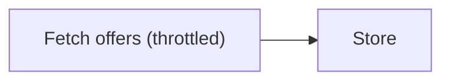
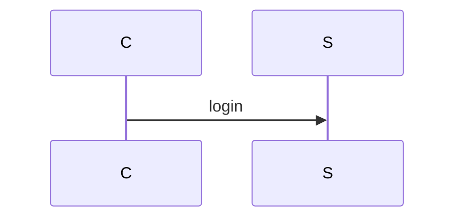

# Mermaid in Markdown to Images

Renders the ` ```mermaid ` blocks that already live inside a Markdown file. One image per
block, named after the block, with the Markdown left as the single source of truth.

This is the opposite direction from authoring a diagram: nothing here writes new `.mmd`
files. Syntax errors are reported against the block's line range **in the `.md`**, so the
diagram gets fixed where it lives.

## When to Use This Skill

Use this skill when you need to:

- Publish Markdown that contains mermaid diagrams to a target that cannot render them —
  Word/`.docx`, PDF, Confluence, SharePoint, slide decks, email
- Attach a diagram from a doc to a pull request, issue, or chat message as an image
- Check in CI that every mermaid block in the docs still parses
- Refresh the exported images after editing a diagram in the Markdown

**Do not** use it when the target renders mermaid natively — GitHub, GitLab, Obsidian,
Docusaurus and MkDocs Material all do. Leave the code block as text there; exported images
go stale the moment the block changes.

## Prerequisites

| Requirement | Version | Notes |
| --- | --- | --- |
| **Python** | 3.8+ | Runs the bundled script; standard library only |
| **Node.js** | 18+ | `mermaid-cli` is ESM-only |
| **`@mermaid-js/mermaid-cli`** | 11+ | `npm install -g @mermaid-js/mermaid-cli` |
| **Chrome / Chromium** | any recent | mermaid-cli renders through Puppeteer |

```bash
npm install -g @mermaid-js/mermaid-cli
npx puppeteer browsers install chrome-headless-shell   # skip if a system Chrome exists
```

Rendering is entirely local — no diagram content is sent to any service.

## Core Capabilities

### 1. Inventory the file before rendering

`--list` reports every block with its index, line range, diagram type and title, and renders
nothing. Cheap, and it tells you exactly what a doc contains.

### 2. Render each block to an image

PNG (default, `-s 2` scale for crisp text), SVG, or PDF. Filenames are derived from the
block: `design-03-auth-flow.png`, taken from a `%% title:` comment, the diagram's
front-matter `title:`, or the nearest Markdown heading. Accents are folded to ASCII, so
non-English headings still produce readable filenames.

### 3. Report failures against the Markdown

A block that fails to parse is reported as `docs/design.md:633-654` — the block's line range
in the source file — followed by mermaid's own message. Fix the block in the `.md`, then
re-render only that block with `--only 3`.

> mermaid's `Parse error on line N` counts tokens, not source lines. Trust the line range,
> not that number.

### 4. Insert the images back into the Markdown

`--rewrite` writes a copy, `--in-place` updates the file. The mermaid block is **kept** and
the image is added under it (`--rewrite-mode replace` swaps it out instead). Re-running
refreshes the existing image line rather than stacking duplicates, so `--in-place` is safe
in a pre-commit hook.

### 5. Validate in CI

`--check` renders every block into a temporary directory, keeps nothing, and exits non-zero
if any block fails.

### 6. Resolve its own toolchain

`mmdc` is a `#!/usr/bin/env node` script, so an active conda/nvm environment with an old
Node hijacks it and fails with `SyntaxError: Unexpected token import`. The script checks
`node -v` first and, when it is too old, runs mermaid-cli's entry point through a newer Node
it finds (`/usr/bin/node`, `/usr/local/bin`, `/opt/homebrew/bin`, nvm, volta). It resolves
Chrome the same way — Puppeteer's cached browser *or* a system Chrome/Chromium/Edge — and
retries with `--no-sandbox` when the sandbox is unavailable (root, containers). Both choices
are printed:

```text
renderer: mmdc (node v20 /usr/bin/node, chrome: /usr/bin/google-chrome)
```

## Usage Examples

### Example 1: Export a design doc's diagrams

```bash
# 1. What's in the file?
python3 skills/mermaid-md/scripts/mermaid_md.py docs/design.md --list

# 2. Render every block into docs/assets/
python3 skills/mermaid-md/scripts/mermaid_md.py docs/design.md -o docs/assets/
```

```text
7 mermaid block(s) in docs/design.md

  [1] lines 12-31   sequence      Login flow
  [2] lines 58-77   flowchart     Ingest pipeline
  ...

renderer: mmdc (node v20, chrome: /usr/bin/google-chrome)
OK   [1] docs/assets/design-1-login-flow.png
OK   [2] docs/assets/design-2-ingest-pipeline.png
7 rendered, 0 failed
```

### Example 2: Fix a broken block and re-render only that one

```text
FAIL [3] docs/design.md:88-104: Error: Parse error on line 4: | Expecting 'SQE', ... got 'PS'
```

The label contains parentheses, so it needs quotes — edit line 88-104 in `docs/design.md`:



```bash
python3 skills/mermaid-md/scripts/mermaid_md.py docs/design.md -o docs/assets/ --only 3
```

### Example 3: Keep images embedded in the doc

```bash
python3 skills/mermaid-md/scripts/mermaid_md.py docs/design.md -o docs/assets/ --in-place
```

````markdown



````

### Example 4: Gate the docs in CI

```bash
python3 skills/mermaid-md/scripts/mermaid_md.py docs/design.md --check   # exits 1 on failure
```

## Options

| Flag | Meaning |
| --- | --- |
| `--list` | List blocks (index, line range, type, title) — renders nothing |
| `--check` | Validate only, into a temp dir; non-zero exit if any block fails |
| `-o, --outdir` | Image output directory (default `.`) |
| `-f, --format` | `png` (default) / `svg` / `pdf` |
| `--only` | Subset by index: `3`, `2,5`, `2-4,7` |
| `--prefix` | Image name prefix (default: the Markdown file's stem) |
| `-s, --scale` | Pixel scale, default 2 for PNG — the sharpness knob |
| `-w, --width` | Render viewport width, default 2048 (affects wrapping, not resolution) |
| `-t, --theme` | `default` / `dark` / `neutral` / `forest` |
| `-b, --background` | Background color, default `white` (`transparent` for slides) |
| `-c, --config` | Mermaid config JSON (fonts, `themeVariables`, …) |
| `-p, --puppeteer-config` | Puppeteer config JSON for custom browser flags |
| `--chrome`, `--node` | Pin the Chrome / Node binary explicitly |
| `--rewrite [OUT.md]` | Markdown copy with image links (default `<stem>.rendered.md`) |
| `--in-place` | Rewrite the input file itself |
| `--rewrite-mode` | `append` (default) keeps the block; `replace` swaps it for the image |

## Guidelines

1. **Never split blocks into `.mmd` files** — render straight from the `.md`. The script
   handles extraction, and keeping one source avoids two copies drifting apart.
2. **`--list` before rendering** — a 40-page RFC may hold 20 diagrams; know the scope first.
3. **Fix at the reported line range, then `--only N`** — re-rendering everything after one
   edit wastes a browser launch per block.
4. **Put images next to the doc** (`docs/assets/`) — paths in the rewritten Markdown are
   relative to the output file, so images outside the doc tree produce fragile `../../..`
   links.
5. **Look at the output** — valid syntax is not readable output. Check for clipped labels,
   cramped layout, or a wrong orientation, and fix the block (`<br/>` wrapping, `TD`↔`LR`,
   `subgraph` grouping).
6. **Confirm before `--in-place`** — it rewrites the user's document. `--rewrite` produces a
   separate file and is the safer default.
7. **`Could not find Chrome` is a setup error, not a diagram error** — do not rewrite valid
   mermaid to chase it. Install a browser or pass `--chrome`.

## Common Patterns

### Pattern: Markdown → images → Word

Pairs with the `md-to-docx` skill, which embeds PNGs referenced by the Markdown:

```bash
python3 skills/mermaid-md/scripts/mermaid_md.py report.md -o assets/ --rewrite report.docx.md
node skills/md-to-docx/scripts/md-to-docx.mjs report.docx.md report.docx
```

Use `--rewrite-mode replace` for that intermediate file so the `.docx` gets the picture
instead of a wall of diagram source.

### Pattern: pre-commit hook

```bash
# Refresh every diagram image; the rewrite is idempotent, so this is a no-op when nothing changed
python3 skills/mermaid-md/scripts/mermaid_md.py docs/architecture.md -o docs/assets/ --in-place
git add docs/assets docs/architecture.md
```

### Pattern: dark-theme images for a dark site

```bash
python3 skills/mermaid-md/scripts/mermaid_md.py docs/design.md -o docs/assets/ \
  -t dark -b transparent
```

## What Counts as a Block

Fenced with ` ``` ` or `~~~`, info string starting with `mermaid`. Correctly **skipped**:
mermaid fences nested inside a longer outer fence (documentation showing mermaid examples),
fences in other languages, and YAML front matter. Blocks indented inside list items are
picked up and de-indented.

## Limitations

- **Requires a real browser** — mermaid-cli renders through Puppeteer; there is no
  pure-Python fallback. A headless-Chrome-free environment cannot use this skill.
- **PDF output needs mermaid-cli's PDF path** and produces one file per block, not a
  combined document.
- **Images are a copy of the diagram** — they go stale when the block changes. Re-run the
  script (or wire `--check` into CI) rather than hand-editing exported files.
- **No layout control** — mermaid does its own layout. Readability is improved by editing
  the diagram (direction, grouping, shorter labels), not by flags.
