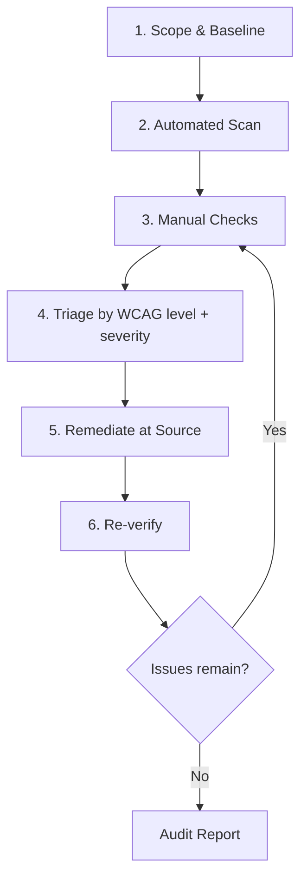

# Web Accessibility Audit

This skill audits a web page or component against [WCAG 2.2](https://www.w3.org/TR/WCAG22/) Level AA, explains *why* each finding matters for real users, and remediates issues in the source code rather than papering over them in the rendered DOM.

Accessibility is not a checkbox exercise. Roughly one in six people live with a disability, and the same fixes that help them — clear focus states, real semantics, sufficient contrast — make the UI faster and more robust for everyone. Automated tools catch only ~30–40% of WCAG issues, so this skill pairs them with the manual checks that find the rest.

## Scope of Application

- Static sites (HTML/CSS/JS)
- SPA frameworks: React / Vue / Angular / Svelte
- Full-stack frameworks: Next.js / Nuxt / SvelteKit / Remix
- CMS-rendered pages: WordPress / Drupal / Sitecore
- Design-system and component-library work (audit a single component in isolation)

## Prerequisites

| Need | Why | Required? |
|------|-----|-----------|
| Running page **or** component source | Automated scans need a live DOM; remediation needs the source | One of the two |
| Browser automation (Playwright MCP recommended) | Run axe-core in-page, capture focus order, test at multiple viewports | Recommended |
| Node.js | Run the bundled `scripts/axe-audit.mjs` and `npx` tools | For automated scan |
| Access to source code | Fixes are applied at the source, not the rendered output | Required for fixes |

If nothing is running, you can still do a **static source audit** — read the markup/components and flag issues by inspection — but say so in the report, because automated coverage and contrast/focus checks will be partial.

## Workflow Overview



---

## Step 1: Scope & Baseline

Confirm before scanning — guessing wastes effort:

- **What** is in scope? A URL, a route, a single component, or the whole site?
- **Conformance target?** Default to **WCAG 2.2 Level AA** (the legal baseline for most of EN 301 549, ADA Title II, and Section 508). Ask if the user needs AAA or a specific standard.
- **Audience constraints?** e.g. "must work with VoiceOver", "keyboard-only users", "must pass our CI axe gate".

Detect the stack from the workspace so fixes land in the right place: `package.json` (framework + deps), `tailwind.config.*`, `*.module.css`, `styled-components`/`@emotion` usage, `app/` vs `pages/`.

## Step 2: Automated Scan

Run automated tools first — they are fast and catch the unambiguous violations, leaving your attention for the judgment calls.

Use the bundled script, which runs axe-core against a live URL and writes JSON + a readable summary:

```bash
node scripts/axe-audit.mjs http://localhost:3000 --tags wcag2a,wcag2aa,wcag22aa
```

Complementary tools (use what is available):

| Tool | Best at | Invocation |
|------|---------|------------|
| **axe-core** | Rule-based WCAG violations, low false positives | bundled script / `@axe-core/playwright` |
| **Lighthouse** | Quick a11y score + common issues | `npx lighthouse <url> --only-categories=accessibility` |
| **pa11y** | CI-friendly, HTML CodeSniffer ruleset | `npx pa11y <url>` |

If using Playwright MCP directly, inject axe in-page: navigate, then evaluate `axe.run()` and collect `violations`. Capture results per route.

> Automated tools report *violations* (definite) and *incomplete* (needs a human). Never report "0 issues = accessible" — that only means no machine-detectable issues. Say exactly that.

## Step 3: Manual Checks

These find the majority of real barriers and cannot be automated. Walk through each; details and the full success-criterion mapping are in [references/wcag-2.2-checklist.md](references/wcag-2.2-checklist.md).

### Keyboard & Focus (WCAG 2.1.1, 2.1.2, 2.4.3, 2.4.7, 2.4.11)
- Tab through the entire page using **only** the keyboard. Every interactive element must be reachable and operable.
- Focus order follows visual/reading order; no keyboard traps.
- The focused element is always **visibly** indicated (2.4.7) and not hidden behind sticky headers (2.4.11, new in 2.2).
- Custom widgets (menus, dialogs, comboboxes) implement the expected key interactions (Esc, arrows, Enter/Space).

### Semantics & Screen Reader (WCAG 1.3.1, 4.1.2, 2.4.6)
- Prefer **native elements** (`<button>`, `<a href>`, `<nav>`, `<label>`) over `<div>` + ARIA. ARIA is a last resort, not a first reach.
- Every control has an accessible name (visible label, `aria-label`, or `aria-labelledby`).
- Headings are hierarchical (one `<h1>`, no skipped levels); landmarks (`main`, `nav`, `header`, `footer`) are present.
- Images have meaningful `alt` (or `alt=""` if decorative). Icon-only buttons have a name.
- Dynamic updates use `aria-live` where appropriate; state (expanded, selected, checked) is exposed.

### Color & Contrast (WCAG 1.4.3, 1.4.11, 1.4.1)
- Text contrast ≥ 4.5:1 (≥ 3:1 for large text). UI components/graphics ≥ 3:1.
- Information is never conveyed by **color alone** (e.g. error states need text/icon too).

### Forms (WCAG 1.3.1, 3.3.1, 3.3.2, 3.3.3, 3.3.8)
- Every input has a programmatically associated `<label>`.
- Errors are identified in text, described, and suggestions offered; errors are announced.
- No accessibility-only barriers in authentication (3.3.8, new in 2.2 — avoid cognitive-only tests like un-assisted CAPTCHA).

### Responsive, Motion & Targets (WCAG 1.4.10, 1.4.4, 2.5.8, 2.3.3)
- Reflows to 320px wide without horizontal scroll or content loss; text resizes to 200%.
- Touch/click targets ≥ 24×24px (2.5.8, new in 2.2) unless an exception applies.
- Respects `prefers-reduced-motion`; no content flashes more than 3×/second.

## Step 4: Triage

Prioritize so the user fixes what blocks people first, not what is merely easy. Combine **user impact** with **conformance level**:

| Priority | Meaning | Examples |
|----------|---------|----------|
| **P1 — Blocker** | Makes a task impossible for a group of users | Keyboard trap, unlabeled critical control, focus lost in modal, form unsubmittable with AT |
| **P2 — Serious** | Major barrier with a workaround | Contrast failures, missing alt on informative images, illogical heading structure |
| **P3 — Moderate** | Friction / polish | Redundant ARIA, minor target size, decorative img without `alt=""` |

Tag each finding with its WCAG success criterion (e.g. `1.4.3 Contrast (Minimum), AA`) so the report is defensible and traceable.

## Step 5: Remediate at Source

Apply fixes in the source code, following these principles:

1. **Native first.** Replace `<div role="button" onClick>` with `<button>`; you inherit focus, keyboard, and semantics for free.
2. **Minimal, idiomatic changes.** Match the project's existing patterns (Tailwind classes vs. CSS modules vs. styled-components).
3. **Fix the cause, not the symptom.** A contrast failure across the app belongs in the design token, not patched per-component.
4. **Don't regress.** Re-run after each fix; verify you didn't break layout or another criterion.

Framework-specific remediation patterns (focus management in React/Vue, accessible routing in SPAs, label binding, live regions) are in [references/wcag-2.2-checklist.md](references/wcag-2.2-checklist.md#framework-remediation).

## Step 6: Re-verify

- Re-run the automated scan; confirm the violation count dropped and no new ones appeared.
- Re-do the manual check for each fixed criterion (a green axe run does **not** prove a keyboard fix works).
- If an issue resists 3 fix attempts, stop and consult the user rather than thrash.

---

## Output Format

Always produce a report in this structure:

```markdown
# Accessibility Audit — {target}

## Summary
| Item | Value |
|------|-------|
| Target | {URL / component} |
| Conformance target | WCAG 2.2 AA |
| Method | Automated (axe-core, Lighthouse) + manual |
| Issues found | {N}  (P1: {a}, P2: {b}, P3: {c}) |
| Issues fixed | {M} |
| Coverage note | Automated tools detect ~40% of issues; manual checks performed: {list} |

## Findings

### [P1] {Short title}
- **Criterion**: {e.g. 4.1.2 Name, Role, Value — AA}
- **Where**: {selector / file:line / route}
- **Impact**: {who is blocked and how — e.g. "screen-reader users cannot identify this control"}
- **Fix**: {what changed}  →  `{file path}`
- **Status**: Fixed | Recommended (not applied)

### [P2] ...

## Not Fixed / Needs Decision
- {Issue} — **Reason**: {why} — **Recommendation**: {next step}

## Recommendations
- {Systemic improvements: tokens, lint rules, CI gate, component-library fixes}
```

Where useful, recommend the user wire accessibility into CI (`eslint-plugin-jsx-a11y`, axe in Playwright tests, a `pa11y-ci` gate) so regressions are caught automatically — a one-time audit decays without enforcement.

---

## Best Practices

**Do**
- ✅ Test with the keyboard and a screen reader, not just a scanner.
- ✅ Cite the specific WCAG success criterion and level for every finding.
- ✅ Prefer semantic HTML; reach for ARIA only when no native element fits.
- ✅ State honestly what was and wasn't checked, and that automated ≠ complete.

**Don't**
- ❌ Report "passes axe" as "is accessible".
- ❌ Add ARIA to elements that already have native semantics (it can override and break them).
- ❌ Remove visible focus outlines without an equally clear replacement.
- ❌ Convey state or meaning through color alone.

## Reference Material

- [references/wcag-2.2-checklist.md](references/wcag-2.2-checklist.md) — full success-criterion checklist (A/AA), what each means in practice, common failures, and framework-specific remediation patterns.
- [scripts/axe-audit.mjs](scripts/axe-audit.mjs) — run axe-core against a URL and emit JSON + a readable summary.
- Authoritative sources: [WCAG 2.2](https://www.w3.org/TR/WCAG22/) · [ARIA Authoring Practices Guide](https://www.w3.org/WAI/ARIA/apg/) · [WebAIM](https://webaim.org/).
